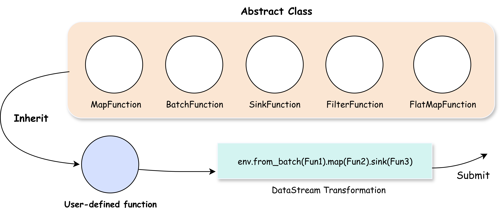

# Operator 与 Function

在 SAGE 的数据处理模型中，`Function` 和 `Operator` 是支撑整个 DataStream 数据转换过程的核心构件：

* **`Function` 是用户实现的业务逻辑模块** —— 它描述了你想要对数据做什么。你只需选择一个合适的 `Base Function` 类型（例如： `MapFunction`），然后实现其中的核心逻辑，比如如何对每条数据进行转换。这个过程就像你告诉系统：“我要对这些数据进行特定的处理”。你不需要关心数据是如何流动、如何分发，甚至如何执行这些处理。
* **`Operator` 是由系统自动创建并调度的构件** —— 它负责如何执行你定义的逻辑，以及在什么环境下执行。这包括决定如何分配资源，如何调度任务，如何在分布式系统中并行处理数据，甚至处理错误和故障恢复。用户无需手动创建或管理 `Operator`，系统会自动为你管理这些底层的执行和调度细节。

[](../../assets/img/function.png)

如图，在 SAGE 中，用户只需要选择合适的 Base Function 类型（如 `MapFunction`）并实现其核心逻辑，系统会在后续为其 **创建匹配的 Operator**，并负责执行调度、资源管理、容错等所有底层细节。

---

## Function 类型总览

SAGE 中提供了一组标准 Base Function 类型，供用户继承并实现自定义的数据处理逻辑，你可以点击具体的 Function 查看用法：

| Function 类型       | 用途描述              |
| ----------------- | ----------------- |
| [`MapFunction`](#mapfunction) | 对每条数据进行一对一转换 | 
| [`FilterFunction`](#filterfunction) | 按条件筛选，仅保留满足条件的数据 |
| [`FlatMapFunction`](#flatmapfunction) | 将一条输入数据拆分为多条输出数据 |
| [`KeyByFunction`](#keybyfunction) | 提取关键字段，实现按 *key* 分区 | 
| [`SinkFunction`](#sinkfunction) | 将数据写出到终端、文件或外部系统 |
| [`BatchFunction`](#batchfunction) | 用于 **批处理** 模式下的数据源 |
| [`SourceFunction`](#sourcefunction) | 用于 **流式** 模式下的数据源 |
| [`CoMapFunction`](#comapfunction) | 用于处理双输入流的组合逻辑 |

### Function 编写示例

每个 Function 都需要实现一个或多个方法，最常见的是 `execute()` 方法。例如：

```python
class MyMap(MapFunction):
    def execute(self, value):
        return value * 2
```

### Function 传参示例

你可以在 Function 中定义构造函数（`__init__`），SAGE 支持通过 `.map(MyFunction, config)` 的方式注入参数。

```python
class MyFunction(MapFunction):
    def __init__(self, config):
        self.factor = config.get("factor")

    def execute(self, value):
        return value * self.factor

# 使用方式
mydatastream.map(MyFunction, config)
```

---

## Operator 原理解析

每一个 Function 在运行时都会由其对应的 `Operator` 包装和调度，Operator 负责：

* 接收上游数据
* 调用 Function 的 `execute()` 或其他接口方法
* 处理数据流传递、并发与容错

系统会根据提交数据流选择合适的 Operator 来包装你的 Function，以下是两者的运行时关系图：

```
输入数据 → Operator.receive() 
          → Function.execute()
            → Operator.send()
输入数据 → 下游 Operator.receive()
...
```

---

## Function 类型详解

### MapFunction <a id="mapfunction"></a>

对每条数据做一对一转换。

```python
class Upper(MapFunction):
    def execute(self, s: str):
        return s.upper()

ds.map(Upper)
```


### FilterFunction <a id="filterfunction"></a>

N条数据输入，M条数据流出，按条件保留数据（N ≥ M）：

```python
class IsPositive(FilterFunction):
    def execute(self, x):
        return x > 0

ds.filter(IsPositive)
```

### FlatMapFunction <a id="flatmapfunction"></a>

一条数据输出多条数据，支持返回列表或调用 `collector.collect()`。

```python
class Split(FlatMapFunction):
    def execute(self, sentence):
        return sentence.split()
```

或使用 `collector`：

```python
class Split(FlatMapFunction):
    def execute(self, sentence, collector):
        for word in sentence.split():
            collector.collect(word)
```

### KeyByFunction <a id="keybyfunction"></a>

一条数据流转为多条数据流，为数据指定 Key，实现分区：

```python
ds.keyby(lambda x: x["user_id"], strategy="hash")
```

支持策略包括 `"hash"`、`"round_robin"`、`"broadcast"`。

### SinkFunction <a id="sinkfunction"></a>

将最终数据写入文件、终端、数据库等：

```python
class PrintSink(SinkFunction):
    def execute(self, value):
        print(value)

ds.sink(PrintSink)
```

### BatchFunction <a id="batchfunction"></a>

用于生成有限批量数据：

```python
class HelloBatch(BatchFunction):
    def __init__(self):
        self.counter = 0

    def execute(self):
        if self.counter >= 5:
            return None
        self.counter += 1
        return f"Hello #{self.counter}"

env.from_batch(HelloBatch)
```

### SourceFunction <a id="sourcefunction"></a>

用于生成无限流数据，例如读取 socket：

```python
class MySocket(SourceFunction):
    def run(self, ctx):
        while True:
            data = read_socket()
            ctx.collect(data)
```

### CoMapFunction <a id="comapfunction"></a>

处理双输入流，分别实现 `map1()` 和 `map2()`：

```python
class TagSource(CoMapFunction):
    def map1(self, a):
        return ("A", a)

    def map2(self, b):
        return ("B", b)

ds1.connect(ds2).co_map(TagSource)
```

---

## 总结

在 SAGE 中，`Function` 和 `Operator` 各自承担不同的职责：

* **`Function` 是用户实现的数据处理逻辑**，用户只需关注“如何处理每一条数据”。例如，继承 `MapFunction`、`FilterFunction` 等类型并实现 `execute()` 方法。

* **`Operator` 是系统自动创建的执行器**，它负责处理数据流的调度、并发、容错等复杂工作。用户无需手动管理 `Operator`。

SAGE 提供了多种内置的 `Function` 类型，覆盖了数据流的各个阶段，包括输入、转换、输出等。例如：

* 输入阶段：`SourceFunction`、`BatchFunction`
* 数据转换阶段：`MapFunction`、`FilterFunction`、`FlatMapFunction`
* 输出阶段：`SinkFunction`

通过 SAGE，你只需专注于实现数据处理的核心逻辑，系统会自动处理底层的资源管理、任务调度等工作。

下一章将讲述：**数据流转换（Transformation）**，我们将详细讲解如何使用 `.map()`、`.filter()`、`.keyby()` 等 API，灵活组合各类 Function，构建完整、可运行的流处理管道。
