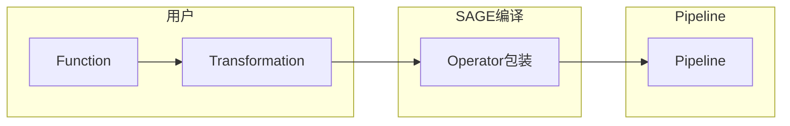

# Transformation 数据流转换

DataStream Transformation 是 SAGE 程序中用于串联和组织各类数据处理函数（算子）的核心抽象。如图所示，用户通过在 DataStream 上依次声明不同的数据转换（如 map、filter、flatmap 等），SAGE 会通过 Complier 组件将它们连接为一个完整的数据处理流，形成最终用于执行任务的 DataStream。

本节将介绍 DataStream Transformation 的核心数据转换接口、算子的连接与组合方式，以及数据在各算子间的分区策略和调度机制。

---

## Transformation 总览
在 SAGE 中，用户通过链式调用一系列转换操作（如 map、filter、keyby 等），可以将原始数据逐步加工成业务所需的结构和形式。

在上一节中，我们提到了`Function`与`Operator`的概念，SAGE会利用`Operator`包装`Function`，继而通过`Operator`的路由能力提供`Function`与`Function`之间的连接，那么SAGE是如何知道用哪种`Operator`包装呢？`Transformation`就是承当着这么一个翻译的角色，用户通过指定`Transformation`来告知SAGE系统该如何包装`Function`从而形成数据处理的Pipeline。

下表列出了 SAGE 中常用的 Transformation 类型及其作用范围，帮助你快速了解各种 API 的用途和返回类型，你可以点击各个方法以查看相关示例：

| 类别 | 代表方法 | 作用 | 返回类型 |
|-----|---------|-----|---------|
| **记录级转换** | [`map`](transformation_guides/hello_filter_world.md) / [`filter`](transformation_guides/hello_filter_world.md) / [`flatmap`](transformation_guides/hello_flatmap_world.md) | 逐条处理、过滤或展开数据 | `DataStream` |
| **分区与重分布** | [`keyby`](transformation_guides/hello_join_world.md)  | 控制数据如何在并行算子间分配 | `DataStream` |
| **多流转换** | [`connect`](transformation_guides/hello_join_world.md) / [`comap`](transformation_guides/hello_filter_world_comap.md) / [`join`](transformation_guides/hello_join_world.md) | 将两条或多条流组合到一起 | `ConnectedStreams` / `DataStream`|
| **终端输出** | [`sink`](transformation_guides/hello_filter_world.md) | 将结果写出到外部系统或文件 | *无*（链路结束） |
