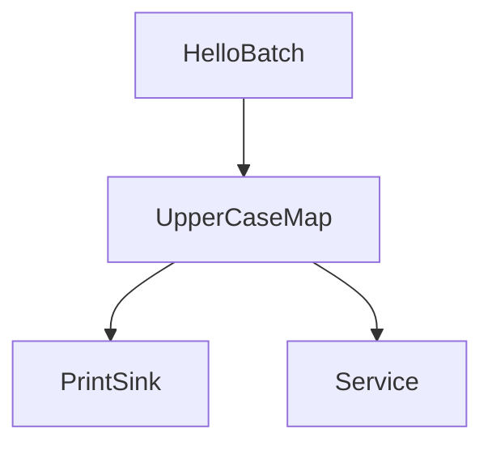

# Micro Service - 微服务

> 本例位于 SAGE Repo 下的 `examples/tutorials/service-api/hello_service_world.py`



## 示例解析

在搭建 SAGE Pipeline的过程中，有时会需要用 **独占式的服务**，例如记忆服务、工具调用、外部模型调用等等，本文档将介绍如何使用 SAGE 微服务。

示例程序如下：

```Python linenums="1" title="Python"
from sage.core.api.service.base_service import BaseService
from sage.core.api.local_environment import LocalEnvironment
from sage.core.api.function.sink_function import SinkFunction
from sage.core.api.function.batch_function import BatchFunction
from sage.common.utils.logging.custom_logger import CustomLogger

class HelloBatch(BatchFunction):
    def __init__(self, **kwargs):
        super().__init__(**kwargs)
        self.counter = 0
        self.max_count = 10  
    
    def execute(self):
        if self.counter >= self.max_count:
            return None  
        self.counter += 1
        return f"Hello, World! #{self.counter}"

class PrintSink(SinkFunction):
    def execute(self, data):
        # 调用服务
        self.call_service["hello_service"].hello()
        print(data)

# 继承BaseService创建一个简单的服务
class HelloService(BaseService):
    def __init__(self):
        self.message = "hello service!!!"
        
    def hello(self):
        print(self.message)


def main():
    env = LocalEnvironment("hello_service")

    # 注册服务
    env.register_service("hello_service", HelloService)

    env.from_batch(HelloBatch).sink(PrintSink)

    env.submit(autostop=True)
    print("Hello Service World 示例完成!")

if __name__ == "__main__":
    CustomLogger.disable_global_console_debug()
    main()
```

本例由 `Hello SAGE` 改动而来，下面我们将对这些改动部分逐一进行概述，以便理解 SAGE 微服务的主要思想：

---

### **A**. `HelloService`：服务定义

```python
class HelloService(BaseService):
    def __init__(self):
        self.message = "hello service!!!"
        
    def hello(self):
        print(self.message)
```

 **说明：**

 * 继承自 `BaseService`， 在编译的时候 SAGE 会自动注入上下文，让算子找到相应的服务。
 * 声明一个hello方法，以供算子调用。

---

### **B**. call_service 算子服务调用

```Python
# 调用服务
self.call_service["hello_service"].hello()
```

 **说明：**

 * 算子内部通过call_service["服务名"].服务方法() 进行服务调用。

---

### **C**. register_service 服务声明

```python
# 注册服务
env.register_service("hello_service", HelloService)
```

 **说明：**

 * 需要在env中通过register_service("服务名", 服务提供对象)来注册服务


---


### **D**.运行效果


```plaintext
ServiceFactory initialized for hello_service with class <class '__main__.HelloService'>
JobManager logs: ***/.sage/logs/jobmanager/session_***
hello service!!!
Hello, World! #1
hello service!!!
Hello, World! #2
hello service!!!
Hello, World! #3
hello service!!!
Hello, World! #4
hello service!!!
Hello, World! #5
hello service!!!
Hello, World! #6
hello service!!!
Hello, World! #7
hello service!!!
Hello, World! #8
hello service!!!
Hello, World! #9
hello service!!!
Hello, World! #10
Hello Service World 示例完成!
```

---

## 结语

微服务程序作为 Pipeline 内 **所有算子都可以调用** 的程序，能为Pipeline的运行提供独特的上下文反馈/记忆等能力。总的来说，编程人员需要定义好服务调用逻辑（即拆解业务逻辑，定义好多算子调用服务事务），最终实现带有记忆等功能的推理程序。