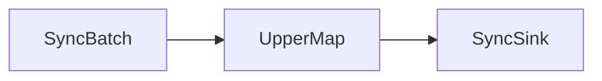

# One Handle Pipeline

> 本例位于 SAGE Repo 下的 `examples/tutorials/stream_mode/hello_onebyone_world.py`



## 示例解析 

对比于hello_sage 示例， `hello_onebyone_world.py` 新增了串行化的特性:

1. **引入 Metronome**：通过 Metronome 实现算子间的同步，确保数据按顺序处理。

其程序如下：

```Python linenums="1" title="Python"
from sage.core.api.local_environment import LocalEnvironment
from sage.core.api.function.sink_function import SinkFunction
from sage.core.api.function.batch_function import BatchFunction
from sage.core.api.function.map_function import MapFunction
from sage.common.utils.logging.custom_logger import CustomLogger
from sage.core.communication.metronome import create_metronome
import time 

metronome = create_metronome("sync_metronome")

class SyncBatch(BatchFunction):
    use_metronome = True
        
    def __init__(self, **kwargs):
        super().__init__(**kwargs)
        self.counter = 0
        self.max_count = 5
        self.metronome = metronome

    def execute(self):
        if self.counter >= self.max_count:
            return None
        self.counter += 1
        data = f"hello, No. {str(self.counter)} one by one world~"
        print(f" ⚡ {data}")
        return data

class UpperMap(MapFunction):
    def execute(self, data):
        print(f" 🔔 uppering word!!!")
        time.sleep(1)  
        return data.upper()

class SyncSink(SinkFunction):
    use_metronome = True
        
    def __init__(self, **kwargs):
        super().__init__(**kwargs)
        self.metronome = metronome
        
    def execute(self, data):
        print(f" ✅ {data}")
        time.sleep(1)  

def main():   
    metronome.release_once()
    env = LocalEnvironment("Test_Sync")
    env.from_batch(SyncBatch).map(UpperMap).sink(SyncSink)
    env.submit(autostop=True)
    print("Hello one by one World 批处理示例结束")

if __name__ == "__main__":
    CustomLogger.disable_global_console_debug()
    main()
```

下面我们将对新增的部分进行解析：

### 引入 use_metronome 成员变量

在BaseFunction中引入了 `use_metronome` 成员变量，表示该算子是否是顺序执行

```Python
use_metronome = True
```

## 运行结果

控制台输出效果：

```plaintext
JobManager logs: ***/.sage/logs/jobmanager/session_***
⚡ hello, No. 1 one by one world~
🔔 uppering word!!!
✅ HELLO, NO. 1 ONE BY ONE WORLD~
⚡ hello, No. 2 one by one world~
🔔 uppering word!!!
✅ HELLO, NO. 2 ONE BY ONE WORLD~
⚡ hello, No. 3 one by one world~
🔔 uppering word!!!
✅ HELLO, NO. 3 ONE BY ONE WORLD~
⚡ hello, No. 4 one by one world~
🔔 uppering word!!!
✅ HELLO, NO. 4 ONE BY ONE WORLD~
⚡ hello, No. 5 one by one world~
🔔 uppering word!!!
✅ HELLO, NO. 5 ONE BY ONE WORLD~
✅ None
Hello one by one World 批处理示例结束
```

---

## 结语

Hello OnebyOne SAGE 程序展示了 SAGE 串行化编程所需的基本接口：env、from_batch、map、sink、submit、几类function以及对应需要实现的execute函数, 同时在function中的成员定义use_metronome 决定function是否串行化执行，总的来说，串行化接口更多用于本地测试功能是否能正常运行, 在设计上 sage 只需要在function声明中, 定义 use_metronome = True 即可实现串行化执行， 但在实际生产环境中，建议使用并行化接口以提升计算效率。