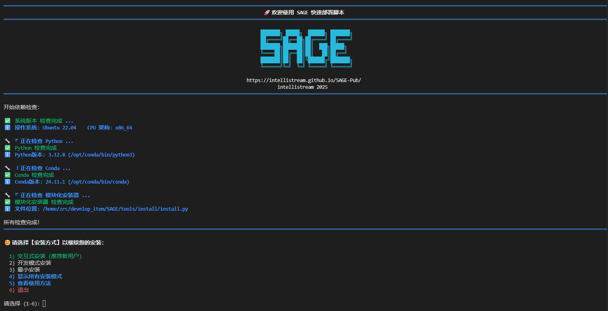
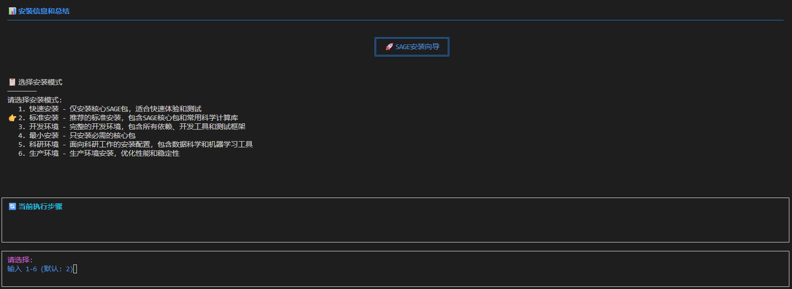
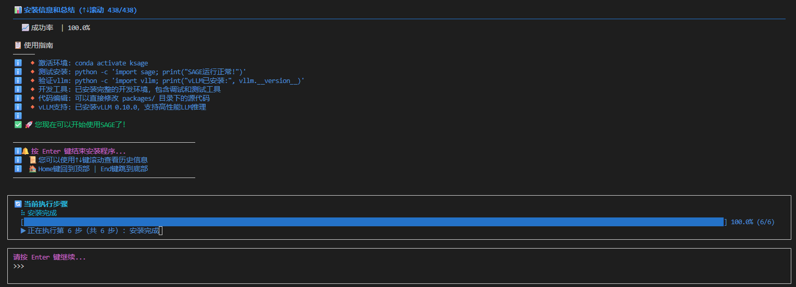
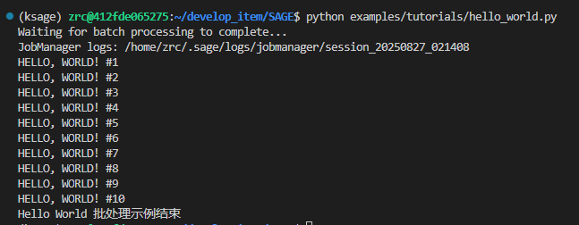

# SAGE 安装指南

本文档将指导您如何以 **开发者模式** 安装 SAGE 源码及其相关依赖。

---

## *A*. 前置要求 (Prerequisites)

在开始安装之前，请确保您的开发环境满足以下要求：

* **操作系统 (OS)**：[Ubuntu 22.04及以上版本](https://ubuntu.com/)
* **基础依赖**：[Anaconda/Miniconda](https://www.anaconda.com/)
* **SAGE官方仓库**：[IntelliStreamSAGE](https://github.com/intellistream)
<!-- 仓库链接待修改 -->
<small>您也可以通过以下命令快速拉取 SAGE 官方仓库</small>

<!-- 仓库链接待修改 -->
```bash
git clone git@github.com:intellistream/SAGE-Pub.git
```

---

## *B*. 本地安装 (Installation)

**第 1 步：运行安装脚本**

在本地的 SAGE 目录下，可见一个quickstart.sh的脚本，提前 **拉长终端边框** ，运行该脚本一键式安装 SAGE：

```bash
./quickstart.sh
```

运行该脚本后，您的终端会显示以下输出：

[](../assets/img/quickstart_intro.png)


**第 2 步：选择环境名称**

输入 ++1+enter++ 进入交互式安装：

[](../assets/img/quickstart_install_1.png)

输入 3 后，指定您希望创建的 SAGE 环境名称并 ++enter++ ，等待安装程序开始安装。

静待片刻后，显示以下页面，完成 SAGE 环境部署：

[](../assets/img/quickstart_install_2.png)

---

## *C*. 验证安装 (Verify Installation)

执行 SAGE 目录下的 `hello_world.py` 文件：

```bash
python examples/tutorials/hello_world.py
```

出现如下输出，说明 SAGE 安装成功，祝您使用愉快~

[](../assets/img/quickstart_install_3.png)

---

## *D*. 常见问题 (Common Question)
