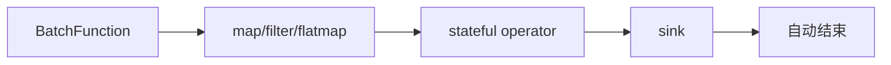
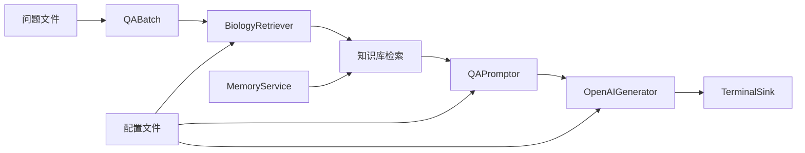

# 有界流处理 (Limited Streaming)

> 处理固定大小的数据集，适合离线批量分析和一次性计算任务。

有界流处理模拟真实世界中的**批量数据分析**场景，如日志分析、报表生成、数据迁移等。它强调完整性和确定性，是构建可靠数据处理系统的基础模式。

## 技术架构



---

## 示例1：WordCount 批处理

WordCount（词频统计）是大数据处理领域的经典示例，它通过统计文本中每个单词出现的次数，展示了完整的数据处理流程：数据读取、清洗、转换、聚合和输出。

在批处理模式下，WordCount处理固定的文本数据集，非常适合离线分析、报告生成和数据挖掘等场景。

### 数据源定义

```python
from sage.core.api.function.batch_function import BatchFunction

class TextDataBatch(BatchFunction):
    def __init__(self, **kwargs):
        super().__init__(**kwargs)
        self.sentences = [
            "hello world sage framework",
            "this is a streaming data processing example",
            "lambda functions make the code much cleaner",
            "word count is a classic big data example",
            "sage provides powerful stream processing capabilities"
        ]
        self.counter = 0

    def execute(self):
        if self.counter >= len(self.sentences):
            return None  # 返回None表示批处理完成
        
        sentence = self.sentences[self.counter]
        self.counter += 1
        return sentence
```

### 批处理管道

```python
from sage.core.api.local_environment import LocalEnvironment
from collections import Counter
import time

def main():
    # 创建本地执行环境
    env = LocalEnvironment("batch_wordcount")

    # 准备状态管理
    word_counts = Counter()
    total_processed = 0

    def update_word_count(words_with_count):
        """更新全局词汇计数"""
        nonlocal word_counts, total_processed
        word, count = words_with_count
        word_counts[word] += count
        total_processed += count
        return words_with_count

    # 构建批处理管道
    (env
        .from_batch(TextDataBatch)                        # 批数据源
        
        # 数据清洗和预处理
        .map(lambda sentence: sentence.lower())           # 转小写
        .map(lambda sentence: sentence.strip())           # 去除首尾空白
        .filter(lambda sentence: len(sentence) > 0)       # 过滤空字符串
        
        # 分词处理
        .flatmap(lambda sentence: sentence.split())       # 按空格分词
        .filter(lambda word: len(word) > 2)               # 过滤长度小于3的词
        .map(lambda word: word.replace(",", "").replace(".", ""))  # 去除标点
        
        # 词汇统计
        .map(lambda word: (word, 1))                      # 转换为(word, count)格式
        .map(update_word_count)                           # 更新计数器
        .sink(lambda x: None)                            # 添加sink确保数据流完整
    )

    print("🚀 Starting Batch WordCount Example")

    try:
        # 提交并运行批处理作业
        env.submit()
        time.sleep(2)  # 等待批处理完成

        # 打印最终统计结果
        print("\n📊 Final Word Count Results:")
        print("=" * 60)
        for word, count in word_counts.most_common():
            print(f"{word:20}: {count:3d}")
        print("=" * 60)
        print(f"Total words processed: {total_processed}")

    except Exception as e:
        print(f"❌ 批处理执行失败: {str(e)}")
    finally:
        env.close()

if __name__ == "__main__":
    main()
```

### 关键技术特点

#### 1. **批量状态累积**
```python
word_counts = Counter()  # 全局词频计数器
total_processed = 0      # 处理总数计数器
```
- 使用 `nonlocal` 关键字访问外部作用域变量
- `Counter` 对象自动处理词频统计
- 所有数据处理完成后才输出最终结果

#### 2. **确定性处理流程**
```python
.from_batch(TextDataBatch)  # 固定数据集
.sink(lambda x: None)       # 必须添加sink触发执行
```
- 与无界流不同，批处理有明确的开始和结束
- 数据源返回 `None` 时自动结束处理
- 必须使用 `.sink()` 确保管道完整执行

---

## 示例2：RAG问答批处理

在第一个WordCount示例展示了基础的文本处理和统计功能后，我们进入一个更复杂的应用场景：基于检索增强生成（RAG）的问答系统。

这个示例演示了如何使用SAGE框架构建智能问答管道，包括问题批量处理、知识检索、提示词生成和大模型回答等关键组件的协作。

### 技术架构



### 数据源定义

基于实际的qa_batch.py代码，从文件读取问题进行批处理：

```python
from sage.core.api.function.batch_function import BatchFunction

class QABatch(BatchFunction):
    """QA批处理数据源：从配置文件中读取数据文件并逐行返回"""
    def __init__(self, config, **kwargs):
        super().__init__(**kwargs)
        self.data_path = config["data_path"]
        self.counter = 0
        self.questions = []
        self._load_questions()

    def _load_questions(self):
        """从文件加载问题"""
        try:
            with open(self.data_path, 'r', encoding='utf-8') as file:
                self.questions = [line.strip() for line in file.readlines() if line.strip()]
        except Exception as e:
            print(f"Error loading file {self.data_path}: {e}")
            self.questions = []

    def execute(self):
        """返回下一个问题，如果没有更多问题则返回None"""
        if self.counter >= len(self.questions):
            return None  # 返回None表示批处理完成

        question = self.questions[self.counter]
        self.counter += 1
        return question
```

### 知识检索组件

知识检索是RAG系统的核心组件之一，负责从向量数据库中检索与用户问题相关的知识片段。以下是检索器的配置：

```python
from sage.core.api.function.map_function import MapFunction

class BiologyRetriever(MapFunction):
    """生物学知识检索器"""
    def __init__(self, config, **kwargs):
        super().__init__(**kwargs)
        self.config = config
        self.collection_name = config.get("collection_name", "biology_rag_knowledge")
        self.index_name = config.get("index_name", "biology_index")
        self.topk = config.get("ltm", {}).get("topk", 3)

    def execute(self, data):
        if not data:
            return None

        query = data
        # 从生物学知识库检索相关知识
        try:
            result = self.call_service["memory_service"].retrieve_data(
                collection_name=self.collection_name,
                query_text=query,
                topk=self.topk,
                index_name=self.index_name,
                with_metadata=True
            )

            if result['status'] == 'success':
                # 返回包含查询和检索结果的元组
                retrieved_texts = [item.get('text', '') for item in result['results']]
                return (query, retrieved_texts)
            else:
                return (query, [])

        except Exception as e:
            return (query, [])
```

### RAG批处理管道

RAG管道将问题处理、知识检索、提示词构造和答案生成串联成完整的问答流程。与WordCount的简单文本处理不同，这里涉及复杂的服务依赖和AI模型调用：

```python
from sage.core.api.local_environment import LocalEnvironment
from sage.apps.lib.rag.generator import OpenAIGenerator
from sage.apps.lib.rag.promptor import QAPromptor
from sage.apps.lib.io.sink import TerminalSink
from sage.middleware.services.memory.memory_service import MemoryService
from sage.utils.embedding_methods.embedding_api import apply_embedding_model

def pipeline_run(config: dict) -> None:
    """创建并运行数据处理管道"""
    env = LocalEnvironment()

    # 注册memory service并连接到生物学知识库
    def memory_service_factory():
        # 创建memory service实例
        embedding_model = apply_embedding_model("default")
        memory_service = MemoryService()

        # 检查生物学知识库是否存在
        try:
            collections = memory_service.list_collections()
            if collections["status"] != "success":
                return None

            collection_names = [c["name"] for c in collections["collections"]]
            if "biology_rag_knowledge" not in collection_names:
                return None

            # 连接到现有的知识库
            collection = memory_service.manager.connect_collection(
                "biology_rag_knowledge", embedding_model
            )
            if not collection:
                return None

        except Exception as e:
            return None

        return memory_service

    # 注册服务到环境中
    env.register_service("memory_service", memory_service_factory)

    # 构建数据处理流程 - 使用自定义的生物学检索器
    (env
        .from_batch(QABatch, config["source"])
        .map(BiologyRetriever, config["retriever"])
        .map(QAPromptor, config["promptor"])
        .map(OpenAIGenerator, config["generator"]["vllm"])
        .sink(TerminalSink, config["sink"])
    )

    env.submit()
    time.sleep(10)  # 增加等待时间确保处理完成
    env.close()
```

### 关键说明

- `.from_batch(QABatch, config["source"])`：从文件批量读取问题
- `BiologyRetriever`：从知识库检索相关生物学知识
- `QAPromptor`：将问题和知识组合成提示词
- `OpenAIGenerator`：调用大模型生成答案
- `TerminalSink`：将结果输出到终端

---

## 代码关键细节解析

前面展示了两个不同复杂度的批处理示例，现在我们深入分析实现这些功能的关键技术细节。

#### 1. 状态管理机制
```python
def update_word_count(words_with_count):
    nonlocal word_counts, total_processed  # 关键：访问外部作用域变量
    word, count = words_with_count
    word_counts[word] += count              # Counter对象自动处理键不存在的情况
    total_processed += count
    return words_with_count                 # 重要：必须返回数据继续流转
```

设计要点：
- `nonlocal` 声明允许修改外部作用域的变量
- `Counter()` 对象在键不存在时自动初始化为0
- 函数必须返回数据以保持流式处理的连续性

#### 2. 数据源生命周期
```python
def execute(self):
    if self.counter >= len(self.questions):
        return None  # 这是唯一的结束信号
    # ...处理逻辑
```

重要约定：返回 `None` 是告诉 SAGE 框架批处理已完成的**唯一方式**，任何其他返回值都会被视为有效数据。

#### 3. 服务注册机制
```python
env.register_service("memory_service", memory_service_factory)
```

框架特性：
- SAGE支持服务注册，实现组件间的依赖注入
- `self.call_service["memory_service"]` 可访问注册的服务
- memory_service_factory负责创建和配置知识库连接

---

## 小结

有界流处理通过**固定数据源**、**明确结束信号**和**状态累积**机制，实现**可复现**、**自动结束**的批量数据处理流程。

关键特点：
- **确定性**：相同输入产生相同输出，便于调试和测试
- **完整性**：确保所有数据都被处理，不会遗漏
- **自动结束**：数据源返回 `None` 时管道自动停止
- **状态聚合**：支持跨数据项的状态累积和最终结果汇总
- **服务集成**：支持复杂的依赖注入和组件协作

适用场景：数据分析、报表生成、模型训练、批量数据处理、批量RAG问答等需要处理完整数据集的场景。
