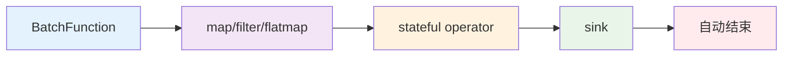

# 有界流处理 (Limited Streaming) :material-database:

> :material-package-variant: 处理固定大小的数据集，适合离线批量分析和一次性计算任务。

## 核心概念 :material-lightbulb:

- **确定性边界** :material-border-all: ：数据集大小固定，每次执行结果一致
- **生命周期管理** :material-lifecycle: ：初始化 → 数据处理 → 自动结束 → 结果汇总
- **框架约定** :material-handshake: ：返回 `None` 表示数据源结束，必须使用 `.sink()` 触发执行

!!! info "应用场景"
    有界流处理特别适合==数据分析==、==批量处理==、==离线计算==等需要**完整性保证**和**可重复执行**的场景。

## 技术架构 :material-sitemap:



---

## 示例1：WordCount 批处理（无大模型参与） :material-counter:

!!! example "典型用例"
    文档词频分析、日志统计、数据清洗等需要完整处理所有数据的场景。

### 批处理管道核心代码（重点） :octicons-code-16:

以下是该示例的核心，重点关注 `env.` 后的操作链：

=== "核心管道"
    ```python linenums="1" hl_lines="18-26" title="有界流WordCount批处理管道"
    from sage.core.api.local_environment import LocalEnvironment
    from collections import Counter
    import time

    # 1. 创建本地执行环境
    env = LocalEnvironment("batch_wordcount")

    # 2. 准备状态管理
    word_counts = Counter()
    total_processed = 0

    def accumulate_word(pair):
        nonlocal word_counts, total_processed
        word, count = pair
        word_counts[word] += count
        total_processed += count
        return pair

    # 3. 构建并绑定管道
    (env
        .from_batch(TextDataBatch)                   # 有界流数据源
        .map(lambda s: s.lower().strip())            # 标准化文本
        .filter(lambda s: bool(s))                   # 过滤空字符串
        .flatmap(lambda s: s.split())                # 按空格分词
        .filter(lambda w: len(w) > 2)                # 过滤短词
        .map(lambda w: (w.replace(',', '').replace('.', ''), 1))  # 清洗并计数
        .map(accumulate_word)                        # 累积统计
        .sink(lambda _: None)                        # 必需：触发执行
    )

    # 4. 提交作业并等待完成
    env.submit()                  # 提交作业
    time.sleep(2)                 # 等待执行完成
    env.close()
    ```

=== "数据源定义"
    ```python linenums="1" title="TextDataBatch - 固定数据集源"
    from sage.core.function.batch_function import BatchFunction

    class TextDataBatch(BatchFunction):
        def __init__(self, **kwargs):
            super().__init__(**kwargs)
            self.sentences = [
                "hello world sage framework",
                "this is a streaming data processing example",
                "lambda functions make the code much cleaner",
                "word count is a classic big data example",
                "sage provides powerful stream processing capabilities"
            ]
            self.counter = 0

        def execute(self):
            if self.counter >= len(self.sentences):
                return None  # 关键：返回None标志批处理结束
            
            sentence = self.sentences[self.counter]
            self.counter += 1
            return sentence
    ```

!!! tip "关键说明"
    - `.from_batch()` :material-database-import: ：启动有界流处理模式
    - `.sink()` :material-database-export: ：声明数据下沉，SAGE 才会执行整个管道
    - `time.sleep(2)` :material-timer: ：等待批处理完成，实战中可用事件或回调替代
    - 返回 `None` :material-null: ：批处理结束的唯一信号，框架检测到后自动停止管道

### 代码关键细节解析 :material-magnify:

#### 1. 状态管理机制
```python title="状态变量的作用域控制"
def accumulate_word(pair):
    nonlocal word_counts, total_processed  # 关键：访问外部作用域变量
    word, count = pair
    word_counts[word] += count              # Counter对象自动处理键不存在的情况
    total_processed += count
    return pair                             # 重要：必须返回数据继续流转
```

!!! note "设计要点"
    - `nonlocal` 声明允许修改外部作用域的变量
    - `Counter()` 对象在键不存在时自动初始化为0
    - 函数必须返回数据以保持流式处理的连续性

#### 2. 数据源生命周期
```python title="批处理结束的判断逻辑"
def execute(self):
    if self.counter >= len(self.sentences):
        return None  # 这是唯一的结束信号
    # ...处理逻辑
```

!!! warning "重要约定"
    返回 `None` 是告诉 SAGE 框架批处理已完成的**唯一方式**，任何其他返回值都会被视为有效数据。

---

## 示例2：RAG问答批处理（有大模型参与） :material-robot:

!!! success "企业级应用"
    这是 SAGE 框架在==知识库问答==场景的典型应用，展示了批量AI处理的强大能力！ :star:

### 场景说明 :material-scenario:

从文件读取问题列表，批量调用知识库检索和大模型生成，完成所有问题后自动结束。这是典型的**批量RAG处理场景**。

### 核心组件实现 :material-puzzle:

#### 1. 问题批处理数据源 :material-file-question:

```python linenums="1" title="QABatch - 智能问题批处理源"
from sage.core.function.batch_function import BatchFunction

class QABatch(BatchFunction):
    def __init__(self, config, **kwargs):
        super().__init__(**kwargs)
        self.data_path = config["data_path"]
        self.counter = 0
        self.questions = []
        self._load_questions()

    def _load_questions(self):
        with open(self.data_path, 'r', encoding='utf-8') as file:
            self.questions = [line.strip() for line in file.readlines() if line.strip()]
        print(f"📚 成功加载 {len(self.questions)} 个问题")

    def execute(self):
        if self.counter >= len(self.questions):
            print("✅ 所有问题处理完成")
            return None  # 批处理结束标志

        question = self.questions[self.counter]
        progress = ((self.counter + 1) / len(self.questions)) * 100
        print(f"📝 处理问题 {self.counter + 1}/{len(self.questions)} ({progress:.1f}%)")
        
        self.counter += 1
        return question
```

#### 2. 知识检索组件 :material-magnify:

```python linenums="1" title="BiologyRetriever - 智能知识检索器"
from sage.core.function.map_function import MapFunction

class BiologyRetriever(MapFunction):
    def __init__(self, config, **kwargs):
        super().__init__(**kwargs)
        self.config = config
        self.collection_name = config.get("collection_name", "biology_rag_knowledge")
        self.topk = config.get("ltm", {}).get("topk", 3)

    def execute(self, data):
        if not data:
            return None

        query = data
        try:
            # 调用内存服务进行向量检索
            result = self.call_service["memory_service"].retrieve_data(
                collection_name=self.collection_name,
                query_text=query,
                topk=self.topk,
                with_metadata=True
            )

            if result['status'] == 'success' and result['results']:
                retrieved_texts = [item.get('text', '') for item in result['results']]
                print(f"🔍 为问题检索到 {len(retrieved_texts)} 条相关知识")
                return (query, retrieved_texts)
            else:
                return (query, [])

        except Exception as e:
            print(f"❌ 检索过程异常: {str(e)}")
            return (query, [])
```

#### 3. RAG批处理管道（重点） :material-rocket:

```python linenums="1" hl_lines="14-19" title="企业级RAG批处理系统"
from sage.lib.rag.generator import OpenAIGenerator
from sage.lib.rag.promptor import QAPromptor
from sage.lib.io.sink import TerminalSink
from sage.service.memory.memory_service import MemoryService
from sage.utils.embedding_methods.embedding_api import apply_embedding_model

def create_rag_pipeline():
    """创建完整的RAG批处理管道"""
    # 1. 环境和配置初始化
    config = load_config("config_batch.yaml")
    env = LocalEnvironment("rag_batch_pipeline")

    # 2. 注册知识库服务
    def memory_service_factory():
        embedding_model = apply_embedding_model("default")
        memory_service = MemoryService()
        # 连接到现有知识库
        collection = memory_service.manager.connect_collection(
            "biology_rag_knowledge", embedding_model
        )
        return memory_service

    env.register_service("memory_service", memory_service_factory)

    # 3. 构建RAG数据处理流程（核心管道）
    (env
        .from_batch(QABatch, config["source"])           # 批量问题源
        .map(BiologyRetriever, config["retriever"])      # 知识检索
        .map(QAPromptor, config["promptor"])             # 提示词构造
        .map(OpenAIGenerator, config["generator"]["vllm"]) # 大模型生成
        .sink(TerminalSink, config["sink"])              # 结果输出
    )

    # 4. 执行批处理作业
    env.submit()
    time.sleep(10)  # 等待批处理完成（RAG处理需要更多时间）
    env.close()

if __name__ == '__main__':
    create_rag_pipeline()
```

### RAG批处理核心概念解析 :material-brain:

#### 服务注册模式 :material-api:
```python title="依赖注入的优雅实现"
env.register_service("memory_service", memory_service_factory)
```

!!! abstract "架构优势"
    - **依赖注入** :material-injection-syringe: ：RAG组件需要访问知识库，通过服务注册实现解耦
    - **资源共享** :material-share: ：多个处理步骤共享同一个内存服务实例

#### RAG处理流程 :material-flow-chart:

| 步骤 | 组件 | 输入 | 输出 | 功能描述 |
|------|------|------|------|----------|
| 1️⃣ | `QABatch` | 文件 | 问题字符串 | :material-file-document: 逐个读取问题 |
| 2️⃣ | `BiologyRetriever` | 问题 | (问题, 知识列表) | :material-magnify: 检索相关知识 |
| 3️⃣ | `QAPromptor` | (问题, 知识) | 提示词 | :material-message-text: 组合成提示词 |
| 4️⃣ | `OpenAIGenerator` | 提示词 | AI回答 | :material-robot: 大模型生成 |
| 5️⃣ | `TerminalSink` | AI回答 | 控制台输出 | :material-monitor: 格式化输出 |

#### 代码关键细节解析 :material-code-braces:

##### 1. 服务调用机制
```python title="通过框架注入的服务调用"
result = self.call_service["memory_service"].retrieve_data(...)
```

!!! note "调用原理"
    `self.call_service` 是 SAGE 框架自动注入的服务字典，通过 `env.register_service()` 注册的服务都可以通过这种方式访问。

##### 2. 数据传递格式
```python title="组件间的数据格式约定"
# BiologyRetriever 输出
return (query, retrieved_texts)  # 元组格式

# QAPromptor 期望输入
def execute(self, data):
    query, contexts = data  # 自动解包
```

!!! tip "设计模式"
    RAG管道中使用元组传递多个相关数据，下游组件可以方便地解包使用。

##### 3. 批处理等待时间
```python title="为什么需要更长的等待时间？"
time.sleep(10)  # RAG处理需要更多时间
```

!!! warning "性能考虑"
    - **网络延迟** :material-network: ：大模型API调用需要网络传输时间
    - **计算复杂度** :material-cpu-64-bit: ：向量检索和文本生成比简单计算耗时更多
    - **数据量影响** :material-database-settings: ：问题数量越多，总处理时间越长

---

## 小结 :material-check-all:

!!! quote "核心价值"
    有界流处理通过**固定数据源**、**明确结束信号**和**状态累积**机制，实现**可复现**、**自动结束**的批量数据处理流程。

!!! success "技术优势"
    - **完整性保证** :material-shield-check: ：确保所有数据都被处理
    - **可重复执行** :material-repeat: ：相同输入产生相同输出
    - **资源可控** :material-chart-line: ：明确的开始和结束，便于资源管理
    - **易于调试** :material-bug: ：固定数据集便于问题定位和修复

!!! info "适用场景"
    特别适合==数据分析==、==报表生成==、==模型训练==、==批量AI处理==等需要处理完整数据集的场景。

---

<center>
[:material-rocket: 开始你的第一个批处理任务](){ .md-button .md-button--primary }
[:material-book: 学习更多批处理模式](){ .md-button }
[:material-compare: 对比无界流处理](unlimited_streaming.md){ .md-button }
</center>
