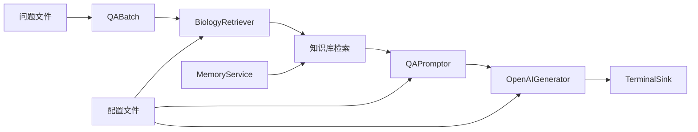

# 有界流处理 (Limited Streaming)

> 有界流处理是SAGE框架处理批量数据的核心功能，用于处理固定大小的数据集，适合批量数据分析和离线处理任务。

## 什么是有界流处理？

有界流处理是一种数据处理模式，其特点是数据集具有明确的边界和固定的大小。这种模式特别适合：

- **离线数据分析**：如日志文件分析、历史数据统计
- **批量文档处理**：如文档转换、数据清洗
- **知识库构建**：如向量化处理、索引构建
- **一次性计算任务**：如报表生成、数据迁移

### 核心设计理念

SAGE的有界流处理基于以下核心概念：

1. **数据集确定性**：通过 `BatchFunction` 基类，明确定义数据集的开始和结束
2. **批处理管道**：使用 `.from_batch()` 启动，支持完整的数据处理生命周期
3. **自动完成**：当所有数据处理完毕后，管道自动停止执行
4. **结果确定性**：每次运行产生相同的结果，便于测试和验证

---

## 示例1：WordCount批处理 - 无大模型参与

### 业务场景描述

构建一个批量词频统计系统，能够：
- 处理预定义的文本数据集
- 完成所有数据的词频统计
- 生成最终的统计报告
- 自动结束处理流程

这是典型的批量数据分析场景，展示了SAGE处理固定数据集的基本能力。

### 技术架构设计


### 核心组件实现

#### 1. 有界流数据源设计

```python
from sage.core.function.batch_function import BatchFunction

class TextDataBatch(BatchFunction):
    """文本数据批处理源 - 提供固定大小的文本数据集"""
    def __init__(self, **kwargs):
        super().__init__(**kwargs)
        # 预定义的数据集 - 这就是"有界"的体现
        self.sentences = [
            "hello world sage framework",
            "this is a streaming data processing example",
            "lambda functions make the code much cleaner",
            "word count is a classic big data example",
            "sage provides powerful stream processing capabilities"
        ]
        self.counter = 0

    def execute(self):
        """
        核心执行方法 - 返回下一个数据项或None表示结束
        None是批处理结束的明确信号
        """
        if self.counter >= len(self.sentences):
            return None  # 批处理结束标志

        sentence = self.sentences[self.counter]
        self.counter += 1
        return sentence
```

**设计关键点**：
- **继承 `BatchFunction`**：这是创建有界流数据源的必要条件
- **固定数据集**：在初始化时确定所有要处理的数据
- **明确结束条件**：通过返回 `None` 告知框架批处理已完成
- **计数器状态**：维护处理进度，确保每个数据项只处理一次

#### 2. 批处理数据管道

```python
from sage.core.api.local_environment import LocalEnvironment
from collections import Counter
import time

def create_batch_wordcount():
    """创建WordCount批处理管道"""
    # 1. 创建批处理环境
    env = LocalEnvironment("batch_wordcount")
    
    # 2. 定义批处理状态管理
    word_counts = Counter()
    total_processed = 0
    
    def update_word_count(word_count_tuple):
        """
        状态累积函数 - 收集整个批次的统计信息
        与无界流不同，这里不需要定期输出中间结果
        """
        nonlocal word_counts, total_processed
        word, count = word_count_tuple
        word_counts[word] += count
        total_processed += count
        return word_count_tuple
    
    # 3. 构建批处理管道
    (env
        .from_batch(TextDataBatch)                        # 启动有界流处理
        .map(lambda sentence: sentence.lower())           # 数据标准化
        .map(lambda sentence: sentence.strip())           # 去除空白字符
        .filter(lambda sentence: len(sentence) > 0)       # 数据质量保证
        .flatmap(lambda sentence: sentence.split())       # 数据解构
        .filter(lambda word: len(word) > 2)              # 业务规则过滤
        .map(lambda word: word.replace(",", "").replace(".", ""))  # 数据清洗
        .map(lambda word: (word, 1))                     # 数据格式转换
        .map(update_word_count)                          # 状态累积
        .sink(lambda x: None)                           # 数据下沉，触发执行
    )
    
    # 4. 批处理执行和结果处理
    print("🚀 开始批处理WordCount任务")
    
    try:
        env.submit()                    # 启动批处理作业
        time.sleep(2)                   # 等待批处理完成
        
        # 批处理完成后的结果展示
        print("\n📊 批处理完成！最终词频统计结果:")
        print("=" * 60)
        for word, count in word_counts.most_common():
            print(f"{word:20}: {count:3d}")
        print("=" * 60)
        print(f"总处理词数: {total_processed}")
        print(f"不重复词数: {len(word_counts)}")
        
    except Exception as e:
        print(f"❌ 批处理执行失败: {str(e)}")
    finally:
        env.close()                     # 资源清理
```

### 批处理核心概念解析

#### 数据处理生命周期
1. **初始化阶段**：创建环境，定义数据源和处理逻辑
2. **数据处理阶段**：逐个处理数据集中的每个项目
3. **自动结束阶段**：数据源返回None，管道自动停止
4. **结果汇总阶段**：输出最终的处理结果

#### 返回None的重要性
```python
def execute(self):
    if self.counter >= len(self.sentences):
        return None  # 这是SAGE框架识别批处理结束的唯一方式
```
- **明确边界**：None是SAGE框架约定的批处理结束标志
- **自动停止**：框架检测到None后会自动停止管道处理
- **资源管理**：确保所有资源在处理完成后及时释放
- **结果确定性**：保证每次运行都处理相同数量的数据

#### sink函数的必要性
```python
.sink(lambda x: None)  # 看似简单，实际上是触发执行的关键
```
- **惰性求值**：SAGE采用惰性求值策略，没有sink不会真正执行
- **数据消费**：sink确保管道中的所有数据都被完整处理
- **管道完整性**：完整的数据流管道必须有明确的数据出口

---

## 示例2：RAG知识问答批处理 - 有大模型参与

### 业务场景描述

构建一个基于知识库的批量问答处理系统，能够：
- 批量处理预定义的问题列表
- 从知识库检索相关信息
- 调用大模型生成增强回答
- 输出完整的问答结果集

这是典型的RAG (检索增强生成) 批处理场景，展示了SAGE集成知识库和大模型的能力。

### 技术架构设计



### 前置条件和环境准备

> **⚠️ 重要前置步骤**：
> RAG批处理需要完整的知识库环境，请按以下顺序准备：
> 
> 1. **构建知识库**：
> ```bash
> cd app/memory_app
> python biology_rag_knowledge.py
> ```
> 
> 2. **准备问题文件**：
> 确保 `data/q.txt` 文件存在，格式为每行一个问题：
> ```
> 什么是DNA？
> 基因表达是如何调控的？
> 蛋白质折叠的机制是什么？
> ```

### 核心组件实现

#### 1. 问题批处理数据源

```python
class QABatch(BatchFunction):
    """
    QA批处理数据源 - 从文件中读取固定的问题列表
    这体现了有界流处理的"预定义数据集"特性
    """
    def __init__(self, config, **kwargs):
        super().__init__(**kwargs)
        self.data_path = config["data_path"]
        self.counter = 0
        self.questions = []
        self._load_questions()

    def _load_questions(self):
        """
        批处理初始化：一次性加载所有问题
        这确保了数据集的确定性和完整性
        """
        try:
            with open(self.data_path, 'r', encoding='utf-8') as file:
                self.questions = [line.strip() for line in file.readlines() if line.strip()]
            print(f"📚 成功加载 {len(self.questions)} 个问题，准备批处理")
        except Exception as e:
            print(f"❌ 加载问题文件失败 {self.data_path}: {e}")
            self.questions = []

    def execute(self):
        """
        批处理执行：逐个返回问题直到全部处理完毕
        """
        if self.counter >= len(self.questions):
            print("✅ 所有问题处理完成，批处理结束")
            return None  # 批处理完成标志

        question = self.questions[self.counter]
        self.counter += 1
        
        # 显示处理进度
        progress = (self.counter / len(self.questions)) * 100
        print(f"📝 处理问题 {self.counter}/{len(self.questions)} ({progress:.1f}%): {question}")
        
        return question
```

#### 2. 知识检索组件

```python
from sage.core.function.map_function import MapFunction

class BiologyRetriever(MapFunction):
    """
    生物学知识检索器 - RAG系统的核心组件
    从预构建的知识库中检索与问题相关的信息
    """
    def __init__(self, config, **kwargs):
        super().__init__(**kwargs)
        self.config = config
        self.collection_name = config.get("collection_name", "biology_rag_knowledge")
        self.index_name = config.get("index_name", "biology_index")
        self.topk = config.get("ltm", {}).get("topk", 3)
        
        print(f"🔧 检索器配置 - 知识库: {self.collection_name}, TopK: {self.topk}")

    def execute(self, data):
        """
        执行知识检索：为每个问题检索相关的背景知识
        """
        if not data:
            return None

        query = data

        try:
            # 调用内存服务进行向量检索
            result = self.call_service["memory_service"].retrieve_data(
                collection_name=self.collection_name,
                query_text=query,
                topk=self.topk,
                index_name=self.index_name,
                with_metadata=True
            )

            if result['status'] == 'success' and result['results']:
                # 提取检索到的文本内容
                retrieved_texts = [item.get('text', '') for item in result['results']]
                print(f"🔍 为问题检索到 {len(retrieved_texts)} 条相关知识")
                
                # 返回问题和检索结果的元组
                return (query, retrieved_texts)
            else:
                print(f"⚠️ 知识检索失败或无结果")
                return (query, [])

        except Exception as e:
            print(f"❌ 检索过程异常: {str(e)}")
            return (query, [])
```

#### 3. 内存服务管理

```python
from sage.service.memory.memory_service import MemoryService
from sage.utils.embedding_methods.embedding_api import apply_embedding_model

def memory_service_factory():
    """
    内存服务工厂函数 - 负责创建和配置知识库连接
    这是RAG系统的基础设施组件
    """
    try:
        # 初始化嵌入模型和内存服务
        embedding_model = apply_embedding_model("default")
        memory_service = MemoryService()

        # 验证知识库是否存在
        collections = memory_service.list_collections()
        if collections["status"] != "success":
            print("❌ 无法获取知识库列表")
            return None

        # 检查目标知识库
        collection_names = [c["name"] for c in collections["collections"]]
        if "biology_rag_knowledge" not in collection_names:
            print("❌ 生物学知识库不存在，请先运行 biology_rag_knowledge.py")
            return None

        # 连接到知识库
        collection = memory_service.manager.connect_collection(
            "biology_rag_knowledge", 
            embedding_model
        )
        
        if not collection:
            print("❌ 连接知识库失败")
            return None
            
        print("✅ 成功连接到生物学知识库")
        return memory_service

    except Exception as e:
        print(f"❌ 内存服务初始化失败: {e}")
        return None
```

#### 4. 完整RAG批处理管道

```python
from sage.lib.rag.generator import OpenAIGenerator
from sage.lib.rag.promptor import QAPromptor
from sage.lib.io.sink import TerminalSink
from dotenv import load_dotenv
from sage.utils.config_loader import load_config

def create_rag_pipeline():
    """
    创建完整的RAG批处理管道
    展示知识检索增强生成的完整流程
    """
    # 1. 环境和配置初始化
    load_dotenv(override=False)
    config = load_config("config_batch.yaml")
    env = LocalEnvironment("rag_batch_pipeline")
    
    # 2. 注册知识库服务
    env.register_service("memory_service", memory_service_factory)
    
    print("🚀 开始构建RAG批处理管道...")
    
    try:
        # 3. 构建RAG数据处理流程
        (env
            .from_batch(QABatch, config["source"])           # 批量问题源
            .map(BiologyRetriever, config["retriever"])      # 知识检索
            .map(QAPromptor, config["promptor"])             # 提示词构造
            .map(OpenAIGenerator, config["generator"]["vllm"]) # 大模型生成
            .sink(TerminalSink, config["sink"])              # 结果输出
        )
        
        print("✅ RAG管道构建完成，开始批处理...")
        
        # 4. 执行批处理作业
        env.submit()
        time.sleep(10)  # 等待批处理完成（RAG处理需要更多时间）
        
        print("🎉 RAG批处理任务完成")
        
    except Exception as e:
        print(f"❌ RAG管道执行失败: {str(e)}")
    finally:
        env.close()

if __name__ == '__main__':
    create_rag_pipeline()
```

### RAG批处理核心概念解析

#### 服务注册模式
```python
env.register_service("memory_service", memory_service_factory)
```
- **依赖注入**：RAG组件需要访问知识库，通过服务注册实现解耦
- **资源共享**：多个处理步骤共享同一个内存服务实例
- **配置灵活**：可以根据环境替换不同的服务实现
- **错误隔离**：服务初始化失败不会影响管道构建

#### RAG处理流程
1. **QABatch** → 逐个读取问题
2. **BiologyRetriever** → 检索相关知识，输出 `(问题, 知识列表)`
3. **QAPromptor** → 组合问题和知识成提示词
4. **OpenAIGenerator** → 调用大模型生成增强回答
5. **TerminalSink** → 格式化输出最终结果

#### 批处理等待时间
```python
time.sleep(10)  # RAG处理需要更多时间
```
- **网络延迟**：大模型API调用需要网络传输时间
- **计算复杂度**：向量检索和文本生成比简单计算耗时更多
- **服务依赖**：需要等待多个外部服务的响应
- **数据量影响**：问题数量越多，总处理时间越长

---

## 有界流处理最佳实践

### 1. 数据源设计模式

#### 文件读取批处理
```python
class FileReaderBatch(BatchFunction):
    """逐行读取文件的批处理模式"""
    def __init__(self, file_path, **kwargs):
        super().__init__(**kwargs)
        self.file_path = file_path
        self.file_handle = None
        self.is_finished = False
    
    def execute(self):
        if self.is_finished:
            return None
            
        if not self.file_handle:
            try:
                self.file_handle = open(self.file_path, 'r', encoding='utf-8')
            except Exception as e:
                print(f"文件打开失败: {e}")
                self.is_finished = True
                return None
        
        line = self.file_handle.readline()
        if not line:
            self.file_handle.close()
            self.is_finished = True
            return None
            
        return line.strip()
```

#### 数据库批处理
```python
class DatabaseBatch(BatchFunction):
    """数据库分页查询批处理"""
    def __init__(self, query, page_size=1000, **kwargs):
        super().__init__(**kwargs)
        self.query = query
        self.page_size = page_size
        self.current_page = 0
        self.has_more = True
    
    def execute(self):
        if not self.has_more:
            return None
        
        # 执行分页查询
        offset = self.current_page * self.page_size
        results = execute_query(self.query, limit=self.page_size, offset=offset)
        
        if len(results) < self.page_size:
            self.has_more = False
        
        self.current_page += 1
        return results if results else None
```

### 2. 状态管理策略

#### 累积统计模式
```python
def create_statistics_accumulator():
    """创建统计信息累积器"""
    stats = {
        "count": 0,
        "sum": 0,
        "min": float('inf'),
        "max": float('-inf'),
        "errors": 0
    }
    
    def accumulate(value):
        try:
            stats["count"] += 1
            stats["sum"] += value
            stats["min"] = min(stats["min"], value)
            stats["max"] = max(stats["max"], value)
        except Exception:
            stats["errors"] += 1
        return stats.copy()
    
    return accumulate
```

#### 分组聚合模式
```python
from collections import defaultdict

def create_group_aggregator(group_key_func):
    """创建分组聚合器"""
    groups = defaultdict(list)
    
    def aggregate(item):
        key = group_key_func(item)
        groups[key].append(item)
        return dict(groups)  # 返回当前分组状态
    
    return aggregate
```

### 3. 错误处理和恢复

#### 数据验证模式
```python
def validate_and_process(data):
    """数据验证和处理模式"""
    try:
        # 数据格式验证
        if not isinstance(data, str) or len(data) == 0:
            return None
        
        # 业务逻辑验证
        if not meets_business_rules(data):
            print(f"数据不符合业务规则: {data}")
            return None
        
        # 正常处理
        return process_data(data)
        
    except Exception as e:
        print(f"处理错误: {e}, 数据: {data}")
        return None  # 跳过错误数据，继续处理
```

#### 批处理进度跟踪
```python
class ProgressTracker:
    """批处理进度跟踪器"""
    def __init__(self, total_items):
        self.total_items = total_items
        self.processed = 0
        self.successful = 0
        self.failed = 0
        self.start_time = time.time()
    
    def update(self, success=True):
        self.processed += 1
        if success:
            self.successful += 1
        else:
            self.failed += 1
        
        # 计算进度和预估时间
        progress = (self.processed / self.total_items) * 100
        elapsed = time.time() - self.start_time
        avg_time = elapsed / self.processed if self.processed > 0 else 0
        eta = avg_time * (self.total_items - self.processed)
        
        print(f"进度: {progress:.1f}% ({self.processed}/{self.total_items}), "
              f"成功: {self.successful}, 失败: {self.failed}, "
              f"预计剩余: {eta:.0f}秒")
```

### 4. 配置管理

#### 批处理配置模板
```yaml
# config_batch.yaml
source:
  data_path: "data/input.txt"
  encoding: "utf-8"
  batch_size: 1000

processor:
  max_retries: 3
  timeout: 30
  error_threshold: 0.1  # 错误率阈值

output:
  format: "json"
  save_path: "results/output.json"
  include_metadata: true

performance:
  parallel_workers: 4
  memory_limit: "2GB"
  checkpoint_interval: 1000
```

#### 配置驱动的批处理
```python
def create_configurable_pipeline(config):
    """基于配置创建批处理管道"""
    env = LocalEnvironment(config["pipeline"]["name"])
    
    # 根据配置选择数据源
    if config["source"]["type"] == "file":
        source_class = FileReaderBatch
    elif config["source"]["type"] == "database":
        source_class = DatabaseBatch
    else:
        raise ValueError(f"未支持的数据源类型: {config['source']['type']}")
    
    # 构建管道
    (env
        .from_batch(source_class, config["source"])
        .map(create_processor(config["processor"]))
        .sink(create_sink(config["output"]))
    )
    
    return env
```

---

## 运行示例和验证

### WordCount批处理运行
```bash
cd app/api_examples
python wordcount_batch_example.py
```

**预期行为**：
1. 系统启动并加载预定义的文本数据
2. 逐条处理每个句子进行分词和统计
3. 所有数据处理完成后自动停止
4. 输出完整的词频统计报告

### RAG批处理运行

#### 步骤1：环境准备
```bash
# 构建知识库（仅需运行一次）
cd app/memory_app
python biology_rag_knowledge.py

# 准备问题文件
echo -e "什么是DNA？\n基因表达是如何调控的？\n蛋白质折叠的机制是什么？" > data/q.txt
```

#### 步骤2：执行批处理
```bash
cd app
python qa_batch.py
```

**预期行为**：
1. 系统连接到预构建的生物学知识库
2. 从文件中加载所有问题
3. 对每个问题执行检索增强生成
4. 输出包含背景知识的完整回答
5. 处理完所有问题后自动结束

### 验证系统正确性

#### 数据完整性验证
- **输入验证**：确认所有输入数据都被处理
- **输出验证**：验证输出结果的数量和质量
- **状态一致性**：检查累积统计的正确性

#### 性能基准测试
- **处理速度**：测量数据处理的吞吐量
- **内存使用**：监控内存使用情况
- **错误率**：统计处理过程中的错误情况

---

## 总结

有界流处理是SAGE框架处理批量数据的核心能力，通过以下关键特性支持确定性的数据处理：

### 技术特性
- **数据边界明确**：通过 `BatchFunction` 和返回 `None` 实现确定的处理边界
- **批处理优化**：针对固定数据集进行优化，支持完整的处理生命周期
- **状态聚合**：提供强大的跨数据项状态管理和结果聚合能力
- **服务集成**：无缝集成外部服务，如知识库、大模型API等

### 应用价值
- **确定性**：每次运行产生相同的结果，便于测试和验证
- **完整性**：确保所有数据都被完整处理，不会遗漏
- **效率性**：针对批量数据优化，处理大数据集更高效
- **可靠性**：完善的错误处理和状态管理机制

### 适用场景
- **数据分析报告**：如日志分析、用户行为统计
- **文档批处理**：如格式转换、内容提取
- **知识库构建**：如向量化、索引创建
- **AI批处理**：如批量问答、文本生成

通过WordCount和RAG两个示例，您可以掌握SAGE有界流处理的核心概念和实践模式，为构建各种批量数据处理应用奠定基础。无论是简单的数据统计还是复杂的AI工作流，SAGE都能提供稳定、高效的批处理解决方案。
