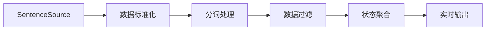

# 无界流处理 (Unlimited Streaming)

> 无界流处理是SAGE框架的核心能力之一，用于处理持续产生的数据流，支持实时数据分析、监控和交互式应用。

## 什么是无界流处理？

无界流处理是一种数据处理模式，其特点是数据源会持续不断地产生新数据，没有预定义的结束点。这种模式特别适合：

- **实时数据监控**：如网站访问日志、传感器数据流
- **用户交互应用**：如聊天机器人、问答系统
- **事件驱动系统**：如消息队列处理、实时通知

### 核心设计理念

SAGE的无界流处理基于以下核心概念：

1. **数据源持续性**：通过 `SourceFunction` 基类，`execute()` 方法被框架持续调用
2. **流式管道**：使用 `.from_source()` 启动，支持链式数据转换操作
3. **状态管理**：支持跨数据项的状态维护，如累积计算、窗口统计
4. **生命周期控制**：通过异常处理和用户中断实现优雅的启动和停止

---

## 示例1：WordCount流处理 - 无大模型参与

### 业务场景描述

构建一个实时词频统计系统，能够：
- 持续接收文本数据流
- 实时统计每个词的出现频次
- 定期输出统计结果
- 支持用户随时停止处理

这是典型的流式数据聚合场景，展示了SAGE处理持续数据流的基本能力。

### 技术架构设计



### 核心组件实现

#### 1. 无界流数据源设计

```python
from sage.core.function.source_function import SourceFunction

class SentenceSource(SourceFunction):
    """文本数据无界流源 - 模拟持续的文本数据输入"""
    def __init__(self, **kwargs):
        super().__init__(**kwargs)
        self.sentences = [
            "hello world sage framework",
            "this is a streaming data processing example",
            "lambda functions make the code much cleaner",
            "word count is a classic big data example",
            "sage provides powerful stream processing capabilities"
        ]
        self.counter = 0
    
    def execute(self):
        """
        核心执行方法 - 被SAGE框架持续调用
        每次调用返回一个数据项，模拟持续的数据流
        """
        sentence = self.sentences[self.counter % len(self.sentences)]
        self.counter += 1
        return sentence
```

**设计关键点**：
- **继承 `SourceFunction`**：这是创建无界流数据源的必要条件
- **`execute()` 方法**：框架会持续调用此方法获取新数据
- **循环数据生成**：使用取模运算实现数据的循环产生，模拟真实的无界数据流
- **状态维护**：通过 `self.counter` 维护数据源的内部状态

#### 2. 流式数据处理管道

```python
from sage.core.api.local_environment import LocalEnvironment
from collections import Counter
import time

def create_wordcount_pipeline():
    """创建WordCount无界流处理管道"""
    # 1. 创建流处理环境
    env = LocalEnvironment("wordcount_streaming")
    
    # 2. 定义全局状态管理
    word_counts = Counter()
    total_processed = 0
    
    def update_word_count(word_count_tuple):
        """
        状态聚合函数 - 维护全局词频统计
        这是流处理中状态管理的核心模式
        """
        nonlocal word_counts, total_processed
        word, count = word_count_tuple
        word_counts[word] += count
        total_processed += count
        
        # 定期输出统计结果 - 流处理的实时反馈机制
        if total_processed % 10 == 0:
            print(f"\n=== 实时词频统计 (已处理: {total_processed}) ===")
            for word, count in word_counts.most_common(10):
                print(f"{word:20}: {count:3d}")
            print("=" * 50)
        
        return word_count_tuple
    
    # 3. 构建流式处理管道
    (env
        .from_source(SentenceSource, delay=1.0)          # 启动无界流，控制数据频率
        .map(lambda sentence: sentence.lower())           # 数据标准化
        .filter(lambda sentence: len(sentence) > 0)       # 数据质量保证
        .flatmap(lambda sentence: sentence.split())       # 数据解构（一对多转换）
        .filter(lambda word: len(word) > 2)              # 业务规则过滤
        .map(lambda word: word.replace(",", "").replace(".", ""))  # 数据清洗
        .map(lambda word: (word, 1))                     # 数据格式转换
        .map(update_word_count)                          # 状态聚合
        .print()                                         # 流式输出
    )
    
    # 4. 启动和生命周期管理
    print("🚀 启动WordCount流处理系统")
    print("📊 系统将实时统计词频，每处理10个词显示一次结果")
    print("⏹️  按 Ctrl+C 停止处理")
    
    try:
        env.submit()                    # 启动流处理管道
        time.sleep(60)                  # 运行60秒
    except KeyboardInterrupt:
        print("\n🛑 用户终止处理")
        # 输出最终统计结果
        print("\n📈 最终词频统计:")
        for word, count in word_counts.most_common():
            print(f"{word:20}: {count:3d}")
    finally:
        env.close()                     # 资源清理
```

### 流处理核心概念解析

#### 数据流转换链路
1. **数据源** → **标准化** → **分词** → **过滤** → **聚合** → **输出**
2. 每个环节都是流式处理，数据逐条通过整个管道
3. 状态在 `update_word_count` 函数中累积，实现跨数据项的聚合计算

#### delay参数的作用
```python
.from_source(SentenceSource, delay=1.0)  # 每秒产生一个数据项
```
- **控制数据频率**：防止数据源产生过快导致系统过载
- **模拟真实场景**：真实环境中数据通常有自然的时间间隔
- **便于观察调试**：慢速数据流便于观察处理效果和调试问题

#### 状态管理模式
无界流处理中的状态管理是核心挑战，SAGE通过以下方式解决：
- **全局状态变量**：使用 `nonlocal` 或全局变量维护跨调用状态
- **函数闭包**：利用Python闭包特性封装状态更新逻辑
- **实时输出**：定期输出中间结果，提供处理进度反馈

---

## 示例2：QA终端交互 - 有大模型参与

### 业务场景描述

构建一个智能问答系统，具备以下能力：
- 用户在终端持续输入问题
- 系统调用大语言模型生成回答
- 实时返回格式化的答案
- 支持多轮对话直到用户退出

这是典型的交互式AI应用场景，展示了SAGE集成大模型的流处理能力。

### 技术架构设计


### 核心组件实现

#### 1. 交互式无界流数据源

```python
class TerminalInputSource(SourceFunction):
    """终端交互输入源 - 用户驱动的无界流"""
    def execute(self, data=None):
        """
        等待用户输入的阻塞式数据源
        这种模式适合交互式应用场景
        """
        try:
            user_input = input("💬 请输入问题: ").strip()
            if user_input:
                return user_input
            # 空输入时递归等待，确保数据流连续性
            return self.execute(data)
        except (EOFError, KeyboardInterrupt):
            # 正确传播用户中断信号
            raise
```

**设计特点**：
- **用户驱动**：不同于定时数据源，这里由用户输入驱动数据流
- **自然阻塞**：`input()` 函数提供天然的阻塞等待机制
- **异常处理**：正确处理用户中断和输入结束信号

#### 2. 智能处理组件

```python
from sage.core.function.map_function import MapFunction
from sage.core.function.sink_function import SinkFunction

class QuestionProcessor(MapFunction):
    """问题预处理组件"""
    def execute(self, data):
        """
        对用户输入进行标准化处理
        确保下游组件接收到的数据质量
        """
        if not data or data.strip() == "":
            return None
        return data.strip()

class AnswerFormatter(MapFunction):
    """回答格式化组件"""
    def execute(self, data):
        """
        格式化大模型的输出结果
        OpenAIGenerator返回格式: (user_query, generated_text)
        """
        if not data:
            return None
        
        if isinstance(data, tuple) and len(data) >= 2:
            user_query, answer = data[0], data[1]
            return {
                "question": user_query,
                "answer": answer,
                "timestamp": time.strftime("%Y-%m-%d %H:%M:%S"),
                "model": "OpenAI GPT"
            }
        else:
            return {
                "answer": str(data),
                "timestamp": time.strftime("%Y-%m-%d %H:%M:%S"),
                "model": "Unknown"
            }

class ConsoleSink(SinkFunction):
    """美化的控制台输出组件"""
    def execute(self, data):
        """
        提供用户友好的输出格式
        这是用户体验的重要组成部分
        """
        if isinstance(data, dict):
            print(f"\n{'='*60}")
            print(f"🤖 AI助手回答:")
            print(f"{data.get('answer', 'N/A')}")
            print(f"{'='*60}")
            print(f"⏰ 时间: {data.get('timestamp', 'N/A')}")
            print()
        else:
            print(f"\n🤖 {data}\n")
        return data
```

#### 3. 大模型集成管道

```python
from sage.lib.rag.generator import OpenAIGenerator
from sage.lib.rag.promptor import QAPromptor
from dotenv import load_dotenv
from sage.utils.config_loader import load_config

def create_qa_pipeline():
    """创建智能问答无界流处理管道"""
    # 1. 环境和配置初始化
    load_dotenv(override=False)
    config = load_config("config_source.yaml")
    env = LocalEnvironment("interactive_qa")
    
    # 2. 用户界面初始化
    print("🎯 SAGE智能问答系统")
    print("💡 输入问题获得AI回答，按Ctrl+C退出")
    print("-" * 50)
    
    try:
        # 3. 构建大模型集成管道
        (env
            .from_source(TerminalInputSource)              # 用户交互输入
            .map(QuestionProcessor)                        # 问题预处理
            .filter(lambda q: q is not None)              # 数据质量保证
            .map(QAPromptor, config["promptor"])           # 提示词工程
            .map(OpenAIGenerator, config["generator"]["vllm"])  # 大模型推理
            .map(AnswerFormatter)                          # 结果格式化
            .sink(ConsoleSink)                            # 用户界面输出
        )
        
        # 4. 启动交互式服务
        env.submit()
        
        # 5. 保持服务运行直到用户退出
        while True:
            time.sleep(1)
            
    except KeyboardInterrupt:
        print("\n\n👋 感谢使用SAGE问答系统！")
    except Exception as e:
        print(f"❌ 系统错误: {str(e)}")
    finally:
        env.close()
```

### 大模型集成核心概念

#### 提示词工程 (QAPromptor)
- **功能**：将用户问题转换为适合大模型的提示词格式
- **配置**：通过 `config["promptor"]` 配置模板和参数
- **输出**：格式化的提示词字符串

#### 大模型推理 (OpenAIGenerator)
- **功能**：调用OpenAI API进行文本生成
- **输入**：提示词字符串
- **输出**：`(原始问题, 生成答案)` 元组
- **配置**：模型类型、温度、最大长度等参数

#### 数据流转换模式
```
用户输入 → 问题清洗 → 提示词构造 → 大模型推理 → 答案格式化 → 界面展示
```

#### 无需delay参数的原因
```python
.from_source(TerminalInputSource)  # 无delay参数
```
- **自然节流**：用户输入本身就是最好的流量控制机制
- **按需触发**：只有用户输入时才产生数据，避免资源浪费
- **响应式设计**：符合交互式应用的响应式设计理念

---

## 无界流处理最佳实践

### 1. 数据源设计模式

#### 定时数据源模式
```python
class TimerSource(SourceFunction):
    def execute(self):
        return generate_time_series_data()  # 定时产生数据
```

#### 事件驱动数据源模式
```python
class EventSource(SourceFunction):
    def execute(self):
        return wait_for_external_event()    # 等待外部事件
```

#### 队列消费数据源模式
```python
class QueueSource(SourceFunction):
    def execute(self):
        return consume_from_message_queue()  # 从消息队列消费
```

### 2. 状态管理策略

#### 简单累积状态
```python
def create_accumulator():
    total = 0
    def accumulate(value):
        nonlocal total
        total += value
        return total
    return accumulate
```

#### 滑动窗口状态
```python
from collections import deque

def create_sliding_window(window_size):
    window = deque(maxlen=window_size)
    def add_to_window(value):
        window.append(value)
        return list(window)
    return add_to_window
```

#### 复杂状态对象
```python
class StatefulProcessor(MapFunction):
    def __init__(self, **kwargs):
        super().__init__(**kwargs)
        self.state = {"count": 0, "sum": 0, "history": []}
    
    def execute(self, data):
        self.state["count"] += 1
        self.state["sum"] += data
        self.state["history"].append(data)
        return self.state.copy()
```

### 3. 错误处理和恢复

#### 数据源错误处理
```python
class RobustSource(SourceFunction):
    def execute(self):
        try:
            return self.get_data()
        except Exception as e:
            print(f"数据源错误: {e}")
            time.sleep(1)  # 错误恢复延迟
            return self.get_fallback_data()
```

#### 处理函数错误恢复
```python
def robust_processor(data):
    try:
        return process_data(data)
    except Exception as e:
        print(f"处理错误: {e}")
        return None  # 跳过错误数据
```

### 4. 性能优化建议

#### 合理设置delay参数
```python
# 高频数据源
.from_source(HighFreqSource, delay=0.1)    # 100ms间隔

# 中频数据源  
.from_source(MediumFreqSource, delay=1.0)  # 1秒间隔

# 低频数据源
.from_source(LowFreqSource, delay=10.0)    # 10秒间隔
```

#### 避免阻塞操作
```python
# 错误：在流处理中进行耗时操作
def bad_processor(data):
    time.sleep(5)  # 阻塞整个流
    return process(data)

# 正确：使用异步或快速处理
def good_processor(data):
    # 快速处理或异步提交
    return quick_process(data)
```

#### 批量优化
```python
class BatchProcessor(MapFunction):
    def __init__(self, batch_size=10, **kwargs):
        super().__init__(**kwargs)
        self.batch = []
        self.batch_size = batch_size
    
    def execute(self, data):
        self.batch.append(data)
        if len(self.batch) >= self.batch_size:
            result = process_batch(self.batch)
            self.batch = []
            return result
        return None
```

---

## 运行示例和验证

### WordCount流处理运行
```bash
cd app/api_examples
python wordcount_lambda_example.py
```

**预期行为**：
1. 系统启动并显示欢迎信息
2. 每秒处理一个句子，实时分词和统计
3. 每处理10个词显示一次统计结果
4. 用户按Ctrl+C可随时停止并查看最终结果

### QA交互系统运行
```bash
cd app
python qa_source.py
```

**预期行为**：
1. 系统启动并提示用户输入
2. 用户输入问题后系统调用大模型生成回答
3. 回答以美化格式显示在终端
4. 支持多轮对话直到用户退出

### 验证系统行为
- **数据流连续性**：确认数据能够持续处理
- **状态正确性**：验证累积统计结果正确
- **异常恢复**：测试各种异常情况的处理
- **性能表现**：观察系统资源使用情况

---

## 总结

无界流处理是SAGE框架的核心能力，通过以下关键特性支持实时数据处理：

### 技术特性
- **持续数据流**：通过 `SourceFunction` 实现持续的数据产生
- **流式管道**：支持复杂的数据转换和处理链路
- **状态管理**：提供灵活的跨数据项状态维护机制
- **大模型集成**：无缝集成各种AI服务和大模型API

### 应用价值
- **实时性**：支持毫秒级的数据处理响应
- **可扩展**：模块化设计便于功能扩展和性能优化
- **易用性**：链式API降低开发复杂度
- **鲁棒性**：完善的错误处理和恢复机制

通过WordCount和QA两个示例，您可以掌握SAGE无界流处理的核心概念和实践模式，为构建各种实时数据处理应用奠定基础。
