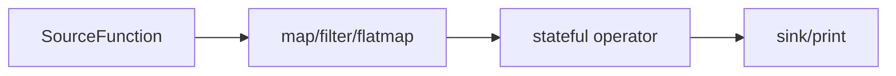

# 无界流处理 (Unlimited Streaming)

> 处理持续产生的数据流，支持实时数据分析、监控和交互式应用。

## 核心概念

- **数据源持续性**：继承 `SourceFunction`，`execute()` 被框架循环调用
- **流式管道**：使用 `.from_source()` 启动，链式调用实现转换
- **状态管理**：闭包或类属性维护跨数据项状态，如累积统计、窗口计算
- **生命周期控制**：`env.submit()` 启动，`KeyboardInterrupt` 或 `env.close()` 停止

无界流处理模拟真实世界中的**连续数据流**，如传感器数据、用户点击流、消息队列等。它强调实时性和响应性，是构建现代数据驱动应用的核心模式。

## 技术架构



---

## 示例1：WordCount 实时统计

WordCount在无界流模式下展现了实时数据处理的魅力。与批处理不同，这里的词频统计是持续更新的，每当新数据到达就会立即处理并更新统计结果。

### 数据源定义

以下示例来自 `examples/tutorials/core-api/wordcount_lambda_example.py`：

```python
from sage.core.api.function.source_function import SourceFunction

class SentenceSource(SourceFunction):
    def __init__(self, **kwargs):
        super().__init__(**kwargs)
        self.sentences = [
            "hello world sage framework",
            "this is a streaming data processing example",
            "lambda functions make the code much cleaner",
            "word count is a classic big data example",
            "sage provides powerful stream processing capabilities"
        ]
        self.counter = 0
    
    def execute(self):
        # 循环选择句子，模拟持续数据流
        sentence = self.sentences[self.counter % len(self.sentences)]
        self.counter += 1
        return sentence
```

### 核心管道代码

```python
from sage.core.api.local_environment import LocalEnvironment
from collections import Counter
import time

def main():
    # 创建环境
    env = LocalEnvironment("wordcount_example")
    
    # 全局词汇计数器
    word_counts = Counter()
    total_processed = 0
    
    def update_word_count(words_with_count):
        """更新全局词汇计数"""
        nonlocal word_counts, total_processed
        word, count = words_with_count
        word_counts[word] += count
        total_processed += count
        
        # 每处理10个词就打印一次统计结果
        if total_processed % 10 == 0:
            print(f"\n=== Word Count Statistics (Total: {total_processed}) ===")
            for word, count in word_counts.most_common(10):
                print(f"{word:20}: {count:3d}")
            print("=" * 50)
        
        return word
    
    # 构建流处理管道
    (env
        .from_source(SentenceSource, delay=1.0)  # 每秒产生一个句子
        
        # 数据清洗和预处理
        .map(lambda sentence: sentence.lower())           # 转小写
        .map(lambda sentence: sentence.strip())           # 去除首尾空白
        .filter(lambda sentence: len(sentence) > 0)       # 过滤空字符串
        
        # 分词处理
        .flatmap(lambda sentence: sentence.split())       # 按空格分词
        .filter(lambda word: len(word) > 2)              # 过滤长度小于3的词
        .map(lambda word: word.replace(",", "").replace(".", ""))  # 去除标点
        
        # 词汇统计
        .map(lambda word: (word, 1))                     # 转换为 (word, count) 格式
        .map(update_word_count)                          # 更新计数器
        .sink(lambda x: None)                           # 确保数据流完整
    )
    
    print("🚀 Starting WordCount Example with Lambda Functions")
    print("📝 Processing sentences and counting words...")
    print("⏹️  Press Ctrl+C to stop")
    
    try:
        # 运行流处理
        env.submit()
        time.sleep(60)  # 运行60秒以观察输出
    except KeyboardInterrupt:
        print("\n\n🛑 Stopping WordCount Example...")
        print("\n📊 Final Word Count Results:")
        print("=" * 60)
        for word, count in word_counts.most_common():
            print(f"{word:20}: {count:3d}")
        print("=" * 60)
        print(f"Total words processed: {total_processed}")
    finally:
        env.close()

if __name__ == "__main__":
    main()
    
    print("🚀 Starting Streaming WordCount Example")
    
    try:
        # 启动流处理
        env.submit()
        
        # 运行一段时间
        time.sleep(20)
        print(f"\n📊 Final Statistics: {total_processed} words processed")
        
    except KeyboardInterrupt:
        print("\n⏹️ Stopping stream processing...")
    finally:
        env.close()

if __name__ == "__main__":
    main()
```

### 关键技术要点

#### 1. **持续数据流**
```python
def execute(self):
    # 循环选择句子，模拟持续数据流
    sentence = self.sentences[self.counter % len(self.sentences)]
    self.counter += 1
    return sentence
```

- 使用取模运算实现循环数据生成
- 永不返回 `None`，保持数据流连续性

#### 2. **实时状态更新**
```python
# 每处理10个词就打印一次统计结果
if total_processed % 10 == 0:
    print(f"=== Word Count Statistics (Total: {total_processed}) ===")
```

- 实时显示处理进度和统计结果
- 提供即时反馈和监控

### 关键技术特点说明

#### 1. **实时状态累积**
```python
word_counts = Counter()  # 全局词频计数器
total_processed = 0      # 处理总数计数器
```

- 使用全局变量维护跨数据项的累积状态
- `Counter`对象提供高效的词频统计功能
- 状态在整个流处理生命周期中持续更新

#### 2. **流式处理链**
```python
.flatmap(lambda sentence: sentence.split())  # 一句话变成多个词
.map(lambda word: (word, 1))                 # 每个词标记为1次出现
.map(update_word_count)                      # 累积到全局计数器
```

- `flatmap`实现一对多转换：一个句子→多个单词
- 每个单词被转换为`(word, 1)`的元组格式
- `update_word_count`函数负责状态更新和条件输出

### 预期输出效果

运行这个例子，你会看到类似的实时输出：
```
🚀 启动无界流WordCount处理...
📊 将每10个词输出一次统计结果
⏹️  运行60秒后自动停止

('hello', 1)
('world', 1)
('sage', 1)
...

=== Word Count Statistics (Total: 10) ===
sage                :   2
example             :   2
data                :   1
world               :   1
hello               :   1
==================================================
```

这种实时更新的特性使得无界流WordCount特别适合：

- **实时监控**：监控网站访问日志中的关键词频
- **社交媒体分析**：实时统计推文或评论中的热门词汇
- **系统日志分析**：持续分析服务器日志中的错误关键词

---

## 核心技术对比
```
import time

class SystemMetricsSource(SourceFunction):
    """系统指标数据源 - 模拟持续的监控数据"""
    def execute(self):
        # 模拟系统指标
        metrics = {
            "timestamp": time.time(),
            "cpu_usage": random.uniform(10, 90),
            "memory_usage": random.uniform(30, 80),
            "disk_io": random.uniform(0, 100),
            "network_traffic": random.uniform(0, 1000)
        }
        return metrics

class AlertProcessor(MapFunction):
    """告警处理器"""
    def execute(self, data):
        alerts = []
        
        if data["cpu_usage"] > 80:
            alerts.append(f"🔥 CPU使用率过高: {data['cpu_usage']:.1f}%")
        
        if data["memory_usage"] > 75:
            alerts.append(f"⚠️ 内存使用率过高: {data['memory_usage']:.1f}%")
        
        if alerts:
            data["alerts"] = alerts
        
        return data

class MonitoringSink(SinkFunction):
    """监控输出"""
    def execute(self, data):
        timestamp = time.strftime("%H:%M:%S", time.localtime(data["timestamp"]))
        print(f"[{timestamp}] CPU: {data['cpu_usage']:.1f}% | MEM: {data['memory_usage']:.1f}%")
        
        if "alerts" in data:
            for alert in data["alerts"]:
                print(f"  🚨 {alert}")
        
        return data

def monitoring_pipeline():
    """系统监控流处理管道"""
    env = LocalEnvironment("system_monitoring")
    
    (env
        .from_source(SystemMetricsSource, delay=2.0)  # 每2秒采集一次
        .map(AlertProcessor)
        .sink(MonitoringSink)
    )
    
    try:
        print("📊 系统监控启动...")
        env.submit()
        time.sleep(60)  # 监控1分钟
    except KeyboardInterrupt:
        print("\n⏹️ 停止监控")
    finally:
        env.close()

if __name__ == "__main__":
    monitoring_pipeline()
```

---

## 核心技术对比

### 有界流 vs 无界流

| 特性 | 有界流（Batch） | 无界流（Streaming） |
|------|----------------|-------------------|
| **数据源** | BatchFunction | SourceFunction |
| **结束条件** | 返回 `None` | 永不结束（除非异常） |
| **状态管理** | 批量聚合 | 实时累积 |
| **输出模式** | 最终结果 | 增量更新 |
| **适用场景** | 离线分析、报告生成 | 实时监控、在线服务 |

### 生命周期管理

```python
# 无界流的典型生命周期
try:
    env.submit()          # 启动流处理
    while True:           # 保持运行
        time.sleep(1)
except KeyboardInterrupt: # 优雅停止
    print("Stopping...")
finally:
    env.close()           # 清理资源
```

---

## 最佳实践

### 1. **数据源设计**
- 实现适当的延迟控制（`delay`参数）
- 处理异常和中断信号
- 提供数据质量保证

### 2. **状态管理**
- 使用 `nonlocal` 或全局变量管理状态
- 定期保存重要状态数据
- 实现状态恢复机制

### 3. **性能优化**
- 控制数据生成速率
- 使用批量处理减少开销
- 实施背压控制

### 4. **错误处理**
- 实现健壮的异常处理
- 提供优雅的停止机制
- 记录详细的错误日志

---

### 知识检索组件
```

### 知识检索组件

这里的知识检索组件与批处理版本完全相同，体现了SAGE框架组件的良好复用性：

```python
from sage.core.api.function.map_function import MapFunction

class BiologyRetriever(MapFunction):
    """生物学知识检索器"""
    def __init__(self, config, **kwargs):
        super().__init__(**kwargs)
        self.config = config
        self.collection_name = config.get("collection_name", "biology_rag_knowledge")
        self.index_name = config.get("index_name", "biology_index")
        self.topk = config.get("ltm", {}).get("topk", 3)

    def execute(self, data):
        if not data:
            return None

        query = data
        # 从生物学知识库检索相关知识
        try:
            result = self.call_service["memory_service"].retrieve_data(
                collection_name=self.collection_name,
                query_text=query,
                topk=self.topk,
                index_name=self.index_name,
                with_metadata=True
            )

            if result['status'] == 'success':
                # 返回包含查询和检索结果的元组
                retrieved_texts = [item.get('text', '') for item in result['results']]
                return (query, retrieved_texts)
            else:
                return (query, [])

        except Exception as e:
            return (query, [])
```

### QA流处理管道

无界流的QA处理管道持续运行，实时响应用户问题。相比批处理，这里更注重服务的持续性和响应速度：

```python
from sage.core.api.local_environment import LocalEnvironment
from sage.lib.rag.generator import OpenAIGenerator
from sage.lib.rag.promptor import QAPromptor
from sage.middleware.services.memory.memory_service import MemoryService
from sage.utils.embedding_methods.embedding_api import apply_embedding_model

def create_qa_streaming():
    env = LocalEnvironment("qa_streaming")
    
    # 注册知识库服务
    def memory_service_factory():
        # 创建memory service实例
        embedding_model = apply_embedding_model("default")
        memory_service = MemoryService()

        # 检查生物学知识库是否存在
        try:
            collections = memory_service.list_collections()
            if collections["status"] != "success":
                return None

            collection_names = [c["name"] for c in collections["collections"]]
            if "biology_rag_knowledge" not in collection_names:
                return None

            # 连接到现有的知识库
            collection = memory_service.manager.connect_collection(
                "biology_rag_knowledge", embedding_model
            )
            if not collection:
                return None

        except Exception as e:
            return None

        return memory_service

    env.register_service("memory_service", memory_service_factory)

    # 构建QA流处理管道
    (env
        .from_source(QASource, delay=5.0)              # 每5秒产生一个问题
        .map(BiologyRetriever, config["retriever"])     # 知识检索
        .map(QAPromptor, config["promptor"])            # 提示词构造
        .map(OpenAIGenerator, config["generator"])      # 大模型生成
        .print()                                        # 输出答案
    )

    env.submit()
    time.sleep(300)  # 运行5分钟
    env.close()
```

### 关键参数说明

- `delay=5.0`：每5秒产生一个问题，模拟真实QA场景的频率
- `BiologyRetriever`：从知识库检索相关信息，与批处理版本代码一致
- `QAPromptor`：将问题和知识组合成提示词
- `OpenAIGenerator`：调用大模型生成答案

---

## 代码关键细节解析

通过前面两个示例的对比，我们可以看到无界流处理的核心特征。现在让我们深入分析实现细节：

#### 1. 无界数据源的循环机制
```python
def execute(self):
    question = self.questions[self.counter % len(self.questions)]  # 取模运算实现循环
    self.counter += 1
    return question  # 永远不返回None，保持数据流持续
```

设计要点：

- 使用 `%` 取模运算实现数据的循环产生
- **永远不返回 `None`**，这是无界流与有界流的核心区别
- `self.counter` 可以无限增长，取模运算保证索引有效

#### 2. delay 参数的节流作用
```python
.from_source(QASource, delay=5.0)  # 每5秒产生一个问题
```

性能控制：

- `delay` 参数在框架内部控制 `execute()` 的调用频率
- 避免过快调用大模型API导致费用过高
- 模拟真实QA系统中问题到达的自然间隔

#### 3. 服务注册机制
```python
env.register_service("memory_service", memory_service_factory)
```

框架特性：

- SAGE支持服务注册，实现组件间的依赖注入
- `self.call_service["memory_service"]` 可访问注册的服务
- memory_service_factory负责创建和配置知识库连接

---

## 小结

无界流处理通过**持续数据源**、**链式转换**和**状态管理**，支持实时分析与交互式应用。核心在于正确使用 `.from_source()` 启动管道，通过 `submit()` 执行，通过中断或 `close()` 停止。

### 关键特点

- **持续性**：数据源永不返回 `None`，保持数据流持续
- **实时性**：支持实时状态更新和结果输出
- **可控性**：通过 `delay` 参数控制数据产生频率
- **服务集成**：支持复杂的服务依赖和组件协作

### 适用场景

实时监控、流式分析、在线推理、交互式AI应用等需要持续处理数据流的场景。
