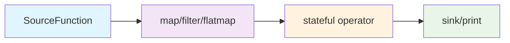

# 无界流处理 (Unlimited Streaming) :material-infinity:

> :fontawesome-solid-stream: 处理持续产生的数据流，支持实时数据分析、监控和交互式应用。

## 核心概念 :material-lightbulb:

- **数据源持续性** :octicons-sync-16: ：继承 `SourceFunction`，`execute()` 被框架循环调用
- **流式管道** :material-pipe: ：使用 `.from_source()` 启动，链式调用实现转换
- **状态管理** :material-database: ：闭包或类属性维护跨数据项状态，如累积统计、窗口计算
- **生命周期控制** :material-lifecycle: ：`env.submit()` 启动，`KeyboardInterrupt` 或 `env.close()` 停止

!!! info "设计理念"
    无界流处理模拟真实世界中的**连续数据流**，如传感器数据、用户点击流、消息队列等。它强调==实时性==和==响应性==，是构建现代数据驱动应用的核心模式。

## 技术架构 :material-sitemap:



---

## 示例1：WordCount 实时统计 :material-counter:

!!! example "使用场景"
    实时分析社交媒体数据流、监控系统日志、统计网站访问词频等场景。

### 核心管道代码（重点） :octicons-code-16:

=== "完整管道"
    ```python linenums="1" hl_lines="17-26" title="无界流WordCount核心管道"
    from sage.core.api.local_environment import LocalEnvironment
    from collections import Counter
    import time

    env = LocalEnvironment("wordcount_streaming")
    word_counts = Counter()
    total_processed = 0

    def update_word_count(word_count_tuple):
        nonlocal word_counts, total_processed
        word, count = word_count_tuple
        word_counts[word] += count
        total_processed += count
        
        if total_processed % 10 == 0:
            print(f"实时统计(已{total_processed}):", word_counts.most_common(5))
        return word_count_tuple

    (env
        .from_source(SentenceSource, delay=1.0)     # 每秒一条数据
        .map(lambda s: s.lower().strip())           # 标准化
        .filter(lambda s: len(s) > 0)               # 过滤空行
        .flatmap(lambda s: s.split())               # 分词
        .filter(lambda w: len(w) > 2)               # 过滤短词
        .map(lambda w: (w.replace(",", "").replace(".", ""), 1))  # 清洗计数
        .map(update_word_count)                     # 累积统计
        .print()                                    # 实时输出
    )

    env.submit()                                    # 启动流处理
    time.sleep(60)                                  # 运行60秒
    env.close()
    ```

=== "数据源定义"
    ```python linenums="1" title="SentenceSource数据源"
    from sage.core.function.source_function import SourceFunction

    class SentenceSource(SourceFunction):
        def __init__(self, **kwargs):
            super().__init__(**kwargs)
            self.sentences = [
                "hello world sage framework",
                "this is a streaming data processing example",
                "lambda functions make the code much cleaner",
                "word count is a classic big data example",
                "sage provides powerful stream processing capabilities"
            ]
            self.counter = 0

        def execute(self):
            # 模拟持续数据流，循环返回
            text = self.sentences[self.counter % len(self.sentences)]
            self.counter += 1
            return text
    ```

!!! tip "关键参数说明"
    - `delay=1.0` :material-timer: ：控制数据产生频率，防止系统过载
    - `update_word_count` :material-function: ：维护全局状态，定期输出统计结果
    - `env.submit()` :material-play: ：启动并持续调用数据源的 `execute()` 方法

### 代码关键细节解析 :material-magnify:

#### 1. 无界数据源的循环机制
```python title="持续数据生成的实现"
def execute(self):
    text = self.sentences[self.counter % len(self.sentences)]  # 取模运算实现循环
    self.counter += 1
    return text  # 永远不返回None，保持数据流持续
```

!!! note "设计要点"
    - 使用 `%` 取模运算实现数据的循环产生
    - **永远不返回 `None`**，这是无界流与有界流的核心区别
    - `self.counter` 可以无限增长，取模运算保证索引有效

#### 2. delay 参数的节流作用
```python title="流量控制机制"
.from_source(SentenceSource, delay=1.0)  # 每秒产生一条数据
```

!!! warning "性能控制"
    - `delay` 参数在框架内部控制 `execute()` 的调用频率
    - 避免数据源过快产生数据导致系统过载
    - 模拟真实世界中数据的自然间隔

#### 3. 实时状态更新策略
```python title="增量统计与定期输出"
def update_word_count(word_count_tuple):
    nonlocal word_counts, total_processed
    word_counts[word] += count
    total_processed += count
    
    if total_processed % 10 == 0:  # 每处理10个词输出一次
        print(f"实时统计:", word_counts.most_common(5))
    return word_count_tuple
```

!!! tip "实时处理技巧"
    - 使用计数器控制输出频率，避免输出过于频繁
    - 只显示 Top5 高频词，保持输出简洁
    - 状态实时更新但输出有节制

---

## 示例2：终端交互问答（重点） :material-chat: 

!!! success "应用亮点"
    这是 SAGE 框架的==明星功能==，展示了用户驱动的实时AI交互能力！ :star:

### 场景说明 :material-scenario:

构建一个智能问答系统，用户通过终端输入问题，系统实时调用大模型生成回答。这是典型的**交互式无界流应用**，展示了用户驱动的数据流处理模式。

### 1. 交互式数据源设计 :material-account-voice:

```python linenums="1" title="TerminalInputSource - 用户输入驱动的数据源"
from sage.core.function.source_function import SourceFunction

class TerminalInputSource(SourceFunction):
    """终端输入数据源 - 等待用户输入驱动数据流"""
    def execute(self, data=None):
        try:
            user_input = input("💬 请输入问题: ").strip()
            if user_input:
                return user_input
            # 空输入时递归等待，确保数据流连续性
            return self.execute(data)
        except (EOFError, KeyboardInterrupt):
            raise  # 正确传播用户中断信号
```

!!! note "设计特点"
    - **用户驱动** :material-account: ：不同于定时数据源，这里由用户输入驱动数据流
    - **自然阻塞** :material-pause: ：`input()` 函数提供天然的阻塞等待机制
    - **中断处理** :material-stop: ：正确处理用户 ++ctrl+c++ 中断信号

### 2. 问题处理组件 :material-cog:

=== "问题预处理器"
    ```python linenums="1" title="QuestionProcessor - 智能问题处理"
    from sage.core.function.map_function import MapFunction

    class QuestionProcessor(MapFunction):
        """问题预处理器 - 清洗用户输入并构造提示词"""
        def execute(self, data):
            if not data:
                return None
            
            # 对用户输入进行标准化处理
            question = data.strip()
            if len(question) < 2:
                return None
            
            # 构造适合大模型的提示词格式
            prompt = f"请回答以下问题：{question}"
            return prompt
    ```

=== "回答格式化器"
    ```python linenums="1" title="AnswerFormatter - 美化AI回答"
    class AnswerFormatter(MapFunction):
        """回答格式化组件"""
        def execute(self, data):
            if not data:
                return None
            
            # OpenAIGenerator返回格式: (user_query, generated_text)
            if isinstance(data, tuple) and len(data) == 2:
                user_query, generated_text = data
                return {
                    "question": user_query,
                    "answer": generated_text,
                    "timestamp": time.strftime("%Y-%m-%d %H:%M:%S")
                }
            else:
                return {
                    "answer": str(data),
                    "timestamp": time.strftime("%Y-%m-%d %H:%M:%S"),
                    "model": "Unknown"
                }
    ```

=== "控制台输出器"
    ```python linenums="1" title="ConsoleSink - 用户友好的输出"
    from sage.core.function.sink_function import SinkFunction

    class ConsoleSink(SinkFunction):
        """控制台输出组件"""
        def execute(self, data):
            if not data:
                return
            
            # 提供用户友好的输出格式
            print(f"\n{'='*60}")
            print(f"🤖 AI助手回答:")
            print(f"{data.get('answer', 'N/A')}")
            print(f"{'='*60}")
            print(f"⏰ 时间: {data.get('timestamp', 'N/A')}")
            print()
    ```

### 3. 完整交互问答管道（重点） :material-rocket:

```python linenums="1" hl_lines="13-19" title="智能问答系统 - 完整实现"
from sage.core.api.local_environment import LocalEnvironment
from sage.lib.rag.generator import OpenAIGenerator
from dotenv import load_dotenv
from sage.utils.config_loader import load_config

def create_interactive_qa():
    """创建智能问答无界流处理管道"""
    # 1. 环境和配置初始化
    load_dotenv(override=False)
    config = load_config("config.yaml")
    env = LocalEnvironment("interactive_qa")

    # 2. 构建交互式问答管道
    (env
        .from_source(TerminalInputSource)              # 用户交互输入
        .map(QuestionProcessor)                        # 问题预处理
        .filter(lambda q: q is not None)              # 数据质量保证
        .map(OpenAIGenerator, config["generator"]["vllm"])  # 大模型推理
        .map(AnswerFormatter)                          # 结果格式化
        .sink(ConsoleSink)                            # 用户界面输出
    )

    print("💡 输入问题获得AI回答，按Ctrl+C退出")
    print("-" * 50)

    try:
        # 3. 启动交互式服务
        env.submit()                                   # 启动并阻塞等待用户输入
        
        # 4. 保持服务运行直到用户退出
        while True:
            time.sleep(1)                              # 保持主线程存活
    except KeyboardInterrupt:
        print("\n\n👋 感谢使用SAGE问答系统！")
    except Exception as e:
        print(f"❌ 系统错误: {str(e)}")
    finally:
        env.close()

if __name__ == '__main__':
    create_interactive_qa()
```

### 4. 交互问答核心概念解析 :material-brain:

#### 用户驱动的数据流 :material-account-arrow-right:
!!! abstract "设计哲学"
    - **按需触发** :material-gesture-tap: ：只有用户输入时产生数据，避免无效计算
    - **自然节流** :material-speedometer: ：用户思考和输入时间天然控制了数据流速度
    - **响应式设计** :material-responsive: ：系统始终准备响应用户的下一个输入

#### 代码关键细节解析 :material-code-braces:

##### 1. 交互式数据源的阻塞机制
```python title="用户输入的自然节流"
def execute(self, data=None):
    user_input = input("💬 请输入问题: ").strip()  # 自然阻塞
    if user_input:
        return user_input
    return self.execute(data)  # 空输入时递归等待
```

!!! note "阻塞原理"
    - `input()` 函数天然提供阻塞等待，无需 `delay` 参数
    - 用户输入速度天然控制了数据流的频率
    - 递归调用处理空输入，保持数据流连续性

##### 2. 中断信号的正确处理
```python title="优雅的中断处理"
except (EOFError, KeyboardInterrupt):
    raise  # 关键：向上传播中断信号
```

!!! warning "重要细节"
    必须使用 `raise` 向上传播中断信号，让框架能够正确捕获用户的退出意图。

##### 3. 数据质量保证机制
```python title="多层数据验证"
.filter(lambda q: q is not None)  # 管道层面的质量保证

# 组件内部验证
if len(question) < 2:
    return None  # 过滤过短的输入
```

!!! tip "质量控制"
    - 管道层面使用 `filter` 过滤无效数据
    - 组件内部进行详细的数据验证
    - 双重保护确保下游组件接收到有效数据

##### 4. 主线程保活机制
```python title="保持服务运行的技巧"
while True:
    time.sleep(1)  # 保持主线程存活
```

!!! info "运行原理"
    - `env.submit()` 启动后台处理线程
    - 主线程需要保持活跃，否则程序会立即退出
    - `time.sleep(1)` 是最简单的保活方式

#### 大模型集成模式 :material-robot:
```python title="配置驱动的AI集成"
.map(OpenAIGenerator, config["generator"]["vllm"])
```

- **配置驱动** :material-cog-outline: ：通过配置文件灵活切换不同的大模型
- **异步处理** :material-sync: ：大模型API调用在流式管道中异步执行
- **错误容错** :material-shield-check: ：单次调用失败不会中断整个交互会话

#### 流式用户体验 :material-account-heart:

| 步骤 | 组件 | 功能 | 状态 |
|------|------|------|------|
| 1️⃣ | `TerminalInputSource` | 等待用户输入 | :material-timer: 阻塞等待 |
| 2️⃣ | `QuestionProcessor` | 清洗和预处理问题 | :material-filter: 数据清理 |
| 3️⃣ | `OpenAIGenerator` | 调用大模型生成回答 | :material-cloud: AI推理 |
| 4️⃣ | `AnswerFormatter` | 格式化输出结果 | :material-format-text: 美化输出 |
| 5️⃣ | `ConsoleSink` | 美化显示给用户 | :material-eye: 用户可见 |

#### 生命周期管理 :material-lifecycle:
```python title="优雅的服务管理" linenums="1" hl_lines="2 4 6"
try:
    env.submit()                    # 启动交互服务
    while True: time.sleep(1)       # 保持服务运行
except KeyboardInterrupt:           # 用户主动退出
    print("感谢使用！")
finally:
    env.close()                     # 清理资源
```

---

## 小结 :material-check-all:

!!! quote "核心价值"
    无界流处理通过**持续数据源**、**链式转换**和**状态管理**，支持实时分析与交互式应用。核心在于正确使用 `.from_source()` 启动管道，通过 `submit()` 执行，通过中断或 `close()` 停止。

!!! success "应用场景"
    **交互式应用**是无界流的重要应用场景，展现了框架在用户驱动场景下的==灵活性==和==实时响应能力==。 :rocket:

---

<center>
[:material-rocket: 开始构建你的第一个无界流应用](){ .md-button .md-button--primary }
[:material-book: 查看更多示例](){ .md-button }
</center>
