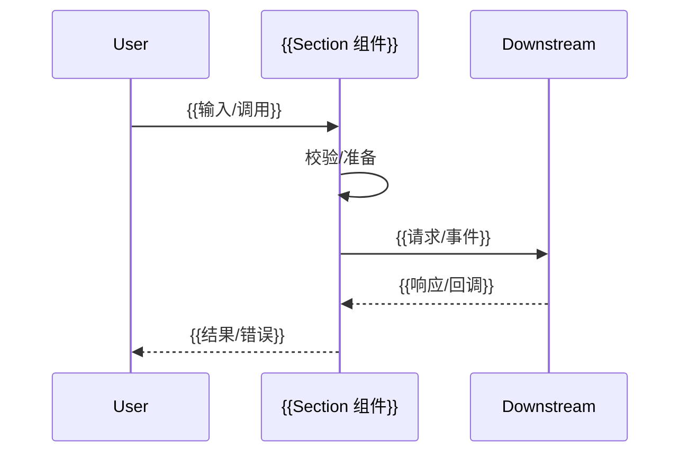

# SAGE 章节小节模板

<!-- 简要介绍：一句话讲清这个 Section 解决什么问题、适用在什么场景 -->

一句话概述：本节介绍 {{对象}}，用于 {{目标/场景}}，帮助你在 {{上下文/系统}} 中完成 {{任务}}。


<small>*注意，在了解本节之前需要提前了解以下知识：*</small>
!!! tip "先决条件（Prerequisites）"
    - 基础概念：{{RAG / Agent / 并发 / 事务 等}}
    - 推荐前置阅读：[\[返回 Chapter：{{所属章节名}}\]](../join_sage/overview_template.md)

---

## 一、快速开始

<!-- 写一个例子/一段故事/一次论证来简单介绍一下Section的某个作用/某个特性 -->

=== "Python"
    ```python title="最小可运行示例（可拷贝运行）" linenums="1"
    from {{package}} import {{ClassOrFn}}

    def main():
        cli = {{ClassOrFn}}({{可选参数}})
        result = cli.run({{输入}})
        print(result)

    if __name__ == "__main__":
        main()
    ```
=== "JavaScript"
    ```javascript title="最小可运行示例（ESM 或 TS）" linenums="1"
    // npm i {{pkg}}  或  pnpm add {{pkg}}
    import { {{fn}} } from "{{pkg}}";

    const out = await {{fn}}({{输入}});
    console.log(out);
    ```
=== "CLI"
    ```bash title="命令行一把梭"
    {{tool}} init {{project}}
    {{tool}} run --input {{path/to/input}} --output {{path/to/out}}
    ```

---

## 二、API 概览（签名 / 入口 / 速查）

> 这里放**最常用**的入口与签名；详细参数放到下一节“参数 & 返回”。

```python title="Python API 签名"
class {{ClassName}}:
    def __init__(self, {{参数列表}}): ...
    def run(self, {{参数}}) -> {{返回类型}}: ...
    async def arun(self, {{参数}}) -> {{返回类型}}: ...
```

---

## 三、参数 & 返回 & 错误

### 参数（Parameters）

| 名称           |         类型 |  必填 |      默认值      | 说明            |
| ------------ | ---------: | :-: | :-----------: | ------------- |
| `{{param1}}` | `{{type}}` |  是  |       —       | {{作用 / 取值范围}} |
| `{{param2}}` | `{{type}}` |  否  | `{{default}}` | {{影响 / 注意事项}} |

### 返回（Returns）

| 字段          | 类型         | 说明          |
| ----------- | ---------- | ----------- |
| `{{field}}` | `{{type}}` | {{含义 / 例子}} |

### 异常 / 错误码（Errors）

| 错误                  | 触发条件     | 建议修复        |
| ------------------- | -------- | ----------- |
| `{{ErrInvalidArg}}` | {{何时出现}} | {{如何修复}}    |
| `{{HTTP 429}}`      | {{限流}}   | {{退避/重试参数}} |

---

## 四、工作机制（由浅入深）



!!! info "设计动机 / 取舍"
    - 选择 {{算法/协议/存储}} 的原因：{{简述}}
    - 与 {{替代方案}} 相比的折中：{{性能、可维护性、成本}}

---

## 六、配置项（进阶）

| 配置键           | 类型             | 默认            | 说明     | 调优建议               |
| ------------- | -------------- | ------------- | ------ | ------------------ |
| `{{cfg.key}}` | `bool/int/str` | `{{default}}` | {{作用}} | {{在何种负载/场景下调大/调小}} |
