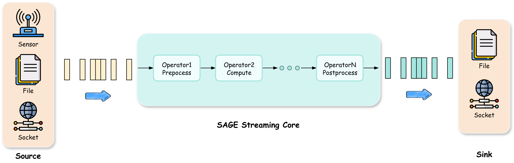

# SAGE Chapter

<!-- 简要介绍本章内容 & 阐明哪些对象应该阅读 & 先决知识-->
Chapter 为SAGE编程提供了XXX，XXX可以do something，例如something。

对于某些人来说，Chapter 通过提供XXX为其提供更便捷/高效的组件/函数/等等。

<small>*注意，在了解本章之前需要提前了解以下知识：*</small>

!!! tip "先决条件（Prerequisites）"
    - 基础概念：{例如RAG、Agent等等}
    - 前置知识：{需读的前一章链接}

---

## 一、Chapter Example

<!-- 写一个例子/一段故事/一次论证来简单介绍一下Chapter的某个作用/某个特性 -->

=== "Python"
    ```python title="pip 安装与最小可运行示例" linenums="1"
    import {{pkg}}
    def main():
        print("{{Hello from chapter}}")
    if __name__ == "__main__":
        main()
    ```
=== "JavaScript"
    ```javascript title="npm 安装与最小示例" linenums="1"
    import { {{fn}} } from "{{pkg}}";
    console.log({{fn}}("{{input}}"));
    ```

---

## 二、Chapter Detail Overview

<!-- 这里主要简单一下各个组件/函数/类/的功能 -->

### Section Ⅰ
Section Ⅰ 包含XXX类，提供XXX支持/功能，具有XXX特性。

XXX在设计之初是为了YYY，用户可通过XXX干ZZZ。详细信息，请参阅XXX。

!!! info "注"
    补充说明。

### Section Ⅱ
Same as above。

### Section Ⅲ
Same as above。

---

## 三、快速索引

<!-- 让“参考型信息”可扫读；深入细节放到子页面，章节页只保留索引与最快链接 -->
| 组件 | 入口 | 快速链接 |
|---|---|---|
| HTTP API | `{{/v1/resources}}` | [一句话叙述作用](../join_sage/detail_template.md) |
| SDK | `{{package/module}}` | [一句话叙述作用](../join_sage/detail_template.md) |
| CLI | `{{tool}}` | [一句话叙述作用](../join_sage/detail_template.md) |

<!-- 图片示例 -->
[](../assets/img/streaming.png)