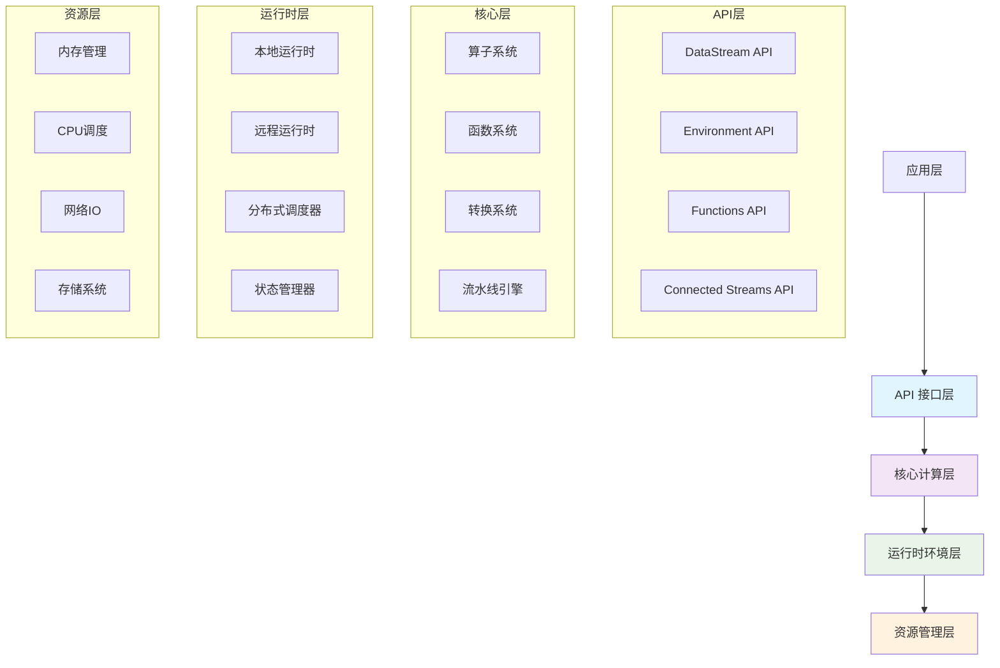

# SAGE Kernel 核心框架

SAGE Kernel 是 SAGE 框架的核心引擎，为大规模语言模型推理提供强大的流数据处理和分布式计算能力。作为整个 SAGE 生态系统的基石，它为上层中间件服务和应用组件提供了统一的高性能运行时环境。

## 🏗️ 架构概览

SAGE Kernel 采用现代化的分层架构设计，各层职责清晰，协同工作：



## 📚 核心组件文档

### DataStream API
流数据处理的核心抽象，提供丰富的数据转换和处理操作：

| 组件 | 功能描述 | 核心特性 |
|------|----------|----------|
| **基础数据流** | 数据流核心抽象 | 类型安全，延迟执行 |
| **转换算子** | Map/Filter/Reduce等 | 链式调用，高性能 |
| **窗口操作** | 时间/计数窗口 | 支持多种窗口类型 |
| **状态管理** | 有状态计算支持 | 分布式状态存储 |

### 执行环境 API
统一的任务执行环境和资源管理：

| 环境类型 | 适用场景 | 关键特性 |
|----------|----------|----------|
| **LocalEnvironment** | 开发测试 | 快速启动，易于调试 |
| **RemoteEnvironment** | 生产环境 | 分布式执行，高可用 |
| **HybridEnvironment** | 混合部署 | 灵活的资源调配 |

### 函数系统 API
用户自定义处理逻辑的标准化接口：

```python
# 函数开发示例
class CustomProcessingFunction(BaseFunction):
    def __init__(self, config: Dict):
        self.config = config
        self.model = None
        
    def open(self, context: FunctionContext):
        # 初始化资源
        self.model = load_model(self.config['model_path'])
        
    def process(self, value: Any) -> Any:
        # 处理逻辑
        result = self.model.predict(value)
        return {"input": value, "output": result}
        
    def close(self):
        # 清理资源
        self.model.release()
```

## 🎯 核心特性矩阵

| 特性类别 | 功能描述 | 技术优势 | 应用价值 |
|---------|---------|---------|---------|
| **流式处理** | 实时数据流水线 | 低延迟，高吞吐 | 实时推理场景 |
| **分布式计算** | 集群协同处理 | 水平扩展，负载均衡 | 大规模部署 |
| **类型安全** | 编译时类型检查 | 减少运行时错误 | 提高开发效率 |
| **可扩展架构** | 插件化设计 | 自定义算子，灵活集成 | 适应多样需求 |
| **企业级功能** | 高级特性支持 | 监控，安全，容错 | 生产环境就绪 |

## 🔄 数据处理流水线示例

```python
from sage.core.api import LocalEnvironment
from sage.core.api.function import MapFunction, FilterFunction
from sage.core.api.datastream import DataStream

# 创建优化后的数据处理流水线
def create_optimized_pipeline():
    # 初始化环境
    env = LocalEnvironment(
        name="llm-inference-pipeline",
        config={
            "parallelism": 8,
            "buffer.timeout": 100,
            "object.reuse": True
        }
    )
    
    # 构建数据处理流水线
    pipeline = (env
        .from_source(KafkaSource("input-topic"))
        .map(InputParser(), name="input-parser")
        .filter(QualityFilter(), name="quality-filter")
        .key_by(lambda x: x["session_id"])
        .map(EmbeddingGenerator(), name="embedding-generator")
        .map(ContextRetriever(), name="context-retriever")
        .map(LLMInference(), name="llm-inference")
        .map(OutputFormatter(), name="output-formatter")
        .sink(KafkaSink("output-topic"))
    )
    
    return pipeline

# 提交执行
if __name__ == "__main__":
    pipeline = create_optimized_pipeline()
    env.submit(pipeline)
```

## 📊 性能指标对比

| 指标类型 | LocalEnvironment | RemoteEnvironment | 优化建议 |
|---------|------------------|-------------------|---------|
| **吞吐量** | 10-50K records/s | 100-500K records/s | 增加并行度 |
| **延迟** | 5-20ms | 10-50ms | 优化网络配置 |
| **资源使用** | 单机资源 | 集群资源池 | 动态扩缩容 |
| **容错能力** | 基础容错 | 完整故障恢复 | 配置检查点 |

## 🛠️ 开发工具链

### CLI 工具集
```bash
# 项目初始化
sage init my-project --template=llm-pipeline

# 本地执行
sage run local --parallelism=4 pipeline.py

# 集群部署
sage deploy cluster --config=production.yaml

# 监控查看
sage monitor metrics --live
sage monitor logs --tail=100
```

### 调试与诊断
```python
# 调试配置示例
env.configure_debug(
    enable_tracing=True,
    metrics_interval="10s",
    log_level="DEBUG"
)

# 性能分析工具
from sage.utils.profiler import PipelineProfiler

profiler = PipelineProfiler(env)
stats = profiler.analyze(pipeline)
print(f"瓶颈算子: {stats.bottleneck}")
print(f"内存使用: {stats.memory_usage}")
```

## 🌐 生态系统集成

### 与中间件服务集成
```python
# 中间件服务集成示例
from sage.middleware.service import ModelService, VectorDBService

# 集成模型服务
model_service = ModelService(
    endpoint="localhost:8080",
    timeout=30000,
    retry_policy={"max_attempts": 3}
)

# 集成向量数据库
vector_db = VectorDBService(
    host="vector-db-cluster",
    port=6333,
    collection="document_embeddings"
)

# 在流水线中使用
pipeline = (env
    .from_source(input_source)
    .map(model_service.embedding)
    .map(vector_db.retrieve)
    .sink(output_sink)
)
```

### 应用组件支持
| 应用类型 | 集成方式 | 核心组件 | 特性支持 |
|---------|----------|----------|----------|
| **RAG系统** | 原生支持 | 检索器，生成器 | 低延迟检索 |
| **智能代理** | SDK集成 | 对话引擎，工具调用 | 多轮对话 |
| **数据分析** | 库集成 | 聚合算子，窗口函数 | 实时分析 |

## 🚀 快速开始指南

### 1. 环境安装
```bash
# 安装SAGE Kernel
pip install sage-kernel

# 验证安装
sage --version
sage check-env
```

### 2. 第一个流水线
```python
# simple_pipeline.py
from sage.core.api import LocalEnvironment

env = LocalEnvironment("hello-sage")

# 创建简单流水线
(env
 .from_collection(["Hello", "World", "SAGE"])
 .map(lambda x: f"Processed: {x}")
 .print()
)

env.submit()
```

### 3. 运行验证
```bash
# 本地执行
sage run local simple_pipeline.py

# 预期输出
Processed: Hello
Processed: World  
Processed: SAGE
```

## 📋 最佳实践

### 性能优化
```python
# 高性能配置模板
high_perf_config = {
    "execution": {
        "parallelism": 16,
        "buffer.timeout": 50,
        "object.reuse": True
    },
    "state": {
        "backend": "rocksdb",
        "checkpoint.interval": "30s",
        "incremental": True
    },
    "resources": {
        "taskmanager.memory.process.size": "4gb",
        "taskmanager.cpu.cores": "4"
    }
}
```

### 容错设计
```python
# 容错配置示例
fault_tolerance_config = {
    "restart.strategy": "exponential-delay",
    "restart.attempts": 10,
    "restart.delay": "10s",
    "restart.max_delay": "5m",
    "checkpointing": "exactly_once",
    "checkpoint.timeout": "5m"
}
```


## 📚 核心组件文档

### DataStream API
流数据处理的核心API，提供丰富的数据转换和处理操作：

<!-- - [DataStream 概览](datastream/datastream_intro.md) - 基础概念和编程模式 -->
- DataStream 概览 - 基础概念和编程模式
<!-- - [Operator 与 Function](datastream/datastream_function.md) - 算子和函数的设计原理 -->
- Operator 与 Function - 算子和函数的设计原理
<!-- - [Transformation](datastream/datastream_trans.md) - 数据转换操作详解 -->
- Transformation - 数据转换操作详解

### 执行环境 API
管理任务执行的环境和资源：

- [Environments API](api/environments.md) - 本地和远程执行环境
- [DataStreams API](api/datastreams.md) - 数据流处理和管道
- [Functions API](api/functions.md) - 自定义函数开发
- [Connected Streams API](api/connected-streams.md) - 多流处理和复杂事件处理

### 系统配置和工具
- [Config 配置](config/config.md) - 系统配置参数详解
- [CLI Reference](components/cli.md) - 命令行工具使用指南

## 📖 深入学习

### 核心概念
- [Architecture Overview](architecture.md) - 系统架构设计
- [Core Concepts](concepts.md) - 核心概念和术语

### 开发指南
- [Quick Start Guide](guides/quickstart.md) - 快速入门教程
- [Best Practices](best-practices.md) - 开发最佳实践
- [FAQ](faq.md) - 常见问题解答

### 示例代码
- [Examples Collection](examples/README.md) - 实用示例集合

## 🔗 与其他组件的关系

### Middleware 层
SAGE Kernel 为 [中间件服务](../middleware/service/service_intro.md) 提供运行时支持

### Application 层
上层应用组件基于 Kernel 构建：
<!-- - [RAG 应用](../applications/rag.md) -->
- RAG 应用
<!-- - [智能代理](../applications/agents.md) -->
- 智能代理
<!-- - [工具集成](../applications/tools_intro.md) -->
- 工具集成

## 🚀 快速开始

```python
from sage.core.api.local_environment import LocalEnvironment

# 创建本地环境
env = LocalEnvironment("my_app")

# 创建数据流管道
stream = env.from_batch([1, 2, 3, 4, 5])
result = stream.map(lambda x: x * 2).sink(print)

# 提交执行
env.submit()
```

## 📋 主要特性

- **🔄 流式处理**: 支持无限数据流的实时处理
- **🌐 分布式**: 原生支持集群部署和分布式计算
- **🎯 类型安全**: 基于Python泛型的编译时类型检查
- **🔌 可扩展**: 插件化架构，支持自定义算子和服务
- **🛠️ 工具完善**: 完整的CLI工具链和监控体系
- **🏢 企业级**: 提供商业版高级功能

## 📞 获取帮助

- [GitHub Issues](https://github.com/intellistream/SAGE/issues) - 报告问题
- [讨论区](https://github.com/intellistream/SAGE/discussions) - 社区讨论
- [官方文档](https://intellistream.github.io/SAGE-Pub/) - 完整文档

## 📄 许可证

MIT License - 详见 LICENSE 文件