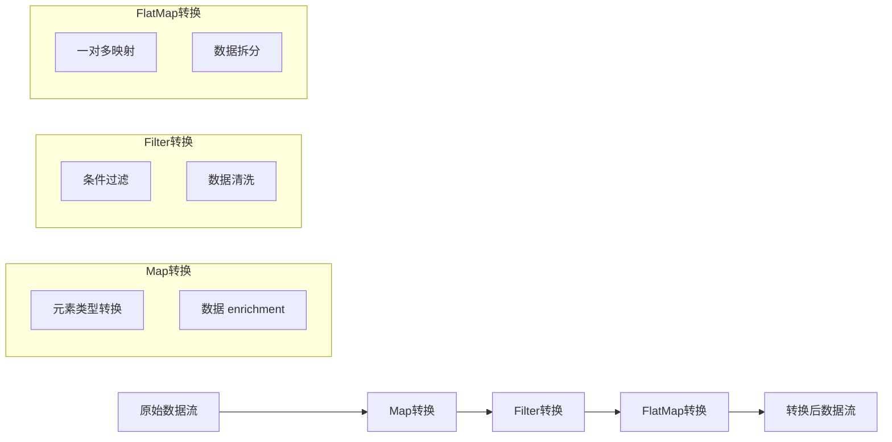
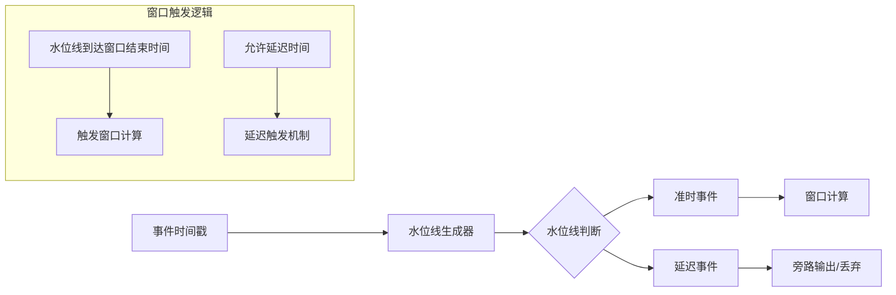
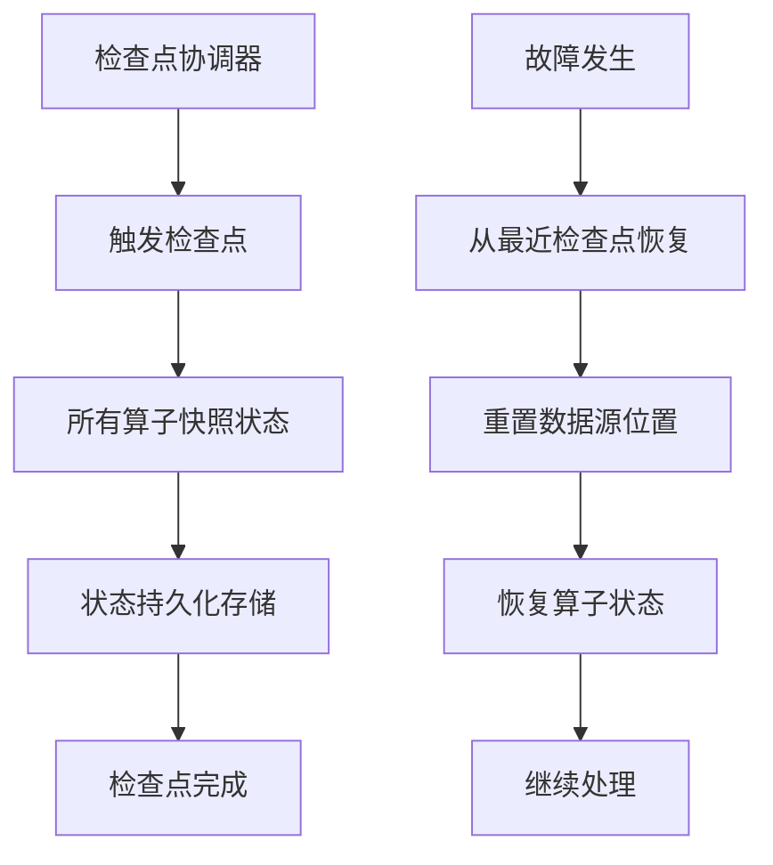

# SAGE Kernel 核心概念

理解 SAGE Kernel 的核心概念是高效使用框架的基础。本文档详细介绍框架中的关键概念和术语。

## 🌊 数据流 (DataStream)

### 定义
DataStream 是 SAGE Kernel 中的核心抽象，代表一个**有界**或**无界**的数据序列，是流处理应用的基础构建块。

### 特性
- **不可变性**: 每次转换操作都会创建新的数据流实例
- **延迟执行**: 构建阶段只创建逻辑计算图，调用 `execute()` 或 `submit()` 时才触发实际执行
- **类型安全**: 基于泛型的编译时类型检查，减少运行时错误
- **链式调用**: 支持函数式编程风格，代码简洁易读

### 示例代码
```python
# 创建有界数据流（批处理场景）
batch_stream = env.from_collection([1, 2, 3, 4, 5])

# 创建无界数据流（流处理场景）
kafka_stream = env.from_kafka_source(
    bootstrap_servers="localhost:9092",
    topics=["input-topic"],
    group_id="consumer-group-1"
)

# 典型的链式转换操作
processing_pipeline = (kafka_stream
    .map(lambda x: json.loads(x))      # 解析JSON
    .filter(lambda x: x["is_valid"])   # 过滤无效数据
    .key_by(lambda x: x["user_id"])    # 按键分区
    .window(TumblingWindow.of(Time.minutes(5)))  # 5分钟滚动窗口
    .reduce(lambda a, b: a + b))       # 聚合操作
```

## 🏗️ 环境 (Environment)

### 定义
Environment 定义了数据流应用的执行上下文，负责管理计算资源、调度策略和系统配置。

### 环境类型对比

| 特性 | LocalEnvironment | RemoteEnvironment |
|------|------------------|-------------------|
| **部署模式** | 单机本地执行 | 分布式集群执行 |
| **适用场景** | 开发测试、小规模数据处理 | 生产环境、大规模流处理 |
| **资源管理** | 本地资源限制 | 集群资源池化管理 |
| **容错能力** | 有限 | 完整的故障恢复机制 |
| **状态管理** | 内存状态 | 分布式持久化状态 |

### 配置示例
```python
# 本地环境配置 - 适合开发测试
local_env = LocalEnvironment(
    name="dev-environment",
    config={
        "parallelism": 4,           # 并行度
        "buffer.timeout": 100,      # 缓冲区超时(ms)
        "state.backend": "memory",  # 状态后端
        "checkpointing": False      # 检查点开关
    }
)

# 生产环境配置 - 分布式集群
prod_env = RemoteEnvironment(
    name="production-pipeline",
    config={
        "jobmanager.host": "cluster-master",
        "jobmanager.port": 8081,
        "taskmanager.slots": 32,
        "parallelism": 24,
        "state.backend": "rocksdb",
        "checkpoint.interval": "30s",
        "restart.strategy": "exponential-delay"
    }
)
```

## 🔄 转换操作 (Transformation)

### 核心转换操作

#### 1. 基本转换


#### 2. 聚合转换
```python
# 滚动窗口聚合
windowed_stream = (data_stream
    .key_by(lambda x: x["category"])
    .window(TumblingWindow.of(Time.minutes(10)))
    .aggregate(AverageAggregator()))

# 会话窗口分析
session_stream = (user_events
    .key_by(lambda x: x["session_id"])
    .window(SessionWindow.with_gap(Time.minutes(30)))
    .reduce(lambda a, b: merge_sessions(a, b)))
```

## ⏰ 时间语义与窗口机制

### 时间类型对比

| 时间类型 | 准确性 | 性能 | 适用场景 |
|----------|--------|------|----------|
| **事件时间** | ⭐⭐⭐⭐⭐ | ⭐⭐ | 需要精确时间顺序的场景 |
| **处理时间** | ⭐⭐ | ⭐⭐⭐⭐⭐ | 低延迟要求场景 |
| **摄入时间** | ⭐⭐⭐ | ⭐⭐⭐⭐ | 平衡准确性和性能 |

### 水位线机制


### 配置示例
```python
# 事件时间配置
env.set_stream_time_characteristic(TimeCharacteristic.EVENT_TIME)

# 水位线策略
watermark_strategy = WatermarkStrategy\
    .for_bounded_out_of_orderness(Duration.of_seconds(5))\
    .with_timestamp_assigner(LambdaTimestampAssigner(lambda event: event["timestamp"]))

stream = stream.assign_timestamps_and_watermarks(watermark_strategy)
```

## 🪟 窗口类型详解

### 窗口配置矩阵

| 窗口类型 | 固定大小 | 可重叠 | 动态调整 | 适用场景 |
|----------|----------|--------|----------|----------|
| **滚动窗口** | ✅ | ❌ | ❌ | 定期统计报表 |
| **滑动窗口** | ✅ | ✅ | ❌ | 移动平均计算 |
| **会话窗口** | ❌ | ❌ | ✅ | 用户行为分析 |
| **全局窗口** | ❌ | ❌ | ❌ | 需要自定义触发 |

### 代码示例
```python
# 多种窗口配置示例
tumbling_window = TumblingWindow.of(Time.minutes(5))  # 5分钟滚动窗口
sliding_window = SlidingWindow.of(Time.minutes(10), Time.minutes(2))  # 10分钟窗口，每2分钟滑动
session_window = SessionWindow.with_gap(Time.minutes(30))  # 30分钟不活动则关闭会话

# 窗口函数应用
result = (stream
    .key_by(lambda x: x["key"])
    .window(tumbling_window)
    .apply(MyWindowFunction(),  # 窗口函数
           TypeInformation.of(ResultType))  # 输出类型信息
```

## 🛡️ 容错与状态管理

### 状态类型对比

| 状态类型 | 存储方式 | 访问模式 | 适用场景 |
|----------|----------|----------|----------|
| **ValueState** | 单对象 | 读写 | 计数器、标志位 |
| **ListState** | 对象列表 | 追加/遍历 | 事件缓冲区 |
| **MapState** | 键值对 | 随机访问 | 缓存、索引 |
| **ReducingState** | 聚合值 | 增量更新 | 持续聚合 |

### 检查点机制


### 配置示例
```python
# 检查点配置
env.enable_checkpointing(
    interval=Duration.of_seconds(30),  # 检查点间隔
    mode=CheckpointingMode.EXACTLY_ONCE,  # 精确一次语义
    timeout=Duration.of_minutes(5),  # 超时时间
    min_pause_between_checkpoints=Duration.of_seconds(10)  # 最小间隔
)

# 状态后端配置
env.set_state_backend(RocksDBStateBackend(
    checkpoint_directory="hdfs://checkpoints/",
    incremental_checkpoints=True
))
```

## 📊 性能优化指南

### 优化策略矩阵

| 优化技术 | 适用场景 | 性能影响 | 复杂度 |
|----------|----------|----------|--------|
| **算子链优化** | 高吞吐场景 | ⭐⭐⭐⭐⭐ | ⭐⭐ |
| **并行度调整** | 计算密集型 | ⭐⭐⭐⭐ | ⭐⭐⭐ |
| **状态后端选择** | 大状态应用 | ⭐⭐⭐ | ⭐⭐⭐⭐ |
| **序列化优化** | 所有场景 | ⭐⭐⭐ | ⭐⭐⭐⭐ |
| **资源调优** | 集群环境 | ⭐⭐⭐⭐ | ⭐⭐⭐⭐⭐ |

### 最佳实践示例
```python
# 性能优化配置示例
optimized_env = StreamExecutionEnvironment.get_execution_environment()

# 设置并行度
optimized_env.set_parallelism(16)

# 启用对象重用模式（谨慎使用）
optimized_env.get_config().enable_object_reuse()

# 配置缓冲区超时
optimized_env.get_config().set_buffer_timeout(50)

# 选择高效序列化器
optimized_env.get_config().register_type_with_kryo_serializer(
    MyCustomType, CustomKryoSerializer()
)
```

## 🔍 调试与监控

### 监控指标

| 指标类别 | 具体指标 | 重要性 |
|----------|----------|--------|
| **吞吐量** | 记录数/秒、字节数/秒 | ⭐⭐⭐⭐⭐ |
| **延迟** | 处理延迟、端到端延迟 | ⭐⭐⭐⭐ |
| **资源** | CPU使用率、内存使用、网络IO | ⭐⭐⭐⭐ |
| **状态** | 状态大小、检查点时间 | ⭐⭐⭐ |
| **错误** | 异常计数、重试次数 | ⭐⭐⭐ |

### 调试技巧
```python
# 调试配置
env.set_parallelism(1)  # 单线程执行便于调试
env.disable_operator_chaining()  # 禁用算子链
env.enable_checkpointing(10000)  # 更频繁的检查点

# 添加调试输出
debug_stream = data_stream\
    .map(lambda x: logging.debug(f"Processing: {x}"))\
    .name("debug_operator")
```

## 📚 总结与最佳实践

### 核心原则
1. **选择合适的语义**: 根据业务需求选择精确一次、至少一次或至多一次语义
2. **合理设计窗口**: 根据数据特性选择适当的窗口类型和大小
3. **优化状态管理**: 根据访问模式选择合适的状态类型和后端
4. **监控和调整**: 持续监控性能指标并相应调整配置

### 推荐配置
```python
# 生产环境推荐配置
production_config = {
    "execution_mode": "EXACTLY_ONCE",
    "state_backend": "rocksdb",
    "checkpoint_interval": "30s",
    "watermark_interval": "200ms",
    "parallelism": "available_cores * 2",
    "buffer_timeout": "100ms",
    "restart_strategy": "exponential_delay"
}
```

---

通过深入理解这些核心概念，您将能够更好地设计和优化基于 SAGE Kernel 的流处理应用，构建高性能、可靠的数据处理管道。