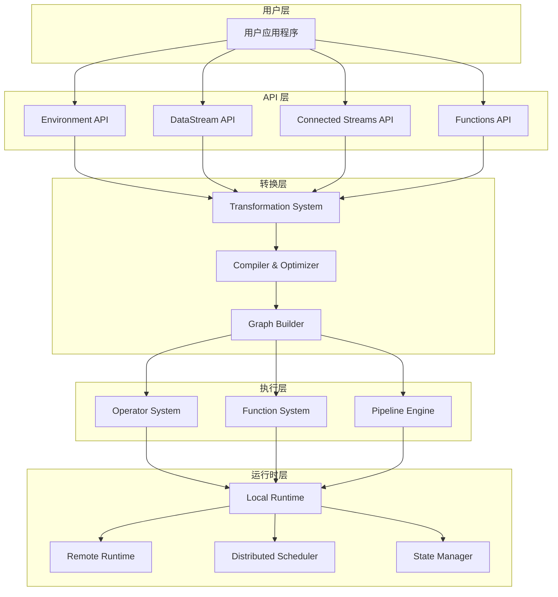

# SAGE Core 层概览

SAGE Core 层是整个SAGE框架的核心组件，提供了完整的数据流处理和流水线编排功能。它采用分层架构设计，从高级API接口到底层执行引擎，为大规模语言模型推理提供了高效、可扩展的数据流计算能力。

## 🏗️ 架构总览

SAGE Core 层采用自底向上的分层架构：



## 📋 核心特性

### 🔄 数据流编程模型

SAGE Core 提供了声明式的数据流编程模型，用户可以通过链式API构建复杂的数据处理流水线：

```python
# 示例：构建一个简单的数据流水线
env = LocalEnvironment()
result = (env
    .from_source(FileSource, "input.txt")
    .map(text_processor)
    .filter(lambda x: len(x) > 10)
    .map(llm_generator)
    .sink(output_sink)
)
```

### ⚡ 异步执行引擎

- **非阻塞执行**: 数据驱动的异步执行模式
- **事件驱动调度**: 基于数据可用性的智能调度
- **背压控制**: 自动处理上下游处理速度差异
- **容错机制**: 内置的错误处理和恢复策略

### 🧩 模块化组件系统

- **算子系统**: 可插拔的数据处理算子
- **函数系统**: 用户自定义逻辑的载体
- **转换系统**: 编译时优化和图转换
- **流水线引擎**: 统一的执行引擎

### 🌐 多环境支持

- **本地环境**: 单机多线程执行
- **远程环境**: 分布式集群执行
- **混合环境**: 本地+远程的混合部署
- **弹性扩展**: 动态资源分配和扩缩容

## 🔧 核心模块

### API 模块 (`api/`)

提供用户友好的编程接口：

- **Environment API**: 执行环境管理
- **DataStream API**: 数据流操作接口
- **Connected Streams API**: 多流连接和协同处理
- **Functions API**: 自定义函数注册和管理

### Operator 模块 (`operator/`)

运行时执行组件：

- **Source Operators**: 数据源算子 (Kafka, File, etc.)
- **Transformation Operators**: 转换算子 (Map, Filter, Join, etc.)
- **Sink Operators**: 数据输出算子
- **Control Operators**: 流程控制算子 (Split, Route, etc.)

### Function 模块 (`function/`)

用户逻辑的实现载体：

- **Base Function**: 函数抽象基类
- **Lambda Function**: Lambda 表达式包装
- **User Function**: 用户自定义函数
- **System Function**: 系统内置函数

### Transformation 模块 (`transformation/`)

编译时处理组件：

- **Graph Builder**: 构建执行图
- **Optimizer**: 图优化器
- **Scheduler**: 任务调度器
- **Type Checker**: 类型检查器

## 🎯 应用场景

### RAG 系统

```python
# RAG 流水线示例
rag_pipeline = (env
    .from_source(QuerySource)
    .map(EmbeddingGenerator)
    .map(VectorRetriever) 
    .map(ContextAggregator)
    .map(LLMGenerator)
    .sink(ResponseSink)
)
```

### 智能代理

```python
# 智能代理流水线
agent_pipeline = (env
    .from_source(MessageSource)
    .map(IntentClassifier)
    .route(intent_router)  # 根据意图路由
    .map(ActionExecutor)
    .map(ResponseGenerator)
    .sink(MessageSink)
)
```

### 流式数据处理

```python
# 流式处理流水线
streaming_pipeline = (env
    .from_stream(KafkaSource)
    .window(time_window=60)  # 60秒时间窗口
    .map(BatchProcessor)
    .keyBy(user_id)
    .map(UserStateUpdater)
    .sink(DatabaseSink)
)
```

## 🚀 性能特点

### 高吞吐量
- **批处理优化**: 自动批量处理提升吞吐量
- **并行执行**: 智能并行度推导和执行
- **内存管理**: 高效的内存池和缓存机制

### 低延迟
- **流水线并行**: 算子间的流水线并行执行
- **异步I/O**: 非阻塞I/O操作
- **零拷贝**: 减少不必要的数据拷贝

### 可扩展性
- **水平扩展**: 支持动态增减计算节点
- **弹性调度**: 根据负载自动调整资源
- **状态分片**: 大状态的自动分片和管理

## 🛠️ 开发工具

### 可视化调试
- **执行图可视化**: 实时查看流水线执行状态
- **性能监控**: 算子级别的性能指标
- **数据流追踪**: 端到端的数据流追踪

### 开发支持
- **类型检查**: 编译时类型安全检查
- **单元测试**: 完善的测试框架
- **本地调试**: 本地环境的快速调试

### 运维监控
- **指标收集**: 丰富的运行时指标
- **日志聚合**: 结构化日志收集
- **告警机制**: 异常情况的及时告警

## 📖 学习路径

### 初学者
1. [快速入门](../guides/quickstart.md) - 5分钟上手SAGE Core
2. [核心概念](../concepts.md) - 理解基本概念
3. [基础教程](../examples/basic_tutorials.md) - 跟随教程学习

### 进阶开发者
1. <!-- [数据流开发指南](../guides/dataflow_development.md) -->
数据流开发指南 - 深入理解数据流编程
2. <!-- [自定义算子开发](../guides/custom_operators.md) -->
自定义算子开发 - 扩展系统功能
3. <!-- [性能调优](../guides/performance_tuning.md) -->
性能调优 - 优化系统性能

### 系统管理员
1. [系统配置](../config/config.md) - 配置生产环境
2. <!-- [监控配置](../config/monitoring_config.md) -->
监控配置 - 设置监控告警
3. <!-- [故障排除](../troubleshooting.md) -->
故障排除 - 解决常见问题

---

**下一步**: 了解 [数据流编程模型](./dataflow_model.md) 的详细设计和使用方法。
