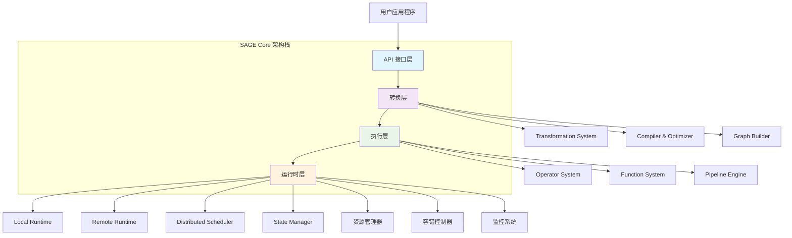
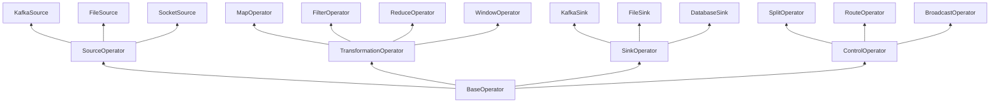
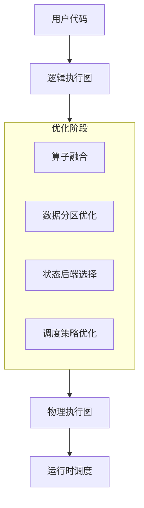

# SAGE Core 层架构深度解析

SAGE Core 层是框架的核心引擎，为大规模语言模型推理提供高性能、可扩展的数据流处理能力。它采用创新的分层架构设计，将复杂的流处理抽象为简洁的编程接口。

## 🏗️ 架构总览

### 分层架构设计



## 📊 核心特性矩阵

| 特性类别 | 具体功能 | 技术优势 | 应用场景 |
|---------|---------|---------|---------|
| **编程模型** | 声明式数据流API | 链式调用，类型安全 | 快速原型开发 |
| **执行引擎** | 异步非阻塞执行 | 高吞吐，低延迟 | 实时流处理 |
| **资源管理** | 动态资源分配 | 弹性扩缩容 | 云原生部署 |
| **状态管理** | 分布式状态存储 | 强一致性保证 | 有状态计算 |
| **容错机制** | 检查点+保存点 | 精确一次语义 | 关键业务系统 |

## 🔧 核心模块详解

### 1. API 模块 (`api/`) - 用户接口层

提供四类核心API接口：

```python
# Environment API - 环境配置
env = StreamExecutionEnvironment.create(
    execution_mode=ExecutionMode.PIPELINED,
    parallelism=4,
    state_backend=StateBackend.ROCKSDB
)

# DataStream API - 数据流操作
data_stream = env.from_source(
    KafkaSource.builder()
        .set_bootstrap_servers("localhost:9092")
        .set_topics("input-topic")
        .build(),
    WatermarkStrategy.for_bounded_out_of_orderness(Duration.of_seconds(5)),
    "Kafka Source"
)

# Functions API - 函数注册
class MyMapFunction(MapFunction):
    def map(self, value):
        return value.upper()

stream.map(MyMapFunction(), output_type=Types.STRING)

# Connected Streams API - 流连接
connected_stream = stream1.connect(stream2)
connected_stream.map(MyCoMapFunction())
```

### 2. Operator 模块 (`operator/`) - 运行时引擎

#### 算子类型体系



#### 算子性能特征

| 算子类型 | 吞吐量 | 延迟 | 状态需求 | 并行度 |
|---------|-------|-----|---------|-------|
| **Source** | 高 | 低 | 无状态 | 高 |
| **Map** | 极高 | 极低 | 无状态 | 极高 |
| **Filter** | 极高 | 极低 | 无状态 | 极高 |
| **Reduce** | 中 | 中 | 有状态 | 中 |
| **Join** | 中 | 高 | 有状态 | 中 |
| **Window** | 中 | 高 | 有状态 | 中 |
| **Sink** | 高 | 低 | 无状态 | 高 |

### 3. Function 模块 (`function/`) - 业务逻辑

#### 函数层次结构

```python
# 函数基类定义
class UserFunction(ABC):
    @abstractmethod
    def open(self, context: FunctionContext):
        pass
    
    @abstractmethod
    def close(self):
        pass
    
    @abstractmethod
    def process_element(self, value, ctx: Context):
        pass

# 具体函数实现
class SentenceEmbeddingFunction(MapFunction):
    def __init__(self, model_path: str):
        self.model_path = model_path
        self.model = None
        
    def open(self, context):
        self.model = load_embedding_model(self.model_path)
        
    def map(self, sentence: str) -> List[float]:
        return self.model.encode(sentence)
        
    def close(self):
        self.model.release()
```

### 4. Transformation 模块 (`transformation/`) - 优化引擎

#### 编译优化流程



#### 优化策略对比

| 优化技术 | 优化效果 | 适用场景 | 复杂度 |
|---------|---------|---------|-------|
| **算子融合** | 减少序列化开销 | 相邻无状态算子 | 低 |
| **数据本地化** | 减少网络传输 | 数据密集型应用 | 中 |
| **状态分区** | 提高并行度 | 有状态计算 | 高 |
| **动态调整** | 自适应负载 | 变化的工作负载 | 高 |

## 🎯 典型应用场景

### 1. RAG 系统完整流水线

```python
def build_rag_pipeline(env: StreamExecutionEnvironment):
    # 创建端到端的RAG流水线
    return (env
        .from_source(QuerySource("user-queries"))
        .map(QueryParser(), name="query-parser")
        .map(EmbeddingGenerator("model/embedding"), 
             name="embedding-generator")
        .map(VectorRetriever("vector-db"), 
             name="vector-retriever")
        .map(ContextEnhancer(), name="context-enhancer")
        .map(LLMGenerator("model/llm"), 
             name="llm-generator")
        .map(ResponseFormatter(), name="response-formatter")
        .sink(ResponseSink("output-topic"), 
              name="response-sink")
    )

# 性能配置
rag_env = StreamExecutionEnvironment.create(
    parallelism=8,
    state_backend=StateBackend.ROCKSDB,
    checkpoint_interval=30000
)
```

### 2. 智能代理系统

```python
class IntelligentAgentPipeline:
    def __init__(self, env):
        self.env = env
        
    def build_router_pipeline(self):
        return (self.env
            .from_source(MessageSource("input-messages"))
            .map(IntentClassifier("model/intent"), 
                 name="intent-classifier")
            .route([
                ("question", self._build_qa_branch()),
                ("command", self._build_cmd_branch()),
                ("conversation", self._build_chat_branch())
            ], name="intent-router")
            .sink(ResponseAggregator(), name="response-aggregator")
        )
```

### 3. 实时数据分析

```python
# 实时指标计算流水线
analytics_pipeline = (env
    .from_source(KafkaSource("metrics-topic"))
    .assign_timestamps_and_watermarks(
        WatermarkStrategy.for_bounded_out_of_orderness(Duration.of_seconds(10))
    )
    .key_by(lambda x: x["service_name"])
    .window(SlidingWindow(Duration.of_minutes(5), Duration.of_minutes(1)))
    .aggregate(StatisticsAggregator(), name="stats-aggregator")
    .map(AnomalyDetector(), name="anomaly-detector")
    .sink(AlertSink("alert-topic"), name="alert-sink")
)
```

## 🚀 性能优化指南

### 资源配置建议

| 工作负载类型 | 并行度 | 内存配置 | CPU配置 | 状态后端 |
|------------|-------|---------|--------|---------|
| **无状态处理** | 高 (16-64) | 中等 | 高 | 内存 |
| **有状态计算** | 中 (8-32) | 高 | 中等 | RocksDB |
| **窗口聚合** | 中 (8-24) | 高 | 高 | RocksDB |
| **机器学习** | 低 (4-16) | 极高 | 极高 | 文件系统 |

### 调优参数示例

```yaml
# 生产环境调优配置
execution:
  mode: PIPELINED
  parallelism: 16
  buffer-timeout: 50ms
  object-reuse: true

state:
  backend: rocksdb
  checkpoint-interval: 30s
  incremental-checkpoints: true
  local-recovery: true

resources:
  taskmanager:
    memory:
      process-size: 4gb
      network-buffer-size: 64mb
    cpu:
      cores: 4
```

## 📊 监控与运维

### 关键监控指标

| 指标类别 | 具体指标 | 告警阈值 | 优化建议 |
|---------|---------|---------|---------|
| **吞吐量** | records/s, bytes/s | < 50%基线 | 调整并行度 |
| **延迟** | p99延迟, 端到端延迟 | > 100ms | 优化算子链 |
| **资源** | CPU使用率, 内存使用 | > 80% | 扩容资源 |
| **状态** | 状态大小, 检查点时间 | > 60s | 优化状态后端 |
| **错误率** | 异常数/分钟, 重试率 | > 1% | 检查数据质量 |

### 运维工具集

```python
# 监控配置示例
monitoring_config = MonitoringConfig(
    metrics_reporter=PrometheusReporter(
        port=9091,
        interval=Duration.of_seconds(10)
    ),
    logging_config=StructuredLogging(
        level="INFO",
        format="json"
    ),
    alert_rules=[
        AlertRule(
            metric="throughput",
            condition="< 1000 records/s for 5m",
            severity="WARNING"
        ),
        AlertRule(
            metric="latency_p99", 
            condition="> 500ms for 2m",
            severity="CRITICAL"
        )
    ]
)
```

## 📖 学习路径建议

### 快速入门 (1-2天)
1. **环境搭建**: 本地开发环境配置
2. **第一个流水线**: 创建简单的数据处理作业
3. **基础概念**: 理解DataStream、算子、函数等核心概念

### 进阶开发 (3-5天)
1. **状态管理**: 学习有状态计算和状态后端配置
2. **窗口操作**: 掌握各种窗口类型和聚合操作
3. **性能调优**: 学习监控指标和调优技巧

### 高级主题 (1-2周)
1. **自定义算子**: 开发特定领域的专用算子
2. **分布式部署**: 生产环境集群部署和管理
3. **故障排除**: 掌握常见问题的诊断和解决方法

### 专家级 (1个月+)
1. **源码贡献**: 参与核心模块的开发和优化
2. **性能优化**: 深度调优和瓶颈分析
3. **架构设计**: 设计复杂的数据流处理系统

---

**下一步行动**:
- ../tutorials/quickstart.md
- ../api/overview.md  
- ../deployment/production.md

如需进一步帮助，请访问我们的https://forum.sage-project.org或查看../README.md。

## 📖 学习路径

### 初学者
1. [快速入门](../guides/quickstart.md) - 5分钟上手SAGE Core
2. [核心概念](../concepts.md) - 理解基本概念
3. [基础教程](../examples/basic_tutorials.md) - 跟随教程学习

### 进阶开发者
1. <!-- [数据流开发指南](../guides/dataflow_development.md) -->
数据流开发指南 - 深入理解数据流编程
2. <!-- [自定义算子开发](../guides/custom_operators.md) -->
自定义算子开发 - 扩展系统功能
3. <!-- [性能调优](../guides/performance_tuning.md) -->
性能调优 - 优化系统性能

### 系统管理员
1. [系统配置](../config/config.md) - 配置生产环境
2. <!-- [监控配置](../config/monitoring_config.md) -->
监控配置 - 设置监控告警
3. <!-- [故障排除](../troubleshooting.md) -->
故障排除 - 解决常见问题

---

**下一步**: 了解 [数据流编程模型](./dataflow_model.md) 的详细设计和使用方法。
