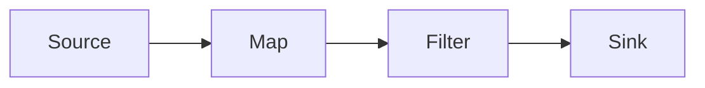
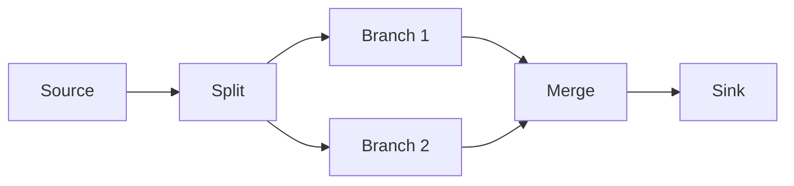
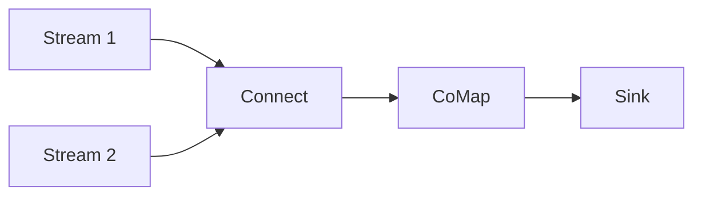

# 数据流编程模型

SAGE Core 采用数据流编程模型，将计算逻辑表示为有向无环图（DAG），其中节点代表计算操作，边代表数据流动。这种模型特别适合大语言模型推理场景，能够有效处理复杂的数据依赖和异步执行需求。

## 🎯 核心理念

### 声明式编程
用户专注于描述**要做什么**，而不是**怎么做**：

```python
# 声明式：描述数据处理逻辑
result = (env
    .from_source(input_source)
    .map(preprocess)      # 预处理
    .map(embedding)       # 向量化
    .map(retrieval)       # 检索
    .map(generation)      # 生成
    .sink(output_sink)    # 输出
)

# 命令式：描述执行步骤
data = read_from_source(input_source)
for item in data:
    processed = preprocess(item)
    embedded = embedding(processed)
    retrieved = retrieval(embedded)
    generated = generation(retrieved)
    write_to_sink(generated, output_sink)
```

### 数据驱动执行
计算的触发完全由数据可用性驱动，而非程序控制流：

```python
# 数据到达触发计算
source → map1 → filter → map2 → sink
  ↑       ↑       ↑       ↑      ↑
 数据    处理    过滤    处理   输出
```

## 📊 数据流图结构

### 基本组件

#### 🔄 算子 (Operators)
算子是数据流图的节点，执行具体的计算逻辑：

```python
class MapOperator(BaseOperator):
    def __init__(self, func):
        self.func = func
    
    def process(self, input_data):
        return self.func(input_data)

class FilterOperator(BaseOperator):
    def __init__(self, predicate):
        self.predicate = predicate
    
    def process(self, input_data):
        return input_data if self.predicate(input_data) else None
```

#### 🔗 数据流 (DataStreams)
数据流是算子之间的连接，定义数据传输路径：

```python
class DataStream:
    def __init__(self, source_op, target_op):
        self.source = source_op
        self.target = target_op
        self.buffer = Queue()  # 缓冲区
    
    def send(self, data):
        self.buffer.put(data)
    
    def receive(self):
        return self.buffer.get()
```

### 图类型

#### 线性流水线
最简单的数据流模式，数据按顺序流经各个算子：



```python
# 线性流水线示例
pipeline = (env
    .from_source(TextSource)
    .map(tokenizer)           # 分词
    .map(embedding_model)     # 嵌入
    .filter(quality_filter)   # 质量过滤
    .sink(vector_store)       # 存储
)
```

#### 分支合并流
支持数据流的分支和合并：



```python
# 分支合并示例
main_stream = env.from_source(QuerySource)

# 分支1：检索
retrieval_stream = main_stream.map(EmbeddingEncoder).map(VectorRetriever)

# 分支2：缓存查询
cache_stream = main_stream.map(CacheQuery)

# 两个分支可以分别处理并输出到不同的sink
retrieval_stream.map(ResponseGenerator).sink(ResponseSink)
cache_stream.sink(CacheSink)
```

### 连接流
多个数据流的协同处理：



```python
# 连接流示例
query_stream = env.from_source(QuerySource)
context_stream = env.from_source(ContextSource)

# 连接两个流进行协同处理
connected = query_stream.connect(context_stream)
result = connected.comap(rag_processor).sink(ResponseSink)
```

## 🔧 API 设计原则

### 链式调用
支持方法链式调用，提升代码可读性：

```python
# 良好的链式设计
result = (stream
    .map(func1)
    .filter(pred1)
    .map(func2)
    .keyby(key_selector)
    .map(aggregator)
    .sink(output)
)
```

### 类型安全
基于Python类型提示提供编译时类型检查：

```python
from typing import TypeVar, Generic

T = TypeVar('T')
U = TypeVar('U')

class DataStream(Generic[T]):
    def map(self, func: Callable[[T], U]) -> 'DataStream[U]':
        return DataStream[U](MapOperator(func))
    
    def filter(self, predicate: Callable[[T], bool]) -> 'DataStream[T]':
        return DataStream[T](FilterOperator(predicate))
```

### 延迟执行
构建阶段只定义计算图，执行阶段才开始计算：

```python
# 构建阶段：定义计算图
pipeline = (env
    .from_source(source)
    .map(processor)
    .sink(output)
)  # 此时还没有执行任何计算

# 执行阶段：启动计算
env.submit()  # 开始执行流水线
```

## 🏃 执行模型

### 异步执行
算子之间异步执行，提高资源利用率：

```python
class AsyncOperator:
    async def process(self, data):
        result = await self.async_operation(data)
        return result
    
    async def run(self):
        while True:
            data = await self.input_queue.get()
            result = await self.process(data)
            await self.output_queue.put(result)
```

### 背压处理
自动处理上下游处理速度差异：

```python
class BackpressureQueue:
    def __init__(self, max_size=1000):
        self.queue = asyncio.Queue(maxsize=max_size)
    
    async def put(self, item):
        if self.queue.full():
            # 背压信号：通知上游减缓发送
            await self.notify_backpressure()
        await self.queue.put(item)
```

### 状态管理
算子可以在处理过程中维护内部状态：

```python
import time
from sage.core.api.function.base_function import BaseFunction

class CounterFunction(BaseFunction):
    def __init__(self):
        super().__init__()
        self.counter = 0  # 内部状态
    
    def process(self, data):
        self.counter += 1
        return {
            'data': data,
            'count': self.counter,
            'timestamp': time.time()
        }
```

## 🎨 常用模式

### Map 模式
一对一的数据转换：

```python
# 文本预处理
text_stream = (env
    .from_source(TextSource)
    .map(lambda x: x.lower())          # 转小写
    .map(lambda x: x.strip())          # 去空格
    .map(tokenize)                     # 分词
)
```

### Filter 模式
数据过滤：

```python
# 质量过滤
quality_stream = (env
    .from_source(DataSource)
    .filter(lambda x: len(x.text) > 10)     # 长度过滤
    .filter(lambda x: x.score > 0.8)        # 分数过滤
    .filter(is_valid_format)                 # 格式过滤
)
```

### FlatMap 模式
一对多的数据转换：

```python
# 文档分块
chunk_stream = (env
    .from_source(DocumentSource)
    .flatmap(lambda doc: split_into_chunks(doc))  # 分块
    .map(create_embedding)                         # 向量化
)
```

### KeyBy 模式
按键分组数据：

```python
# 用户事件分组
grouped_stream = (env
    .from_source(EventSource)
    .keyby(lambda event: event.user_id)     # 按用户分组
    .map(user_event_processor)              # 处理用户事件
)
```

### Connect 模式
多流连接：

```python
# 用户查询与上下文连接
connected_stream = query_stream.connect(context_stream)
result = connected_stream.comap(merge_query_context)    # 合并逻辑
```

## ⚡ 性能优化

### 执行图优化
SAGE Core在执行前会对数据流图进行优化：

```python
# 链式map操作会被自动优化
stream.map(func1).map(func2).map(func3)

# 编译器会分析并优化执行计划
env.submit()  # 优化在提交时自动进行
```

### 并行执行
支持算子并行执行：

```python
# 通过环境配置并行度
env.config['parallelism'] = 4  # 设置全局并行度
stream.map(expensive_operation)
```

### 数据处理
SAGE Core提供了基础的批量处理能力：

```python
# 批量数据处理
stream.map(operation_function)
```

## 🛠️ 调试与监控

### 日志记录
SAGE Core提供了内置的日志记录功能：

```python
# 通过print方法查看数据流
stream.map(processor).print("调试输出").sink(output)

# 设置日志等级
env.set_console_log_level("DEBUG")
```

## 📋 最佳实践

### 1. 函数设计
- 保持函数纯净性，避免副作用
- 优先使用不可变数据结构
- 合理设置超时时间

```python
# 良好的函数设计
def process_text(text: str) -> ProcessedText:
    # 纯函数，无副作用
    return ProcessedText(
        content=text.strip().lower(),
        word_count=len(text.split()),
        timestamp=datetime.now()
    )
```

### 2. 错误处理
- 使用try-catch包装可能失败的操作
- 设置合理的重试策略
- 提供回退机制

```python
def robust_processor(data):
    try:
        return expensive_operation(data)
    except ProcessingError as e:
        # 记录错误
        logger.error(f"Processing failed: {e}")
        # 返回默认值或None
        return None
```

### 3. 资源管理
- 合理设置环境配置
- 及时释放不再需要的资源
- 通过环境配置管理外部连接

```python
# 环境配置
env.config.update({
    'buffer_size': 1000,
    'timeout': 5000,
    'max_memory': "2GB"
})
```

---

**下一步**: 了解 <!-- [流水线编排系统](./pipeline_orchestration.md) -->
流水线编排系统 如何管理复杂的数据流执行。
