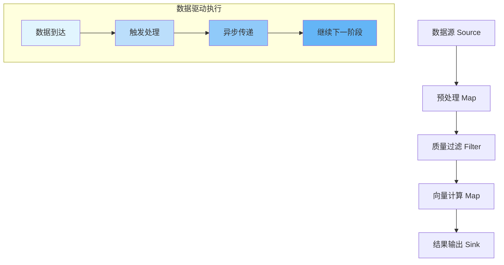
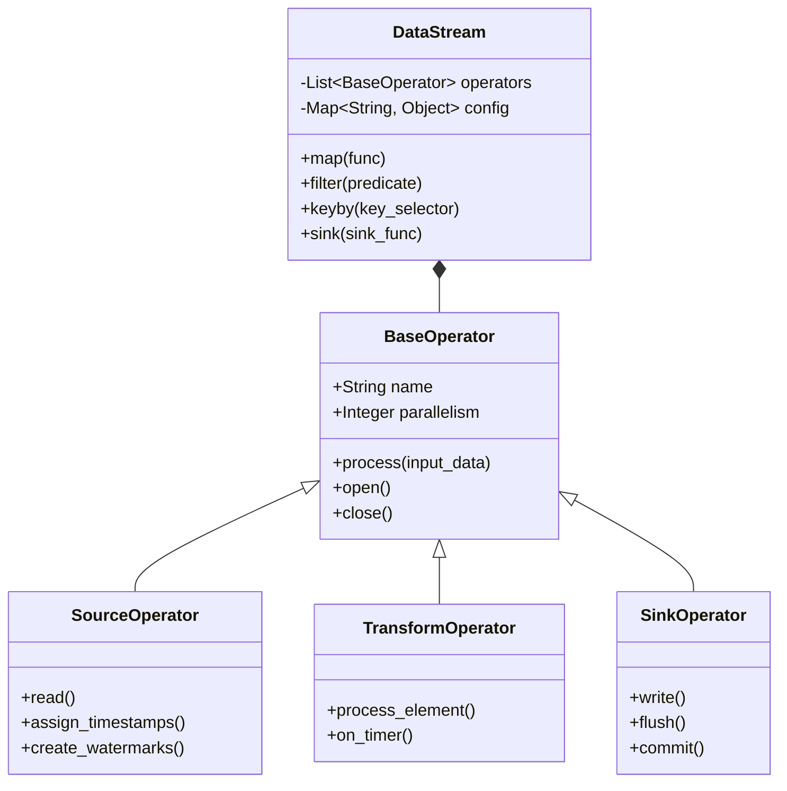

# SAGE Core 数据流编程模型深度解析

SAGE Core 采用先进的数据流编程模型，将计算逻辑表示为有向无环图（DAG），其中节点代表计算操作，边代表数据流动。这种模型特别适合大语言模型推理场景，能够有效处理复杂的数据依赖和异步执行需求。

## 🎯 核心理念与优势

### 声明式 vs 命令式编程

| 特性 | 声明式编程 (SAGE) | 命令式编程 (传统) |
|------|-------------------|------------------|
| **关注点** | 描述"做什么" | 描述"如何做" |
| **代码风格** | 链式调用，简洁优雅 | 顺序语句，详细步骤 |
| **优化空间** | 自动优化执行计划 | 手动优化代码逻辑 |
| **可维护性** | 高层抽象，易于理解 | 底层细节，维护复杂 |
| **并行化** | 自动并行优化 | 手动线程管理 |

```python
# 声明式编程示例 - 专注于业务逻辑
result = (env
    .from_source(input_source)
    .map(preprocess)          # 数据预处理
    .map(embedding)           # 向量嵌入计算
    .map(retrieval)           # 向量检索
    .map(generation)          # 文本生成
    .sink(output_sink)        # 结果输出
)

# 命令式编程示例 - 需要管理执行细节
def process_data():
    data = read_from_source(input_source)
    results = []
    for item in data:
        processed = preprocess(item)        # 手动循环处理
        embedded = embedding(processed)    # 显式状态管理
        retrieved = retrieval(embedded)     # 手动错误处理
        generated = generation(retrieved)   # 复杂的流程控制
        results.append(generated)
    write_to_sink(results, output_sink)    # 结果输出管理
```

### 数据驱动执行模型

SAGE Core 的执行完全由数据可用性驱动，实现了高效的异步处理：



## 📊 数据流图结构与组件体系

### 核心架构组件



### 算子类型详解

#### 1. 数据源算子 (Source Operators)
```python
class KafkaSourceOperator(SourceOperator):
    def __init__(self, bootstrap_servers, topics, group_id):
        self.consumer = KafkaConsumer(
            bootstrap_servers=bootstrap_servers,
            topics=topics,
            group_id=group_id
        )
    
    def read(self):
        """从Kafka持续读取数据"""
        while self.running:
            records = self.consumer.poll(timeout_ms=100)
            for record in records:
                yield record.value
    
    def assign_timestamps(self, record):
        """分配时间戳用于事件时间处理"""
        return record.timestamp if hasattr(record, 'timestamp') else time.time()
```

#### 2. 转换算子 (Transformation Operators)
```python
class SmartMapOperator(TransformOperator):
    def __init__(self, user_func, config=None):
        self.user_func = user_func
        self.config = config or {}
        self.metrics = {}  # 性能指标收集
        
    def process_element(self, value, ctx):
        start_time = time.time()
        try:
            result = self.user_func(value)
            # 记录处理延迟
            self.metrics['latency'] = time.time() - start_time
            self.metrics['processed_count'] += 1
            return result
        except Exception as e:
            self.metrics['error_count'] += 1
            ctx.output_error(value, e)  # 错误处理
            return None
```

#### 3. 数据汇算子 (Sink Operators)
```python
class ElasticsearchSinkOperator(SinkOperator):
    def __init__(self, hosts, index_name, batch_size=1000):
        self.es_client = Elasticsearch(hosts)
        self.index_name = index_name
        self.batch_size = batch_size
        self.buffer = []
        
    def write(self, record):
        """批量写入优化"""
        self.buffer.append(record)
        if len(self.buffer) >= self.batch_size:
            self.flush()
            
    def flush(self):
        """批量提交数据"""
        if self.buffer:
            bulk_data = [
                {"index": {"_index": self.index_name}}
                for record in self.buffer
            ]
            self.es_client.bulk(bulk_data)
            self.buffer.clear()
```

## 🔧 高级数据流模式

### 1. 复杂事件处理模式
```python
# 复杂事件检测流水线
cep_pipeline = (env
    .from_source(EventSource("user-events"))
    .assign_timestamps_and_watermarks(
        WatermarkStrategy.for_bounded_out_of_orderness(Duration.of_seconds(5))
    )
    .key_by(lambda event: event.user_id)
    .window(SlidingEventTimeWindows.of(Duration.of_minutes(10), Duration.of_minutes(1)))
    .process(ComplexEventProcessor(), name="complex-event-detector")
    .sink(AlertSink("alerts-topic"))
)

class ComplexEventProcessor(ProcessWindowFunction):
    def process(self, key, context, events):
        # 检测复杂事件模式
        pattern = self.detect_pattern(events)
        if pattern:
            yield {
                "user_id": key,
                "pattern_type": pattern.type,
                "timestamp": context.window().end(),
                "events_count": len(events)
            }
```

### 2. 状态流处理模式
```python
# 有状态流处理示例
stateful_pipeline = (env
    .from_source(UserBehaviorSource())
    .key_by(lambda x: x["user_id"])
    .map(UserSessionAggregator(), name="session-aggregator")
    .map(BehaviorAnalyzer(), name="behavior-analyzer")
    .sink(ProfileUpdaterSink())
)

class UserSessionAggregator(MapFunction):
    def __init__(self):
        self.session_state = None
        
    def open(self, context):
        # 初始化状态描述符
        state_descriptor = ValueStateDescriptor(
            "user_session", 
            Types.POJO(UserSession)
        )
        self.session_state = context.get_keyed_state(state_descriptor)
        
    def map(self, event):
        current_session = self.session_state.value() or UserSession(event.user_id)
        current_session.update(event)
        self.session_state.update(current_session)
        return current_session
```

### 3. 机器学习推理流水线
```python
# 大语言模型推理流水线
llm_pipeline = (env
    .from_source(QuerySource("user-queries"))
    .map(QueryPreprocessor(), name="query-preprocessor")
    .map(EmbeddingGenerator("model/embedding"), 
         name="embedding-generator")
    .map(ContextRetriever("vector-db"), 
         name="context-retriever")
    .map(LLMInferenceEngine("model/llm"), 
         name="llm-inference")
    .map(ResponsePostprocessor(), 
         name="response-postprocessor")
    .sink(ResponseSink("response-topic"))
)

class LLMInferenceEngine(MapFunction):
    def __init__(self, model_path):
        self.model_path = model_path
        self.model = None
        self.batch_size = 32
        
    def open(self, context):
        # 延迟加载模型
        self.model = load_llm_model(self.model_path)
        
    def map(self, input_batch):
        # 批量推理优化
        if isinstance(input_batch, list):
            return self.model.generate_batch(input_batch)
        else:
            return self.model.generate(input_batch)
```

## ⚡ 性能优化策略

### 执行优化技术对比

| 优化技术 | 适用场景 | 
|---------|---------|---------|
| **算子融合** | 相邻无状态算子 | 
| **数据本地化** | 数据密集型应用 | 
| **批量处理** | 高吞吐场景 | 
| **异步I/O** | I/O密集型应用 | 
| **状态分区** | 有状态计算 | 

### 优化配置示例
```python
# 高性能流水线配置
optimized_env = StreamExecutionEnvironment.create(
    execution_mode=ExecutionMode.PIPELINED,
    parallelism=16,  # 根据CPU核心数调整
    buffer_timeout=50,  # 毫秒
    object_reuse=True,
    state_backend=StateBackend.ROCKSDB,
    checkpoint_config=CheckpointConfig(
        interval=30000,  # 30秒
        timeout=60000,
        min_pause_between_checkpoints=5000
    )
)

# 内存优化配置
memory_config = {
    'taskmanager.memory.process.size': '4gb',
    'taskmanager.memory.network.min': '64mb',
    'taskmanager.memory.network.max': '1gb',
    'taskmanager.memory.managed.fraction': '0.4'
}
```

## 🛠️ 调试与监控最佳实践

### 1. 分布式追踪集成
```python
# OpenTelemetry集成示例
from opentelemetry import trace
from opentelemetry.sdk.trace import TracerProvider

def setup_tracing():
    tracer_provider = TracerProvider()
    trace.set_tracer_provider(tracer_provider)
    
    # 添加导出器
    otlp_exporter = OTLPSpanExporter()
    span_processor = BatchSpanProcessor(otlp_exporter)
    tracer_provider.add_span_processor(span_processor)
    
    return trace.get_tracer("sage-pipeline")

class TracedOperator(BaseOperator):
    def __init__(self, name):
        self.tracer = setup_tracing()
        self.span_name = name
        
    def process(self, data):
        with self.tracer.start_as_current_span(self.span_name) as span:
            span.set_attribute("data.size", len(str(data)))
            result = self._process_impl(data)
            span.set_attribute("result.size", len(str(result)))
            return result
```

### 2. 性能监控配置
```yaml
# 监控配置
monitoring:
  metrics:
    reporters:
      - type: prometheus
        port: 9090
        interval: 10s
      - type: jmx
        port: 9091
    system_metrics: true
    user_metrics: true
    
  logging:
    level: INFO
    format: json
    exporters:
      - type: elasticsearch
        hosts: ["http://elk:9200"]
        index: "sage-logs"
        
  alerting:
    rules:
      - metric: throughput
        condition: < 1000 records/s for 5m
        severity: WARNING
      - metric: latency_p99
        condition: > 500ms for 2m
        severity: CRITICAL
```

## 📋 生产环境最佳实践

### 1. 容错设计
```python
# 容错配置
fault_tolerance_config = {
    'restart-strategy': 'exponential-delay',
    'restart-strategy.exponential-delay.initial-backoff': '10s',
    'restart-strategy.exponential-delay.max-backoff': '5m',
    'restart-strategy.exponential-delay.backoff-multiplier': '2.0',
    'checkpointing': 'exactly_once',
    'checkpointing.interval': '30s',
    'checkpointing.timeout': '5m',
    'checkpointing.min-pause': '10s'
}

# 状态后端配置
state_backend_config = {
    'backend': 'rocksdb',
    'rocksdb.localdir': '/tmp/rocksdb',
    'rocksdb.compaction.style': 'universal',
    'rocksdb.writebuffer.size': '64MB',
    'rocksdb.max.write.buffer.number': '4'
}
```

### 2. 安全配置
```python
# 安全配置示例
security_config = {
    'ssl.enabled': True,
    'ssl.keystore.path': '/path/to/keystore',
    'ssl.keystore.password': 'changeit',
    'ssl.truststore.path': '/path/to/truststore',
    'ssl.truststore.password': 'changeit',
    'authentication.type': 'kerberos',
    'authorization.enabled': True
}

# 数据加密
class EncryptedSinkOperator(SinkOperator):
    def __init__(self, inner_sink, encryption_key):
        self.inner_sink = inner_sink
        self.encryption_key = encryption_key
        
    def write(self, record):
        encrypted_data = self.encrypt(record, self.encryption_key)
        self.inner_sink.write(encrypted_data)
        
    def encrypt(self, data, key):
        # 实现加密逻辑
        cipher = AES.new(key, AES.MODE_GCM)
        ciphertext, tag = cipher.encrypt_and_digest(data.encode())
        return cipher.nonce + tag + ciphertext
```

---

**下一步学习方向**:
- <!-- ./state_management.md -->
深入理解状态管理 - 掌握有状态计算的核心概念
- <!-- ./performance_tuning.md -->
性能调优实战 - 学习生产环境性能优化技巧
- <!-- ./deployment_guide.md -->
分布式部署指南 - 了解集群部署和管理

通过深入掌握SAGE Core的数据流编程模型，您将能够构建高性能、可扩展的大语言模型推理流水线，满足各种复杂的业务场景需求。

---

**下一步**: 了解 <!-- [流水线编排系统](./pipeline_orchestration.md) -->
流水线编排系统 如何管理复杂的数据流执行。
