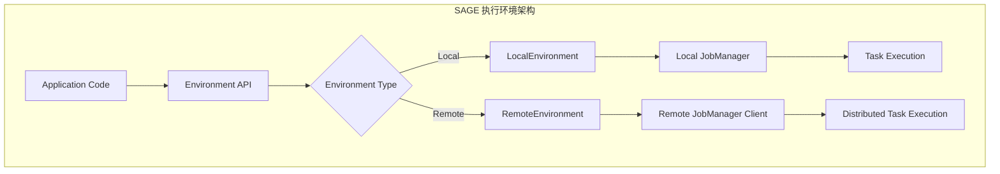

# 执行环境详解

SAGE Core支持多种执行环境，从本地开发到分布式部署，每种环境都有其特定的特性和用途。本文档详细介绍各种执行环境的配置、使用和最佳实践。

## 🌟 环境概述

SAGE Core提供了统一的执行环境抽象，目前支持：

- **LocalEnvironment**: 本地单机执行环境
- **RemoteEnvironment**: 远程分布式执行环境



## 🔧 本地执行环境 (LocalEnvironment)

### 基本使用

```python
from sage.core.api.local_environment import LocalEnvironment

# 创建本地环境
env = LocalEnvironment("my_local_app")

# 配置选项（通过config字典传递）
env = LocalEnvironment("my_local_app", config={
    "engine_host": "127.0.0.1",
    "engine_port": 19000
})

# 设置控制台日志等级
env.set_console_log_level("DEBUG")  # 可选: DEBUG, INFO, WARNING, ERROR

# 创建数据流（使用实际存在的方法）
# 1. 从批处理数据创建
data_stream = env.from_batch([1, 2, 3, 4, 5])

# 2. 从Kafka源创建
kafka_stream = env.from_kafka_source(
    bootstrap_servers="localhost:9092",
    topic="my_topic",
    group_id="my_group"
)

# 3. 从自定义源函数创建
from sage.core.api.function.base_function import BaseFunction

class MySourceFunction(BaseFunction):
    def get_data_iterator(self):
        return iter(range(10))

source_stream = env.from_source(MySourceFunction)

# 数据处理 (使用实际的DataStream API)
result = (data_stream
    .map(lambda x: x * 2)
    .filter(lambda x: x > 5)
    # .collect() 方法需要根据实际DataStream API确认
)

# 提交任务到JobManager
env.submit()
```

### 服务注册

```python
# 注册自定义服务
class MyCacheService:
    def __init__(self, cache_size=1000):
        self.cache_size = cache_size
        self.cache = {}

env.register_service("my_cache", MyCacheService, cache_size=1000)

# 注册数据库连接服务
class DatabaseConnection:
    def __init__(self, host, port, db):
        self.host = host
        self.port = port  
        self.db = db

env.register_service("db_conn", DatabaseConnection, 
                   host="localhost", port=5432, db="mydb")
```

### 数据源创建

```python
# 从各种数据类型创建批处理流
# 1. 列表和元组
data_list = ["item1", "item2", "item3", "item4", "item5"]
list_stream = env.from_batch(data_list)

# 2. 任何可迭代对象
set_stream = env.from_batch({1, 2, 3, 4, 5})
range_stream = env.from_batch(range(100))
string_stream = env.from_batch("hello")  # 按字符迭代

# 3. 自定义批处理函数
class CustomBatchFunction(BaseFunction):
    def get_data_iterator(self):
        return iter(range(50))
        
    def get_total_count(self):
        return 50

batch_stream = env.from_batch(CustomBatchFunction, custom_param="value")

# 4. Future流（用于反馈循环）
future_stream = env.from_future("feedback_loop")
```

## 🌐 远程执行环境 (RemoteEnvironment)

### 基本使用

```python
from sage.core.api.remote_environment import RemoteEnvironment

# 创建远程环境，连接到远程JobManager
env = RemoteEnvironment(
    name="remote_app",
    config={
        "parallelism": 8,
        "buffer_size": 10000
    },
    host="127.0.0.1",  # JobManager服务主机
    port=19001         # JobManager服务端口
)

# 设置控制台日志等级
env.set_console_log_level("INFO")

# 创建数据流（与LocalEnvironment相同的API）
data_stream = env.from_batch(list(range(1000)))

# 数据处理
processed_stream = data_stream.map(lambda x: x * 2)

# 提交到远程集群
env_uuid = env.submit()
print(f"Job submitted with UUID: {env_uuid}")

# 停止远程任务
response = env.stop()
print(f"Stop response: {response}")

# 关闭并清理远程环境
response = env.close()
print(f"Close response: {response}")
```

### 远程配置

```python
# 详细远程配置
remote_env = RemoteEnvironment(
    name="production_app",
    config={
        # 基础配置
        "parallelism": 16,
        "buffer_size": 50000,
        "checkpoint_interval": 300,  # 5分钟
        
        # 容错配置
        "restart_strategy": "fixed-delay",
        "max_failures": 3,
        "failure_rate_interval": 60,
        
        # 资源配置
        "taskmanager_memory": "2GB",
        "taskmanager_slots": 4
    },
    host="cluster-master.example.com",
    port=8081
)

# 获取客户端状态
client = remote_env.client
print(f"Connected to JobManager at {client.host}:{client.port}")

# 提交并监控
env_uuid = remote_env.submit()
print(f"Remote job submitted: {env_uuid}")

# 检查任务状态（如果JobManagerClient支持）
# status = client.get_job_status(env_uuid)
```

### 高级远程操作

```python
# Kafka源在远程环境中的使用
kafka_stream = remote_env.from_kafka_source(
    bootstrap_servers="kafka1:9092,kafka2:9092",
    topic="events",
    group_id="remote_consumer",
    auto_offset_reset="earliest",
    buffer_size=20000
)

# 复杂数据处理管道
result_stream = (kafka_stream
    .map(parse_event_function)
    .filter(is_valid_event_function)
    .key_by(extract_key_function)
    .window(tumbling_time_window(minutes=5))
    .aggregate(count_aggregator)
)

# 输出到目标系统
result_stream.add_sink(kafka_output_sink)

# 提交远程任务
env_uuid = remote_env.submit()

# 任务管理
try:
    # 等待任务运行一段时间
    import time
    time.sleep(300)  # 运行5分钟
    
    # 优雅停止
    stop_response = remote_env.stop()
    if stop_response.get("status") == "success":
        print("Remote job stopped successfully")
    else:
        print(f"Stop failed: {stop_response}")
        
finally:
    # 确保资源清理
    remote_env.close()
```

## � 环境对比和选择指南

### 环境特性对比

| 特性 | LocalEnvironment | RemoteEnvironment |
|------|------------------|-------------------|
| 适用场景 | 开发、测试、小规模处理 | 生产、大规模分布式处理 |
| 资源管理 | 本地资源 | 分布式集群资源 |
| 容错能力 | 基础 | 高级（故障恢复、重试） |
| 扩展性 | 单机限制 | 水平扩展 |
| 配置复杂度 | 简单 | 相对复杂 |
| 调试便利性 | 高 | 中等 |

### 选择建议

**选择 LocalEnvironment 当：**
- 开发和调试应用程序
- 数据量较小（< 1GB）
- 处理逻辑相对简单
- 需要快速原型验证

**选择 RemoteEnvironment 当：**
- 生产环境部署
- 大数据处理（> 1GB）
- 需要高可用性和容错
- 需要水平扩展能力

### 实际使用示例

```python
from sage.core.api.local_environment import LocalEnvironment
from sage.core.api.remote_environment import RemoteEnvironment

# 开发环境：使用LocalEnvironment
def create_dev_environment():
    env = LocalEnvironment("dev_app")
    env.set_console_log_level("DEBUG")  # 开发时显示详细日志
    return env

# 生产环境：使用RemoteEnvironment  
def create_prod_environment():
    env = RemoteEnvironment(
        name="prod_app",
        config={
            "parallelism": 32,
            "checkpoint_interval": 300,
            "restart_strategy": "exponential-backoff"
        },
        host="prod-jobmanager.company.com",
        port=8081
    )
    env.set_console_log_level("INFO")  # 生产环境减少日志输出
    return env

# 根据运行模式选择环境
import os
if os.getenv("SAGE_ENV") == "production":
    env = create_prod_environment()
else:
    env = create_dev_environment()

# 相同的应用逻辑代码
data_stream = env.from_batch(load_data())
result = data_stream.map(process_function).filter(filter_function)
env.submit()
```

## �️ 环境配置最佳实践

### 日志配置

```python
# 开发环境：详细日志
env = LocalEnvironment("dev_app")
env.set_console_log_level("DEBUG")

# 测试环境：关键信息
env = LocalEnvironment("test_app")  
env.set_console_log_level("INFO")

# 生产环境：错误和警告
env = RemoteEnvironment("prod_app")
env.set_console_log_level("WARNING")
```

### 服务注册模式

```python
# 单例服务模式
class DatabaseService:
    _instance = None
    
    def __new__(cls, *args, **kwargs):
        if not cls._instance:
            cls._instance = super().__new__(cls)
        return cls._instance
        
    def __init__(self, connection_string):
        if not hasattr(self, 'initialized'):
            self.connection_string = connection_string
            self.initialized = True

# 注册单例服务
env.register_service("db", DatabaseService, "postgresql://localhost:5432/mydb")

# 工厂模式服务
class CacheServiceFactory:
    @staticmethod
    def create_cache(cache_type="memory", **kwargs):
        if cache_type == "memory":
            return MemoryCache(**kwargs)
        elif cache_type == "redis":
            return RedisCache(**kwargs)
        else:
            raise ValueError(f"Unknown cache type: {cache_type}")

env.register_service("cache", CacheServiceFactory.create_cache, 
                   cache_type="redis", host="localhost", port=6379)
```

### 错误处理

```python
# 环境级别的错误处理
try:
    # 创建和配置环境
    env = RemoteEnvironment("my_app", host="jobmanager.example.com")
    
    # 构建数据流
    stream = env.from_kafka_source("localhost:9092", "events", "group1")
    result = stream.map(processing_function)
    
    # 提交任务
    job_id = env.submit()
    print(f"Job submitted: {job_id}")
    
    # 监控任务（可选）
    # monitor_job(job_id)
    
except Exception as e:
    print(f"Environment setup failed: {e}")
    # 清理资源
    if 'env' in locals():
        env.close()
    raise
```

---

通过选择合适的执行环境，您可以：

- 🚀 **优化性能**: 根据应用需求选择本地或远程执行
- 🔧 **简化部署**: 使用统一API在不同环境间无缝切换
- 📈 **弹性扩展**: 从本地开发扩展到分布式生产环境
- 🛠️ **灵活配置**: 通过服务注册和配置管理适应不同场景

选择适合您场景的执行环境，释放SAGE Core的全部潜能！

## 📚 相关文档

- [环境管理 API](../api/environments.md) - 详细的环境API文档
- <!-- [数据流处理](./datastream_overview.md) -->
DataStream 概览 - 数据流的创建和操作
- <!-- [服务管理](../services/service_management.md) -->
服务管理 - 服务注册和管理
- <!-- [JobManager 架构](../jobmanager/architecture.md) -->
JobManager 架构 - JobManager的工作原理
