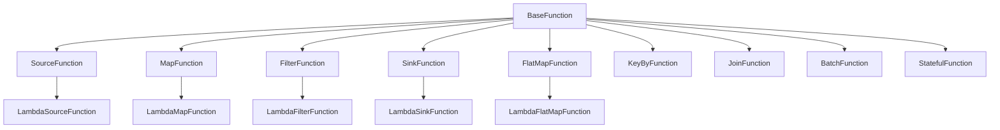

# Function 函数系统概览

Function 函数系统是 SAGE Core 中用户逻辑的载体，它将用户定义的处理函数包装成可在算子系统中执行的标准化组件。函数系统提供了类型安全、资源管理、异常处理等功能，是连接用户代码和底层执行引擎的桥梁。

## 🏗️ 设计架构

函数系统采用分层抽象设计，支持多种类型的用户函数：



## 🧩 核心组件

### 1. 基础函数类 (BaseFunction)

所有函数的抽象基类，定义了函数的通用接口：

```python
from abc import ABC, abstractmethod
from typing import Any, TYPE_CHECKING
import logging

if TYPE_CHECKING:
    from sage.kernel.runtime.task_context import TaskContext

class BaseFunction(ABC):
    """
    BaseFunction is the abstract base class for all operator functions in SAGE.
    It defines the core interface and initializes a logger.
    """
    def __init__(self, *args, **kwargs):
        self.ctx: 'TaskContext' = None # 运行时注入
        self.router = None  # 运行时注入
        self._logger = None

    @property
    def logger(self):
        if not hasattr(self, "_logger") or self._logger is None:
            if self.ctx is None:
                self._logger = logging.getLogger("")
            else:
                self._logger = self.ctx.logger
        return self._logger
    
    @property
    def name(self):
        if self.ctx is None:
            return self.__class__.__name__
        return self.ctx.name
    
    @property
    def call_service(self):
        """
        同步服务调用语法糖
        
        用法:
            result = self.call_service["cache_service"].get("key1")
            data = self.call_service["db_service"].query("SELECT * FROM users")
        """
        if self.ctx is None:
            raise RuntimeError("Runtime context not initialized. Cannot access services.")
        
        return self.ctx.call_service()
    
    @property 
    def call_service_async(self):
        """
        异步服务调用语法糖
        
        用法:
            future = self.call_service_async["cache_service"].get("key1")
            result = future.result()  # 阻塞等待结果
            
            # 或者非阻塞检查
            if future.done():
                result = future.result()
        """
        if self.ctx is None:
            raise RuntimeError("Runtime context not initialized. Cannot access services.")
        
        return self.ctx.call_service_async()

    @abstractmethod
    def execute(self, data: Any):
        """
        Abstract method to be implemented by subclasses.

        Each function must define its own execute logic that processes input data
        and returns the output.

        :param data: Input data.
        :return: Output data.
        """
        pass
```

### 2. 任务上下文 (TaskContext)

提供函数执行时的环境信息和工具：

```python
class TaskContext:
    def __init__(self, graph_node, transformation, env, execution_graph=None):
        self.name = graph_node.name
        self.env_name = env.name
        self.env_base_dir = env.env_base_dir
        self.parallel_index = graph_node.parallel_index
        self.parallelism = graph_node.parallelism
        self._logger = None
        self.is_spout = transformation.is_spout
        self.delay = 0.01
        self.stop_signal_num = graph_node.stop_signal_num
        
    @property
    def logger(self):
        """获取日志记录器"""
        return self._logger
    
    def call_service(self):
        """同步服务调用接口"""
        # 实际实现由运行时提供
        pass
    
    def call_service_async(self):
        """异步服务调用接口"""
        # 实际实现由运行时提供
        pass
```

### 3. 有状态函数 (StatefulFunction)

SAGE 提供了内置的状态管理功能：

```python
import os
from sage.core.api.function.base_function import BaseFunction
from sage.kernel.utils.persistence.state import load_function_state, save_function_state

class StatefulFunction(BaseFunction):
    """
    有状态算子基类：自动在 init 恢复状态，
    并可通过 save_state() 持久化。
    """
    # 子类可覆盖：只保存 include 中字段
    __state_include__ = []
    # 默认排除 logger、私有属性和 runtime_context
    __state_exclude__ = ['logger', '_logger', 'ctx']

    def __init__(self, **kwargs):
        super().__init__(**kwargs)
        # 恢复上次 checkpoint
        if self.ctx:
            chkpt_dir = os.path.join(self.ctx.env_base_dir, ".sage_checkpoints")
            chkpt_path = os.path.join(chkpt_dir, f"{self.ctx.name}.chkpt")
            load_function_state(self, chkpt_path)

    def save_state(self):
        """
        将当前对象状态持久化到 disk
        """
        if self.ctx:
            base = os.path.join(self.ctx.env_base_dir, ".sage_checkpoints")
            os.makedirs(base, exist_ok=True)
            path = os.path.join(base, f"{self.ctx.name}.chkpt")
            save_function_state(self, path)
```

## 🔧 函数类型

### 1. 源函数 (Source Functions)

负责数据生成和输入的函数：

```python
from sage.core.api.function.base_function import BaseFunction

class StopSignal:
    """停止信号类，用于标识任务停止"""
    def __init__(self, name: str):
        self.name = name

    def __repr__(self) -> str:
        return f"<StopSignal {self.name}>"

class SourceFunction(BaseFunction):
    """
    源函数基类 - 数据生产者
    
    源函数不接收输入数据，只产生输出数据
    通常用于读取文件、数据库、API等外部数据源
    """

    @abstractmethod
    def execute(self) -> Any:
        """
        执行源函数逻辑，生产数据
        
        Returns:
            生产的数据
        """
        pass

# 使用示例
class SimpleSourceFunction(SourceFunction):
    def __init__(self, data_list):
        super().__init__()
        self.data_list = data_list
        self.index = 0
        
    def execute(self):
        if self.index < len(self.data_list):
            data = self.data_list[self.index]
            self.index += 1
            return data
        else:
            return StopSignal("data_exhausted")
```

### 2. 映射函数 (Map Functions)

对数据进行一对一转换的函数：

```python
from sage.core.api.function.base_function import BaseFunction
from sage.core.api.function.map_function import MapFunction

class MapFunction(BaseFunction):
    """
    映射函数基类 - 一对一数据变换
    
    映射函数接收一个输入，产生一个输出
    用于数据转换、增强、格式化等操作
    """

    @abstractmethod
    def execute(self, data: Any) -> Any:
        """
        执行映射变换
        
        Args:
            data: 输入数据
            
        Returns:
            变换后的数据
        """
        pass

# Lambda函数包装器
from typing import Callable
from sage.core.api.function.lambda_function import LambdaMapFunction

class LambdaMapFunction(MapFunction):
    """将 lambda 函数包装为 MapFunction"""
    
    def __init__(self, lambda_func: Callable[[Any], Any], **kwargs):
        super().__init__(**kwargs)
        self.lambda_func = lambda_func
    
    def execute(self, data: Any) -> Any:
        return self.lambda_func(data)

# 使用示例
text_processor = LambdaMapFunction(lambda x: x.strip().upper())
number_doubler = LambdaMapFunction(lambda x: x * 2)
```

### 3. 过滤函数 (Filter Functions)

用于数据过滤的谓词函数：

```python
from sage.core.api.function.filter_function import FilterFunction
from sage.core.api.function.lambda_function import LambdaFilterFunction

class FilterFunction(BaseFunction):
    """
    FilterFunction 是专门用于 Filter 操作的函数基类。
    它定义了过滤条件函数的接口，用于判断数据是否应该通过过滤器。
    
    Filter 函数的主要作用是接收输入数据，返回布尔值表示数据是否通过过滤条件。
    """

    @abstractmethod
    def execute(self, data: Any) -> bool:
        """
        抽象方法，由子类实现具体的过滤逻辑。
        
        Args:
            data: 输入数据
            
        Returns:
            bool: True表示数据应该通过，False表示应该被过滤掉
        """
        pass

class LambdaFilterFunction(FilterFunction):
    """将返回布尔值的 lambda 函数包装为 FilterFunction"""
    
    def __init__(self, lambda_func: Callable[[Any], bool], **kwargs):
        super().__init__(**kwargs)
        self.lambda_func = lambda_func
    
    def execute(self, data: Any) -> bool:
        return self.lambda_func(data)

# 使用示例
positive_filter = LambdaFilterFunction(lambda x: x > 0)
non_empty_filter = LambdaFilterFunction(lambda x: x is not None and str(x).strip() != "")
```

### 4. 汇函数 (Sink Functions)

负责数据输出的函数：

```python
from sage.core.api.function.sink_function import SinkFunction
from sage.core.api.function.lambda_function import LambdaSinkFunction

class SinkFunction(BaseFunction):
    """
    汇聚函数基类 - 数据消费者
    
    汇聚函数接收输入数据，通常不产生输出
    用于数据存储、发送、打印等终端操作
    """
    
    @abstractmethod
    def execute(self, data: Any) -> None:
        """
        执行汇聚操作
        
        Args:
            data: 输入数据
        """
        pass

class LambdaSinkFunction(SinkFunction):
    """将 lambda 函数包装为 SinkFunction"""
    
    def __init__(self, lambda_func: Callable[[Any], None], **kwargs):
        super().__init__(**kwargs)
        self.lambda_func = lambda_func
    
    def execute(self, data: Any) -> None:
        self.lambda_func(data)

# 使用示例
print_sink = LambdaSinkFunction(lambda x: print(f"Processing: {x}"))

class FileSinkFunction(SinkFunction):
    def __init__(self, filename):
        super().__init__()
        self.filename = filename
        self.file_handle = None
    
    def setup(self):
        self.file_handle = open(self.filename, 'w')
    
    def execute(self, data: Any) -> None:
        if self.file_handle:
            self.file_handle.write(str(data) + '\n')
            self.file_handle.flush()
    
    def cleanup(self):
        if self.file_handle:
            self.file_handle.close()
```

### 5. 其他函数类型

SAGE 还支持其他类型的函数：

#### FlatMapFunction - 扁平化映射

```python
from sage.core.api.function.flatmap_function import FlatMapFunction
from sage.core.api.function.lambda_function import LambdaFlatMapFunction

class FlatMapFunction(BaseFunction):
    """
    扁平化映射函数基类 - 一对多数据变换
    
    FlatMap函数接收一个输入，产生多个输出（列表形式）
    用于数据分解、展开等操作
    """

    @abstractmethod
    def execute(self, data: Any) -> List[Any]:
        """
        执行扁平化映射变换
        
        Args:
            data: 输入数据
            
        Returns:
            变换后的数据列表
        """
        pass

class LambdaFlatMapFunction(FlatMapFunction):
    """将返回列表的 lambda 函数包装为 FlatMapFunction"""
    
    def __init__(self, lambda_func: Callable[[Any], List[Any]], **kwargs):
        super().__init__(**kwargs)
        self.lambda_func = lambda_func
    
    def execute(self, data: Any) -> List[Any]:
        result = self.lambda_func(data)
        if not isinstance(result, list):
            raise TypeError(f"FlatMap lambda function must return a list, got {type(result)}")
        return result

# 使用示例
sentence_splitter = LambdaFlatMapFunction(lambda x: x.split())
```

#### KeyByFunction - 键值分组

```python
from sage.core.api.function.keyby_function import KeyByFunction

class KeyByFunction(BaseFunction):
    """
    KeyBy函数基类 - 数据分组
    
    用于根据键值对数据进行分组操作
    """

    @abstractmethod
    def execute(self, data: Any) -> Any:
        """
        提取分组键
        
        Args:
            data: 输入数据
            
        Returns:
            分组键
        """
        pass
```

## ⚡ 高级特性

### 1. Lambda函数包装器

SAGE 提供了便捷的Lambda函数包装器，可以快速将普通函数转换为SAGE函数：

```python
from sage.core.api.function.lambda_function import (
    LambdaMapFunction, LambdaFilterFunction, LambdaFlatMapFunction, 
    LambdaSinkFunction
)

# 快速创建各种类型的函数
map_func = LambdaMapFunction(lambda x: x * 2)
filter_func = LambdaFilterFunction(lambda x: x > 0)
flatmap_func = LambdaFlatMapFunction(lambda x: x.split())
sink_func = LambdaSinkFunction(lambda x: print(x))
```

### 2. 服务调用功能

函数可以通过上下文调用系统服务：

```python
class ServiceCallFunction(BaseFunction):
    def execute(self, data):
        # 同步调用服务
        result = self.call_service["cache_service"].get("key1")
        
        # 异步调用服务
        future = self.call_service_async["db_service"].query("SELECT * FROM users")
        
        # 处理结果
        if future.done():
            db_result = future.result()
        
        return {"cache": result, "db": db_result}
```

## 📋 最佳实践

### 1. 函数设计

- **单一职责**: 每个函数应该只做一件事情
- **类型明确**: 明确输入和输出的数据类型
- **错误处理**: 合理处理异常并记录日志

```python
class TextCleanerFunction(MapFunction):
    """文本清理函数 - 良好的设计示例"""
    
    def execute(self, text: str) -> str:
        if not isinstance(text, str):
            self.logger.error(f"Expected string input, got {type(text)}")
            raise TypeError("Input must be a string")
        
        if not text.strip():
            return ""
        
        # 清理逻辑
        cleaned = text.strip().lower()
        cleaned = ' '.join(cleaned.split())  # 规范化空格
        
        return cleaned
```

### 2. 状态管理

- **使用StatefulFunction**: 对于需要维护状态的函数
- **定期保存状态**: 在关键点调用save_state()
- **合理设计状态结构**: 避免状态过大导致序列化问题

```python
class CounterFunction(StatefulFunction):
    def __init__(self):
        super().__init__()
        self.count = 0
        
    def execute(self, data):
        self.count += 1
        
        # 每处理100个数据保存一次状态
        if self.count % 100 == 0:
            self.save_state()
            
        return {"data": data, "count": self.count}
```

### 3. 服务调用

- **异步优先**: 对于I/O操作使用异步服务调用
- **错误处理**: 检查服务调用的返回状态
- **资源管理**: 及时释放服务连接

```python
class DatabaseQueryFunction(MapFunction):
    def execute(self, query_params):
        try:
            # 使用异步服务调用
            future = self.call_service_async["db_service"].query(query_params)
            
            if future.done():
                result = future.result()
                if result.get("success"):
                    return result.get("data")
                else:
                    self.logger.error(f"Database query failed: {result.get('error')}")
                    return None
            else:
                self.logger.warning("Database query timeout")
                return None
                
        except Exception as e:
            self.logger.error(f"Service call failed: {e}")
            return None
```

### 4. 测试和调试

- **单元测试**: 为每个函数编写测试
- **模拟上下文**: 在测试中模拟TaskContext
- **日志记录**: 充分利用logger记录关键信息

```python
import unittest
from unittest.mock import Mock

class TestTextCleanerFunction(unittest.TestCase):
    def setUp(self):
        self.function = TextCleanerFunction()
        # 模拟上下文
        self.function.ctx = Mock()
        self.function.ctx.logger = Mock()
        
    def test_clean_normal_text(self):
        result = self.function.execute("  Hello   World  ")
        self.assertEqual(result, "hello world")
        
    def test_clean_empty_text(self):
        result = self.function.execute("   ")
        self.assertEqual(result, "")
        
    def test_invalid_input(self):
        with self.assertRaises(TypeError):
            self.function.execute(123)
```

---

**下一步**: 了解 <!-- [Transformation 转换系统](../transformations_overview.md) -->
转换操作概览 如何优化函数执行。
