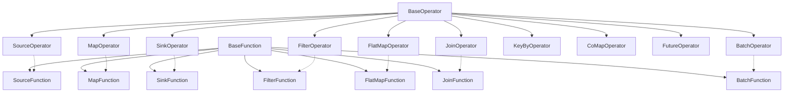

# Operator 算子系统概览

Operator 算子系统是 SAGE Kernel 的执行层核心组件，负责在运行时执行具体的数据处理逻辑。算子基于包装器模式，将用户定义的 Function 包装成可执行的运行时组件，通过 Packet 和 Router 进行数据传递。

## 🏗️ 设计架构

算子系统采用 Operator-Function 分离设计，算子负责运行时调度，Function 负责业务逻辑：



## 🧩 核心组件

### 1. 基础算子类 (BaseOperator)

所有算子的抽象基类，定义了算子与 Function 协作的基本接口：

```python
from abc import ABC, abstractmethod
from typing import Any, Optional, TYPE_CHECKING
from sage.kernel.runtime.task.base_task import BaseTask
from sage.utils.logging.custom_logger import CustomLogger

if TYPE_CHECKING:
    from sage.core.api.packet import Packet
    from sage.core.api.function.base_function import BaseFunction
    from sage.kernel.runtime.task_context import TaskContext
    from sage.core.factory.function_factory import FunctionFactory
    from sage.kernel.runtime.communication.router.router import BaseRouter

class BaseOperator(ABC):
    def __init__(self, 
                 function_factory: 'FunctionFactory', 
                 ctx: 'TaskContext', 
                 *args, **kwargs):
        
        self.ctx: 'TaskContext' = ctx
        self.function: 'BaseFunction'
        self.router: 'BaseRouter'
        self.task: Optional['BaseTask'] = None
        
        # 通过工厂创建对应的Function实例
        try:
            self.function = function_factory.create_function(self.name, ctx)
            self.logger.debug(f"Created function instance with {function_factory}")
        except Exception as e:
            self.logger.error(f"Failed to create function instance: {e}", exc_info=True)
            raise

    def inject_router(self, router: 'BaseRouter'):
        """注入路由器实例，用于数据包传递"""
        self.router = router
        self.logger.debug(f"Injected router into operator {self.name}")

    def receive_packet(self, packet: 'Packet'):
        """接收数据包并处理"""
        if packet is None:
            self.logger.warning(f"Received None packet in {self.name}")
            return
        self.logger.debug(f"Operator {self.name} received packet: {packet}")
        self.process_packet(packet)

    @abstractmethod
    def process_packet(self, packet: 'Packet' = None):
        """处理数据包的核心逻辑，由具体算子实现"""
        pass

    def save_state(self):
        """保存有状态Function的状态"""
        from sage.core.api.function.base_function import StatefulFunction
        if isinstance(self.function, StatefulFunction):
            self.function.save_state()
    
    @property
    def name(self) -> str:
        """获取任务名称"""
        return self.ctx.name

    @property
    def logger(self) -> CustomLogger:
        """获取当前任务的日志记录器"""
        return self.ctx.logger
```

### 2. 数据包系统 (Packet)

SAGE 使用 Packet 作为算子间数据传递的载体：

```python
from typing import Any
import time

class Packet:
    def __init__(self, payload: Any, input_index: int = 0, 
                 partition_key: Any = None, partition_strategy: str = None):
        self.payload = payload                    # 实际数据
        self.input_index = input_index           # 输入索引
        self.partition_key = partition_key       # 分区键
        self.partition_strategy = partition_strategy  # 分区策略
        self.timestamp = time.time_ns()          # 时间戳
    
    def is_keyed(self) -> bool:
        """检查packet是否包含分区信息"""
        return self.partition_key is not None
    
    def inherit_partition_info(self, new_payload: Any) -> 'Packet':
        """创建新packet，继承当前的分区信息"""
        return Packet(
            payload=new_payload,
            input_index=self.input_index,
            partition_key=self.partition_key,
            partition_strategy=self.partition_strategy,
        )
```

### 3. Function 基类系统

Function 封装用户的业务逻辑，由 Operator 调用执行：

```python
from abc import ABC, abstractmethod
from typing import Any, TYPE_CHECKING
from sage.kernel.utils.persistence.state import load_function_state, save_function_state

if TYPE_CHECKING:
    from sage.kernel.runtime.task_context import TaskContext

class BaseFunction(ABC):
    """所有Function的基础类"""
    def __init__(self, *args, **kwargs):
        self.ctx: 'TaskContext' = None  # 运行时注入
        self.router = None              # 运行时注入
        self._logger = None

    @property
    def logger(self):
        if not hasattr(self, "_logger") or self._logger is None:
            if self.ctx is None:
                self._logger = logging.getLogger("")
            else:
                self._logger = self.ctx.logger
        return self._logger
    
    @property
    def name(self):
        if self.ctx is None:
            return self.__class__.__name__
        return self.ctx.name

class StatefulFunction(BaseFunction):
    """
    有状态的Function基类，支持状态持久化
    子类可以定义 __state_include__ 和 __state_exclude__ 来控制序列化
    """
    __state_include__ = []
    __state_exclude__ = ['logger', '_logger', 'ctx']
    
    def load_state(self, chkpt_path: str):
        """加载状态"""
        if os.path.exists(chkpt_path):
            load_function_state(self, chkpt_path)

    def save_state(self):
        """保存状态"""
        if self.ctx is None or not hasattr(self.ctx, 'env_base_dir'):
            return
        
        path = os.path.join(self.ctx.env_base_dir, ".sage_states", 
                           "function_states", f"{self.name}.pkl")
        save_function_state(self, path)
```

## 🔄 具体算子实现

### 1. 源算子 (SourceOperator)

负责从数据源产生数据并注入数据流，不接收上游数据：

```python
from sage.core.operator.base_operator import BaseOperator
from sage.core.api.function.source_function import SourceFunction, StopSignal
from sage.core.api.packet import Packet

class SourceOperator(BaseOperator):
    def __init__(self, *args, **kwargs):
        super().__init__(*args, **kwargs)

    def process_packet(self, packet: 'Packet' = None):
        """源算子不接收上游数据包，直接执行Function生成数据"""
        try:
            # 调用 SourceFunction 生成数据
            result = self.function.execute()
            self.logger.debug(f"Operator {self.name} processed data with result: {result}")
            
            # 检查是否收到停止信号
            if isinstance(result, StopSignal):
                self.logger.info(f"Source Operator {self.name} received stop signal: {result}")
                result.name = self.name
                self.router.send_stop_signal(result)
                self.task.stop()
                return
            
            # 发送数据到下游
            if result is not None:
                self.logger.info(f"SourceOperator {self.name}: Sending packet with payload: {result}")
                success = self.router.send(Packet(result))
                self.logger.info(f"SourceOperator {self.name}: Send result: {success}")
                
                # 如果发送失败（如队列已关闭），停止任务
                if not success:
                    self.logger.warning(f"Source Operator {self.name} failed to send packet, stopping task")
                    if hasattr(self, 'task') and hasattr(self.task, 'stop'):
                        self.task.stop()
                    return
        except Exception as e:
            self.logger.error(f"Error in {self.name}.process(): {e}", exc_info=True)
```

### 2. 映射算子 (MapOperator)

对每个数据元素应用转换函数，一对一映射：

```python
from sage.core.operator.base_operator import BaseOperator
from sage.core.api.packet import Packet
import time
import os
import json

class MapOperator(BaseOperator):
    def __init__(self, function_factory, ctx, enable_profile=False, *args, **kwargs):
        # 移除 enable_profile 避免传递给 BaseOperator
        kwargs.pop('enable_profile', None)
        super().__init__(function_factory, ctx, *args, **kwargs)
        self.enable_profile = enable_profile
        if self.enable_profile:
            self._setup_time_tracking()

    def _setup_time_tracking(self):
        """设置性能统计"""
        if hasattr(self.ctx, 'env_base_dir') and self.ctx.env_base_dir:
            self.time_base_path = os.path.join(self.ctx.env_base_dir, 
                                             ".sage_states", "time_records")
        else:
            self.time_base_path = os.path.join(os.getcwd(), 
                                             ".sage_states", "time_records")
        
        os.makedirs(self.time_base_path, exist_ok=True)
        self.time_records = []

    def process_packet(self, packet: 'Packet' = None):
        """处理数据包，应用映射函数"""
        try:
            if packet is None or packet.payload is None:
                self.logger.warning(f"Operator {self.name} received empty data")
                return

            start_time = time.time() if self.enable_profile else None
            
            # 调用 MapFunction 处理数据
            result = self.function.execute(packet.payload)
            self.logger.debug(f"Operator {self.name} processed data with result: {result}")
            
            if self.enable_profile:
                duration = time.time() - start_time
                self._save_time_record(duration)
            
            # 发送处理结果到下游
            if result is not None:
                # 继承分区信息
                output_packet = packet.inherit_partition_info(result)
                success = self.router.send(output_packet)
                if not success:
                    self.logger.warning(f"Map Operator {self.name} failed to send packet")
                    
        except Exception as e:
            self.logger.error(f"Error in {self.name}.process(): {e}", exc_info=True)
```

### 3. 过滤算子 (FilterOperator)

根据谓词条件过滤数据元素：

```python
from sage.core.operator.base_operator import BaseOperator
from sage.core.api.packet import Packet

class FilterOperator(BaseOperator):
    def __init__(self, *args, **kwargs):
        super().__init__(*args, **kwargs)

    def process_packet(self, packet: 'Packet' = None):
        """处理数据包，应用过滤条件"""
        try:
            if packet is None or packet.payload is None:
                self.logger.warning(f"Operator {self.name} received empty data")
                return

            # 调用 FilterFunction 检查过滤条件
            should_pass = self.function.execute(packet.payload)
            self.logger.debug(f"Operator {self.name} filter result: {should_pass}")
            
            # 只有通过过滤条件的数据才发送到下游
            if should_pass:
                success = self.router.send(packet)
                if not success:
                    self.logger.warning(f"Filter Operator {self.name} failed to send packet")
                    
        except Exception as e:
            self.logger.error(f"Error in {self.name}.process(): {e}", exc_info=True)
```

### 4. 汇算子 (SinkOperator)

负责将数据输出到外部系统，是数据流的终点：

```python
from sage.core.operator.base_operator import BaseOperator
from sage.core.api.packet import Packet

class SinkOperator(BaseOperator):
    def __init__(self, *args, **kwargs):
        super().__init__(*args, **kwargs)
        
    def process_packet(self, packet: 'Packet' = None):
        """处理数据包，输出到外部系统"""
        try:
            if packet is None or packet.payload is None:
                self.logger.warning(f"Operator {self.name} received empty data")
            else:
                # 调用 SinkFunction 输出数据
                result = self.function.execute(packet.payload)
                self.logger.debug(f"Operator {self.name} processed data with result: {result}")
        except Exception as e:
            self.logger.error(f"Error in {self.name}.process(): {e}", exc_info=True)
```

### 5. 扁平映射算子 (FlatMapOperator)

将每个输入元素映射为零个或多个输出元素：

```python
from sage.core.operator.base_operator import BaseOperator
from sage.core.api.packet import Packet

class FlatMapOperator(BaseOperator):
    def __init__(self, *args, **kwargs):
        super().__init__(*args, **kwargs)

    def process_packet(self, packet: 'Packet' = None):
        """处理数据包，应用扁平映射"""
        try:
            if packet is None or packet.payload is None:
                self.logger.warning(f"Operator {self.name} received empty data")
                return

            # 调用 FlatMapFunction，可能返回多个结果
            results = self.function.execute(packet.payload)
            self.logger.debug(f"Operator {self.name} processed data with results: {results}")
            
            # 发送所有结果到下游
            if results:
                for result in results:
                    if result is not None:
                        output_packet = packet.inherit_partition_info(result)
                        success = self.router.send(output_packet)
                        if not success:
                            self.logger.warning(f"FlatMap Operator {self.name} failed to send packet")
                            break
                            
            # 保存状态（如果是有状态Function）
            from sage.core.api.function.base_function import StatefulFunction
            if isinstance(self.function, StatefulFunction):
                self.function.save_state()
                
        except Exception as e:
            self.logger.error(f"Error in {self.name}.process(): {e}", exc_info=True)
```

### 6. 分组算子 (KeyByOperator)

根据键函数对数据重新分区：

```python
from sage.core.operator.base_operator import BaseOperator
from sage.core.api.packet import Packet

class KeyByOperator(BaseOperator):
    def __init__(self, *args, **kwargs):
        super().__init__(*args, **kwargs)

    def process_packet(self, packet: 'Packet' = None):
        """处理数据包，重新分区"""
        try:
            if packet is None or packet.payload is None:
                self.logger.warning(f"Operator {self.name} received empty data")
                return

            # 调用 KeyByFunction 计算新的分区键
            new_key = self.function.execute(packet.payload)
            self.logger.debug(f"Operator {self.name} computed key: {new_key}")
            
            # 更新分区信息并发送
            if new_key is not None:
                output_packet = packet.update_key(new_key, "hash")
                success = self.router.send(output_packet)
                if not success:
                    self.logger.warning(f"KeyBy Operator {self.name} failed to send packet")
                    
        except Exception as e:
            self.logger.error(f"Error in {self.name}.process(): {e}", exc_info=True)
```

## ⚡ 高级特性

### 1. 状态管理

SAGE 通过 StatefulFunction 支持有状态的算子：

```python
from sage.core.api.function.base_function import StatefulFunction

class CounterFunction(StatefulFunction):
    """计数器函数示例"""
    __state_include__ = ['count']  # 指定需要持久化的字段
    
    def __init__(self):
        super().__init__()
        self.count = 0
    
    def execute(self, data):
        self.count += 1
        return f"Processed {self.count} items: {data}"
```

### 2. 批处理算子

支持批量处理数据以提高效率：

```python
from sage.core.operator.base_operator import BaseOperator
from sage.core.api.packet import Packet

class BatchOperator(BaseOperator):
    def __init__(self, batch_size: int = 32, *args, **kwargs):
        super().__init__(*args, **kwargs)
        self.batch_size = batch_size
        self.batch_buffer = []

    def process_packet(self, packet: 'Packet' = None):
        """累积数据到批次，达到批次大小时处理"""
        try:
            if packet is None or packet.payload is None:
                self.logger.warning(f"Operator {self.name} received empty data")
                return

            self.batch_buffer.append(packet.payload)
            
            # 当批次满时处理
            if len(self.batch_buffer) >= self.batch_size:
                batch_data = list(self.batch_buffer)
                self.batch_buffer.clear()
                
                # 调用 BatchFunction 处理批量数据
                results = self.function.execute(batch_data)
                
                # 发送批次结果
                if results:
                    for result in results:
                        if result is not None:
                            output_packet = packet.inherit_partition_info(result)
                            success = self.router.send(output_packet)
                            if not success:
                                self.logger.warning(f"Batch Operator {self.name} failed to send packet")
                                break
                                
        except Exception as e:
            self.logger.error(f"Error in {self.name}.process(): {e}", exc_info=True)
```

### 3. 连接算子 (JoinOperator)

支持多流连接操作：

```python
from sage.core.operator.base_operator import BaseOperator
from sage.core.api.function.base_function import StatefulFunction
from sage.core.api.packet import Packet

class JoinOperator(BaseOperator):
    def __init__(self, *args, **kwargs):
        super().__init__(*args, **kwargs)

    def process_packet(self, packet: 'Packet' = None):
        """处理连接操作"""
        try:
            if packet is None or packet.payload is None:
                self.logger.warning(f"Operator {self.name} received empty data")
                return

            # 调用 JoinFunction 进行连接逻辑
            results = self.function.execute(packet.payload, packet.input_index)
            
            # 发送连接结果
            if results:
                for result in results:
                    if result is not None:
                        output_packet = packet.inherit_partition_info(result)
                        success = self.router.send(output_packet)
                        if not success:
                            self.logger.warning(f"Join Operator {self.name} failed to send packet")
                            break
                            
        except Exception as e:
            self.logger.error(f"Error in {self.name}.process(): {e}", exc_info=True)
```

### 4. 性能监控

MapOperator 支持性能监控功能：

```python
def _save_time_record(self, duration: float):
    """保存执行时间记录"""
    if not self.enable_profile:
        return

    record = {
        'timestamp': time.time(),
        'duration': duration,
        'function_name': self.function.__class__.__name__,
        'operator_name': self.name
    }
    
    self.time_records.append(record)
    
    # 定期保存到文件
    if len(self.time_records) >= 100:
        self._flush_time_records()

def _flush_time_records(self):
    """刷新时间记录到文件"""
    if not self.time_records:
        return
        
    file_path = os.path.join(self.time_base_path, f"{self.name}_timing.jsonl")
    with open(file_path, 'a') as f:
        for record in self.time_records:
            f.write(json.dumps(record) + '\n')
    
    self.time_records.clear()
```

## 🔧 算子运行时架构

### Task 与 Operator 的关系

在 SAGE 中，每个算子都运行在一个独立的 Task 中：

```python
from sage.kernel.runtime.task.base_task import BaseTask

class OperatorTask(BaseTask):
    """算子任务包装器"""
    def __init__(self, operator: BaseOperator):
        super().__init__()
        self.operator = operator
        self.operator.task = self  # 注入任务引用
    
    async def run(self):
        """任务运行逻辑"""
        while self.running:
            try:
                # 等待接收数据包
                packet = await self.input_queue.get()
                
                if packet is None:  # 停止信号
                    break
                    
                # 委托给算子处理
                self.operator.receive_packet(packet)
                
            except Exception as e:
                self.logger.error(f"Task {self.name} error: {e}")
                break
```

### Router 路由系统

算子通过 Router 进行数据传递：

```python
from sage.kernel.runtime.communication.router.router import BaseRouter

class OperatorRouter(BaseRouter):
    """算子路由器"""
    def __init__(self):
        self.output_channels = []
        self.stopped = False
    
    def send(self, packet: 'Packet') -> bool:
        """发送数据包到下游"""
        if self.stopped:
            return False
            
        for channel in self.output_channels:
            try:
                channel.send(packet)
            except Exception as e:
                self.logger.error(f"Failed to send packet: {e}")
                return False
        return True
    
    def send_stop_signal(self, stop_signal):
        """发送停止信号"""
        self.stopped = True
        # 通知下游任务停止
        for channel in self.output_channels:
            channel.send_stop_signal(stop_signal)
```

### Function Factory

通过工厂模式创建 Function 实例：

```python
from sage.core.factory.function_factory import FunctionFactory

class DefaultFunctionFactory(FunctionFactory):
    """默认Function工厂"""
    def __init__(self):
        self.function_registry = {}
    
    def register_function(self, name: str, function_class):
        """注册Function类"""
        self.function_registry[name] = function_class
    
    def create_function(self, name: str, ctx: 'TaskContext'):
        """创建Function实例"""
        if name not in self.function_registry:
            raise ValueError(f"Unknown function: {name}")
        
        function_class = self.function_registry[name]
        function = function_class()
        
        # 注入运行时上下文
        function.ctx = ctx
        return function
```

## 📊 实际应用示例

### 1. 简单的数据处理流水线

```python
from sage.core.api.function.source_function import SourceFunction
from sage.core.api.function.map_function import MapFunction
from sage.core.api.function.sink_function import SinkFunction

# 定义数据源
class NumberSourceFunction(SourceFunction):
    def __init__(self):
        super().__init__()
        self.current = 0
        
    def execute(self):
        if self.current < 10:
            self.current += 1
            return self.current
        else:
            return StopSignal("Finished generating numbers")

# 定义映射函数
class SquareMapFunction(MapFunction):
    def execute(self, data):
        return data * data

# 定义输出函数
class PrintSinkFunction(SinkFunction):
    def execute(self, data):
        print(f"Result: {data}")
```

### 2. 有状态的计数器

```python
from sage.core.api.function.base_function import StatefulFunction

class CounterMapFunction(StatefulFunction):
    __state_include__ = ['total_count']
    
    def __init__(self):
        super().__init__()
        self.total_count = 0
    
    def execute(self, data):
        self.total_count += 1
        return f"Item {self.total_count}: {data}"
```

### 3. 批处理示例

```python
from sage.core.api.function.batch_function import BatchFunction

class SumBatchFunction(BatchFunction):
    def execute(self, batch_data):
        """对批次数据求和"""
        total = sum(batch_data)
        return [f"Batch sum: {total}"]
```

## 🛠️ 开发指南

### 1. 创建自定义算子

虽然 SAGE 提供了完整的算子集合，但如果需要特殊的处理逻辑，可以扩展 BaseOperator：

```python
class CustomOperator(BaseOperator):
    def __init__(self, *args, **kwargs):
        super().__init__(*args, **kwargs)
        # 自定义初始化逻辑
    
    def process_packet(self, packet: 'Packet' = None):
        """自定义处理逻辑"""
        try:
            if packet is None or packet.payload is None:
                return
            
            # 执行自定义处理
            result = self.function.execute(packet.payload)
            
            # 发送结果
            if result is not None:
                output_packet = packet.inherit_partition_info(result)
                success = self.router.send(output_packet)
                if not success:
                    self.logger.warning("Failed to send packet")
                    
        except Exception as e:
            self.logger.error(f"Error in {self.name}: {e}", exc_info=True)
```

### 2. 自定义 Function

继承适当的 Function 基类来实现业务逻辑：

```python
from sage.core.api.function.map_function import MapFunction

class MyCustomFunction(MapFunction):
    def __init__(self, multiplier=2):
        super().__init__()
        self.multiplier = multiplier
    
    def execute(self, data):
        # 实现自定义的映射逻辑
        return data * self.multiplier
```

### 3. 有状态 Function

```python
from sage.core.api.function.base_function import StatefulFunction

class WindowAverageFunction(StatefulFunction):
    __state_include__ = ['window_data', 'window_size']
    
    def __init__(self, window_size=5):
        super().__init__()
        self.window_size = window_size
        self.window_data = []
    
    def execute(self, data):
        self.window_data.append(data)
        if len(self.window_data) > self.window_size:
            self.window_data.pop(0)
        
        return sum(self.window_data) / len(self.window_data)
```

## 📋 关键特性总结

### 1. 核心设计原则

- **分层架构**: Operator 负责运行时调度，Function 负责业务逻辑
- **数据包传递**: 通过 Packet 和 Router 实现算子间通信
- **工厂模式**: 通过 FunctionFactory 动态创建 Function 实例
- **状态管理**: 支持 StatefulFunction 的自动状态持久化

### 2. 算子类型

| 算子类型 | 功能描述 | 对应Function |
|---------|---------|-------------|
| SourceOperator | 数据源，生成数据流 | SourceFunction |
| MapOperator | 一对一数据转换 | MapFunction |
| FilterOperator | 条件过滤 | FilterFunction |
| FlatMapOperator | 一对多数据转换 | FlatMapFunction |
| SinkOperator | 数据输出 | SinkFunction |
| BatchOperator | 批量处理 | BatchFunction |
| JoinOperator | 多流连接 | JoinFunction |
| KeyByOperator | 数据重分区 | KeyByFunction |

### 3. 运行时特性

- **异步处理**: 基于事件驱动的异步处理模型
- **错误处理**: 完善的异常处理和日志记录
- **性能监控**: 支持执行时间统计和性能分析
- **容错机制**: 支持状态检查点和恢复

### 4. 最佳实践

1. **Function 设计**:
   - 保持 Function 的纯函数特性
   - 使用 `__state_include__` 精确控制状态序列化
   - 避免在 Function 中进行 I/O 操作

2. **错误处理**:
   - 在 Function 中抛出具体的异常
   - 依赖 Operator 进行统一的错误处理和日志记录

3. **性能优化**:
   - 使用 BatchOperator 进行批量处理
   - 合理设置分区策略提高并行度
   - 启用性能监控分析瓶颈

4. **状态管理**:
   - 只有需要跨批次保持状态的 Function 才继承 StatefulFunction
   - 定期调用 save_state() 进行状态持久化

---

**相关文档**: 
- [Function 函数系统详解](../functions/functions_overview.md)
- <!-- [Task 任务系统架构](../../runtime/task/task_overview.md) -->
任务概览
- <!-- [通信路由系统](../../runtime/communication/router_overview.md) -->
通信路由概览
