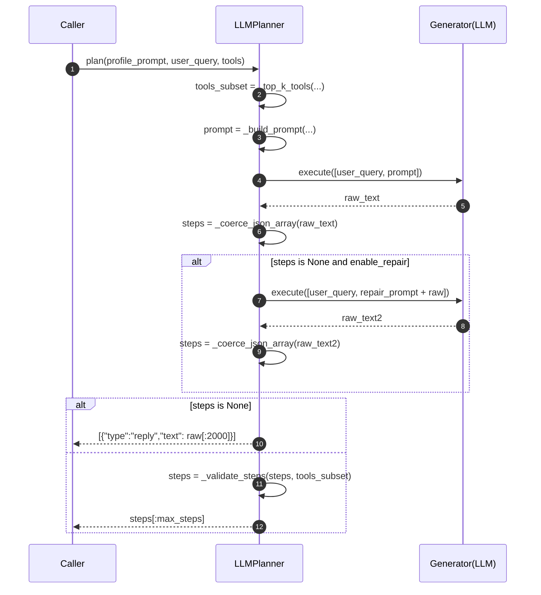

# `LLMPlanner` 组件设计文档

> 模块路径：`sage/libs/agents/planning/llm_planner.py`

!!! note "定位"
    `LLMPlanner` 负责把 **Profile + 用户请求 + 工具清单(MCP)** 转换为**可执行的 JSON 计划**（PlanSteps）。
    实现目标是：**简单、稳健、易接入** —— 不引入复杂的状态机，只做计划生成与最小校验。

---

## 1. 功能概述

- **输入**：
  - `profile_system_prompt`：通过 `BaseProfile.render_system_prompt()` 生成的系统提示词
  - `user_query`：用户问题/需求
  - `tools`：MCP 风格的工具字典 `{name: {description, input_schema}}`
- **输出**：
  - `List[PlanStep]`（Python 字典列表），满足 MCP 规范：
    - `{"type":"tool","name":"...","arguments":{...}}`  
    - 或 `{"type":"reply","text":"..."}`
- **核心能力**：
  1. 提示词构造：将 Profile、用户问题、可用工具拼接为**强约束提示**（只允许输出 JSON 数组）
  2. 工具筛选：基于 `name/description` 的朴素关键词打分，传入 Top-K 工具，降低跑偏
  3. JSON 解析容错：剥离代码围栏、截取 `[`…`]` 片段做二次解析
  4. 轻量合法化：校验 `type/name/arguments` 与 `input_schema.required`，缺失则丢弃该步
  5. 兜底策略：完全不可解析时返回单步 `reply`

---

## 2. 代码结构

```python title="模块概览"
PlanStep = Dict[str, Any]  # 计划步骤（MCP 风格）

# 工具 Top-K 选择
_top_k_tools(user_query, tools, k=6) -> Dict[str, Dict[str, Any]]

# 生成 LLM 提示词（包含 Profile / Query / Tools）
_build_prompt(profile_system_prompt, user_query, tools_subset) -> str

# 剥离 ```fences```
_strip_code_fences(text) -> str

# JSON 容错解析：先 loads；失败再截取 [ ... ] 片段
_coerce_json_array(text) -> Optional[List[Any]]

# 轻量校验：结构正确、工具存在、必填参数齐全
_validate_steps(steps, tools) -> List[PlanStep]

class LLMPlanner:
    def __init__(generator, max_steps=6, enable_repair=True, topk_tools=6): ...
    def plan(profile_system_prompt, user_query, tools) -> List[PlanStep]: ...
```

---

## 3. 关键流程



---

## 4. 接口与参数

### 4.1 `LLMPlanner.__init__`

| 参数 | 类型 | 默认 | 说明 |
|---|---|---:|---|
| `generator` | `OpenAIGenerator | HFGenerator` | — | 你的 LLM 生成器，需实现 `.execute([user_query, prompt]) -> (user_query, text)` |
| `max_steps` | `int` | `6` | 计划最大步数（最终会截断） |
| `enable_repair` | `bool` | `True` | 首次解析失败时，是否进行一次“简短修复”重试 |
| `topk_tools` | `int` | `6` | 传给模型的工具子集上限 |

### 4.2 `LLMPlanner.plan(...)`

```python
plan(profile_system_prompt: str, user_query: str, tools: Dict[str, Dict[str, Any]]) -> List[PlanStep]
```

- **返回**：`List[PlanStep]`，保证列表非空；若全被过滤，会返回 `[{"type":"reply","text":"（计划不可用）"}]`

---

## 5. 提示词规范

```text title="核心 Prompt 片段（简化）"
<SYSTEM>
You are a planning module. Produce a plan as a JSON array of steps.
Each step is EITHER:
  1) {"type":"tool","name":"<tool_name>","arguments":{...}}
  2) {"type":"reply","text":"..."}
Rules:
- Use ONLY the provided tools.
- Arguments MUST follow the tool JSON Schema.
- Output ONLY the JSON array (no explanations / code fences).
- Conclude with a reply step once done.
</SYSTEM>

<PROFILE>
{profile_system_prompt}
</PROFILE>

<USER_QUERY>
{user_query}
</USER_QUERY>

<AVAILABLE_TOOLS>
[{"name":..., "description":..., "input_schema":...}, ...]
</AVAILABLE_TOOLS>
```

!!! tip "为什么要 Top-K 工具子集？"
    传入过多工具会稀释注意力且增加跑偏概率。朴素的关键词匹配能在多数场景显著提升稳定性（后续可替换为向量召回）。

---

## 6. 轻量校验规则

- **结构**：每个步骤必须含 `type`；`reply` 需有非空 `text`；`tool` 需有 `name` 与 `arguments`
- **工具存在性**：`name` 必须在 `tools_subset` 中
- **必填参数**：若 `input_schema.required` 有缺失参数，该步被丢弃（可在 Runtime 做“澄清补齐”）
- **兜底**：若最终 `valid` 为空，返回 `[{"type":"reply","text":"（计划不可用）"}]`

---

## 7. 使用示例

=== "调用示例"
```python
from sage.libs.agents.planning.llm_planner import LLMPlanner
from sage.libs.rag.generator import OpenAIGenerator

conf = {"method":"openai","model_name":"gpt-4o-mini","base_url":"http://localhost:8000/v1","api_key":"sk-..."}
gen = OpenAIGenerator(conf)

planner = LLMPlanner(generator=gen, max_steps=4, enable_repair=True, topk_tools=6)

profile_prompt = "You are ResearchAgent, acting as planner. Reply in zh."
user_query = "在 arXiv 找 2 篇 LLM agents 调研；再计算 21*2+5，最后给出中文总结。"

tools = {
  "arxiv_search": {
    "description": "Search arXiv papers",
    "input_schema": {
      "type":"object",
      "properties":{"query":{"type":"string"},"max_results":{"type":"integer"}},
      "required":["query"]
    }
  },
  "calculator": {
    "description": "Do arithmetic",
    "input_schema": {"type":"object","properties":{"expr":{"type":"string"}},"required":["expr"]}
  }
}

steps = planner.plan(profile_prompt, user_query, tools)
print(steps)
```

=== "可能输出"
```json
[
  {"type":"tool","name":"arxiv_search","arguments":{"query":"LLM agents survey","max_results":2}},
  {"type":"tool","name":"calculator","arguments":{"expr":"21*2+5"}},
  {"type":"reply","text":"已找到 2 篇相关综述，计算结果为 47，并给出总结。"}
]
```

---

## 8. 常见问题（FAQ）

??? question "模型输出了 Markdown 包裹的 JSON，怎么处理？"
    `_coerce_json_array` 会剥离 ``` 围栏，并尝试截取 `[` 到 `]` 的 JSON 片段再解析。

??? question "如果模型乱填了不存在的参数？"
    在 `_validate_steps` 阶段只检查 **必填项存在**；非法字段暂不报错，由工具自身的参数校验负责拦截。

??? question "必须先实现 Memory 才能用吗？"
    不需要。`LLMPlanner` 与 Memory 解耦；有 Memory 时只需把其上下文拼到 Profile/Prompt 中即可。

---

## 9. 测试建议（pytest）

- **解析容错**：构造带围栏/附加说明的输出，断言 `_coerce_json_array` 能成功提取数组
- **必填参数**：工具 schema 含 `required=[...]`，缺失时该步会被过滤
- **兜底回复**：给出明显不可解析的文本，断言返回单步 `reply`
- **步数上限**：生成超过 `max_steps` 的数组，断言最终被截断

---

## 10. 演进方向

- 用 **向量召回** 替换关键词 Top-K；
- 在 `_validate_steps` 缺参时，交给 Runtime 发起 **澄清/补齐** 交互；
- 引入 **硬/软约束**（来自 Profile）做二次过滤；
- 计划失败时触发 **Re-Plan**（把错误观测作为额外上下文重试）。
