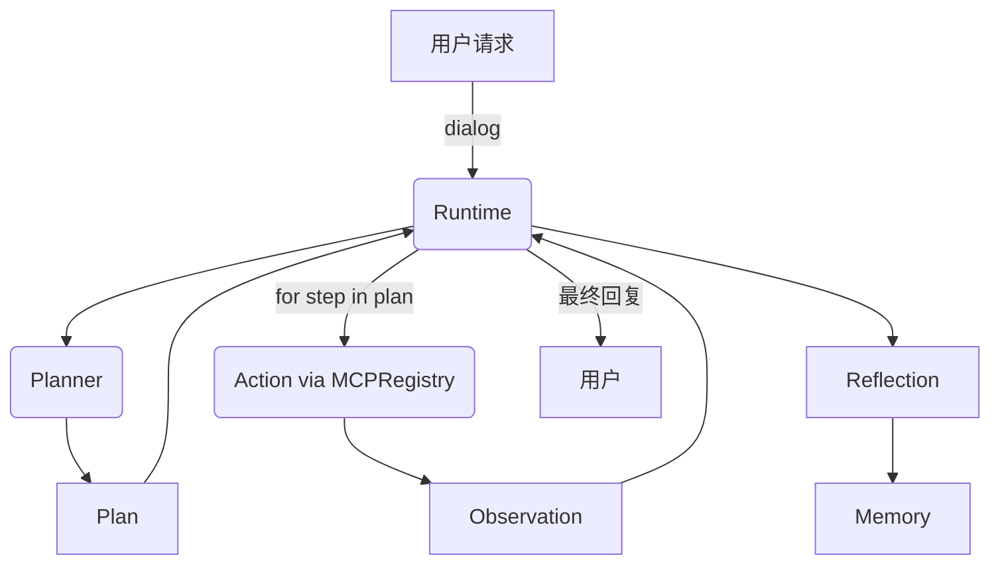

# Runtime 组件设计文档

!!! note "定位"
    **Runtime** 是 Agent 的“执行循环”，负责调度 **Profile / Planning / Action / Memory / Reflection** 各个组件，驱动 Agent 从用户请求到最终回复的全过程。

---

## 1. 设计目标

- **统一调度**：将 Planner 产出的计划依次执行。
- **工具调用**：调用 MCPRegistry 中注册的工具，获取执行结果。
- **容错处理**：在工具出错或计划无效时提供兜底策略（如 fallback reply）。
- **可扩展性**：支持日志记录、事件追踪、记忆写入、反思更新。
- **简单易用**：调用 `agent.step(dialog)` 即可完成一次完整的感知 → 规划 → 执行 → 反馈流程。

---

## 2. 数据流



---

## 3. 核心类

```python title="runtime/agent.py"
from typing import List, Dict
from sage.libs.agents.planning.schema import Plan, PlanStep
from sage.libs.agents.action.mcp_registry import MCPRegistry

class AgentRuntime:
    def __init__(self, profile, planner, registry: MCPRegistry, memory=None, reflector=None, llm=None):
        self.profile = profile
        self.planner = planner
        self.registry = registry
        self.memory = memory
        self.reflector = reflector
        self.llm = llm

    def step(self, dialog: List[dict]) -> dict:
        # 1) Profile prompt
        profile_prompt = self.profile.render_system_prompt()

        # 2) 生成计划
        plan: Plan = self.planner.plan(profile_prompt, dialog[-1]["content"], self.registry.describe())

        results = []
        reply = None
        for step in plan.steps:
            if step.type == "tool":
                try:
                    obs = self.registry.call(step.name, step.arguments)
                    results.append({"tool": step.name, "output": obs})
                except Exception as e:
                    results.append({"tool": step.name, "error": str(e)})
            elif step.type == "reply":
                reply = {"role": "assistant", "content": step.text}

        # 3) Reflection + Memory
        if self.reflector:
            self.reflector.reflect(results, self.memory)
        if self.memory:
            self.memory.write(str(results))

        # 4) 返回最终回复
        return reply or {"role": "assistant", "content": "(no valid reply)"}
```

---

## 4. 使用示例

```python
from sage.libs.agents.profile.profile import BaseProfile
from sage.libs.agents.planning.llm_planner import LLMPlanner
from sage.libs.agents.action.mcp_registry import MCPRegistry
from sage.libs.rag.generator import OpenAIGenerator

# 1) Profile
profile = BaseProfile(name="ResearchAgent", role="planner", language="zh")

# 2) Generator + Planner
gen = OpenAIGenerator({"method":"openai","model_name":"gpt-4o-mini","base_url":"http://localhost:8000/v1","api_key":"sk-..."})
planner = LLMPlanner(generator=gen)

# 3) 工具注册
reg = MCPRegistry()
reg.register(Calculator())
reg.register(ArxivSearcher())

# 4) Runtime
agent = AgentRuntime(profile, planner, reg)

# 5) 单轮对话
dialog = [{"role": "user", "content": "帮我查 arXiv 上的 LLM agents 综述，并计算 21*2+5"}]
resp = agent.step(dialog)
print(resp)
```

---

## 5. 扩展方向

- **多轮循环**：在 `step()` 内支持 `PLAN → ACT → OBSERVE → REPLAN` 的循环，而不是一次性计划。
- **事件总线**：在执行过程中生成结构化事件流（可存储为 JSONL，用于调试/复现）。
- **错误处理**：对工具报错时自动触发 replanning，而不是简单记录错误。
- **并发执行**：当 Planner 产出可并行的工具调用时，Runtime 可并行调度。
