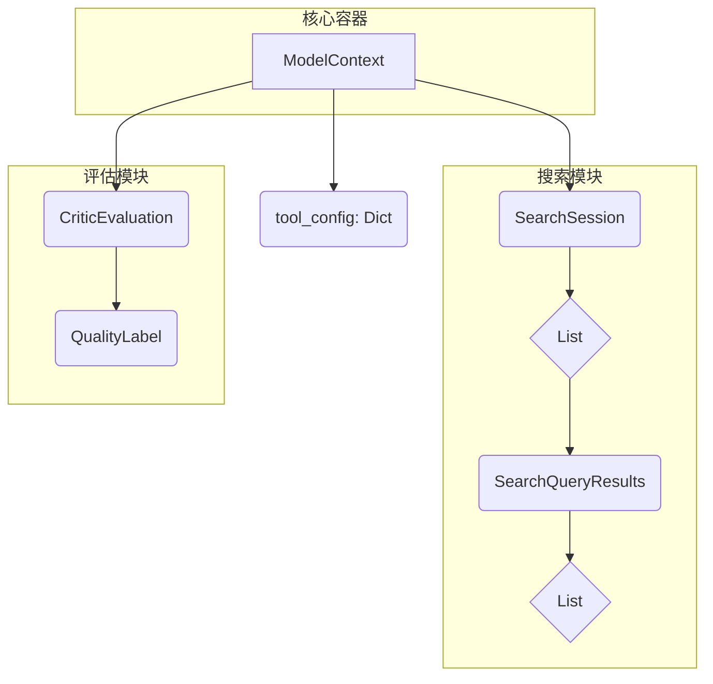

# SAGE 上下文数据结构 (`context`)

!!! info "核心数据模型"
    本文档详细描述了 SAGE 系统中用于在不同处理阶段间传递信息的系列核心数据结构。这些数据类共同构成了一个名为 `ModelContext` 的综合性“数据包”，它如同一个流转于各个工具和处理节点之间的“护照”，封装了从原始问题、搜索过程、模型响应到最终评估的所有信息，记录了请求生命周期中的每一步。

---

## 1. 整体数据流与关系

这些数据结构被设计成一个分层的、相互关联的体系，其核心是 `ModelContext`。下图展示了它们之间的关系：

**数据流说明**:
1.  一个请求开始时，系统会创建一个 `ModelContext` 实例，并填入用户的 `raw_question`。
2.  当需要进行搜索时，会在 `ModelContext` 中创建一个 `SearchSession`。
3.  搜索工具（如 `BochaSearchTool`）会执行一个或多个查询。每次查询的结果被封装成一个 `SearchQueryResults` 对象。
4.  每个 `SearchQueryResults` 内部包含一个 `SearchResult` 对象列表，代表该次查询返回的具体条目。
5.  所有 `SearchQueryResults` 被添加到 `SearchSession` 中。
6.  后续的模块（如大语言模型）利用这些结构化的信息生成 `response`。
7.  最后，`Critic` 模块会对整个 `ModelContext` 的处理结果进行评估，生成一个 `CriticEvaluation` 对象，并使用 `QualityLabel` 来标记质量。

---

## 2. `quality_label.py`: 质量评估标签

该文件定义了一个枚举类 `QualityLabel`，为评估结果提供了一套受控词汇表，确保了评估标准的一致性。

| 成员 (Member) | 值 (Value) | 描述 |
|:------------------------------|:-----------------------------|:-----------------------|
| `COMPLETE_EXCELLENT` | `"complete_excellent"` | 完整且质量优秀 |
| `COMPLETE_GOOD` | `"complete_good"` | 完整且质量良好 |
| `PARTIAL_NEEDS_IMPROVEMENT` | `"partial_needs_improvement"`| 部分完成，需要改进 |
| `INCOMPLETE_MISSING_INFO` | `"incomplete_missing_info"`| 不完整，缺少信息 |
| `FAILED_POOR_QUALITY` | `"failed_poor_quality"` | 失败，质量差 |
| `ERROR_INVALID` | `"error_invalid"` | 发生错误或结果无效 |

---

## 3. `critic_evaluation.py`: Critic 评估结果

这是一个数据类 `CriticEvaluation`，它像一份“质检报告”，详细记录了对 `ModelContext` 处理结果的评估。

| 属性 (Attribute) | 类型 (Type) | 描述 |
|:---------------------------|:-----------------|:---------------------------------------------------|
| `label` | `QualityLabel` | 来自 `QualityLabel` 枚举的评估标签。 |
| `confidence` | `float` | 评估的置信度，范围从 0.0 到 1.0。 |
| `reasoning` | `str` | 做出此评估的详细理由，解释为何给出该标签。 |
| `specific_issues` | `List[str]` | 发现的具体问题列表，例如“事实性错误”、“回答不完整”等。 |
| `suggestions` | `List[str]` | 针对发现的问题提出的具体改进建议。 |
| `should_return_to_chief` | `bool` | 一个重要的标志，指示是否应将此结果返回给主控模块进行反思和重新处理。 |
| `ready_for_output` | `bool` | 标记该结果是否已达到可输出给用户的标准。 |

---

## 4. `search_result.py`: 单个搜索结果

数据类 `SearchResult` 是搜索信息的最基本单元，代表从搜索引擎返回的单个条目。

| 属性 (Attribute) | 类型 (Type) | 描述 |
|:------------------|:--------------|:-------------------------------------------------|
| `title` | `str` | 搜索结果的标题。 |
| `content` | `str` | 搜索结果的内容片段或摘要。 |
| `source` | `str` | 结果的来源 URL，用于溯源和验证。 |
| `rank` | `int` | 结果在原始搜索列表中的排名，有助于判断其原始重要性。 |
| `relevance_score` | `float` | 系统根据相关性算法计算出的分数，用于结果的排序和筛选。 |
| `timestamp` | `int` | 创建该条目的时间戳（毫秒）。 |

---

## 5. `search_query_results.py`: 单次查询的结果集

数据类 `SearchQueryResults` 将一次特定查询的所有相关信息组织在一起，是分析单次搜索效果的关键。

| 属性 (Attribute) | 类型 (Type) | 描述 |
|:----------------------|:-----------------------|:-------------------------------------------------|
| `query` | `str` | 执行的原始搜索查询字符串。 |
| `results` | `List[SearchResult]` | 本次查询返回的 `SearchResult` 对象列表。 |
| `search_timestamp` | `int` | 执行搜索的时间戳（毫秒）。 |
| `total_results_count` | `int` | 搜索引擎声称找到的结果总数，可能多于 `results` 列表的长度。 |
| `execution_time_ms` | `int` | 本次查询的执行耗时（毫秒），用于性能监控。 |
| `search_engine` | `str` | 使用的搜索引擎名称，如 "Bocha" 或 "Google"。 |
| `metadata` | `Dict[str, Any]`| 一个灵活的字典，用于存储额外的搜索元数据，如API返回的原始数据片段。 |

---

## 6. `search_session.py`: 完整搜索会话

数据类 `SearchSession` 代表了为回答一个 `original_question` 而进行的所有搜索活动的总和。它将多次、可能不同的查询组织成一个逻辑单元。

| 属性 (Attribute) | 类型 (Type) | 描述 |
|:--------------------|:-----------------------------|:-------------------------------------------------|
| `session_id` | `str` | 整个会话的唯一标识符 (UUID)。 |
| `query_results` | `List[SearchQueryResults]` | `SearchQueryResults` 对象的列表，代表本次会话中进行的所有查询。 |
| `session_timestamp` | `int` | 会话创建时的时间戳（毫秒）。 |
| `original_question` | `str` | 触发本次搜索会话的原始用户问题。 |
| `session_metadata` | `Dict[str, Any]`| 用于存储会话级别元数据的字典，如整体搜索策略等。 |

---

## 7. `model_context.py`: 核心模型上下文

`ModelContext` 是所有数据结构的汇集点，是整个处理流程中状态传递的核心。

### 主要属性

| 属性 (Attribute) | 类型 (Type) | 描述 |
|:-------------------|:---------------------------|:-------------------------------------------------|
| `sequence` | `int` | 处理序列号，用于追踪处理步骤。 |
| `timestamp` | `int` | 上下文创建时的时间戳（毫秒）。 |
| `raw_question` | `str` | 用户输入的、未经任何修改的原始问题。 |
| `retriver_chunks` | `List[str]` | **[兼容字段]** 旧格式的、扁平化的检索结果文本块列表。为确保旧模块能继续工作而保留。 |
| `search_session` | `Optional[SearchSession]`| **[推荐使用]** 完整的、结构化的搜索会话对象，是新架构下的标准数据格式。 |
| `prompts` | `List[Dict[str, str]]`| 发送给大语言模型的提示（Prompts）列表，记录了与模型交互的完整历史。 |
| `response` | `str` | 大语言模型返回的最终响应。 |
| `uuid` | `str` | 本次上下文的唯一标识符 (UUID)。 |
| `tool_name` | `str` | 在此上下文中主要使用的工具名称，如 `BochaSearchTool`。 |
| `evaluation` | `CriticEvaluation` | 对本次处理结果的评估对象，由 Critic 模块填充。 |
| `tool_config` | `Dict[str, Any]`| 一个灵活的字典，用作工具的“草稿纸”，可以存储任何工具特定的配置、中间结果或元数据。 |

### 核心方法详解

* `__str__()`: 提供了一个格式化精美、带 Emoji 的终端打印视图，包含了所有关键信息的摘要，非常适合在开发和调试时快速了解上下文状态。

* `to_dict()` / `from_dict(data)`: 这是实现序列化的基础。`to_dict` 将整个复杂的嵌套对象转换为纯 Python 字典，而 `from_dict` 则可以从字典反向构造出完整的 `ModelContext` 对象。

* `to_json()` / `from_json(json_str)`: 基于 `to_dict`/`from_dict`，提供了与 JSON 格式的直接转换，使得上下文可以轻松地通过网络传输或存储在文本数据库中。

* `save_to_file(path)` / `load_from_file(path)`: 提供了将整个上下文对象的状态完整保存到文件系统，以及从文件恢复的能力，对于调试、复现问题和数据归档至关重要。

* `create_search_session()`: 这是一个工厂方法，用于在需要时方便地创建并初始化 `search_session` 属性，避免了繁琐的手动实例化。

* `add_search_results(...)`: 这是一个高级辅助方法，它抽象了将一次查询结果添加到 `search_session` 的复杂过程，确保了数据以正确的结构被添加。

* `update_evaluation(...)`: 允许 Critic 模块方便地更新或创建 `evaluation` 字段，并自动处理 `should_return_to_chief` 和 `ready_for_output` 等关联状态。

* `get_processing_summary()`: 返回一个包含关键处理指标的摘要字典，便于进行遥测、监控和性能分析，而无需解析整个对象。