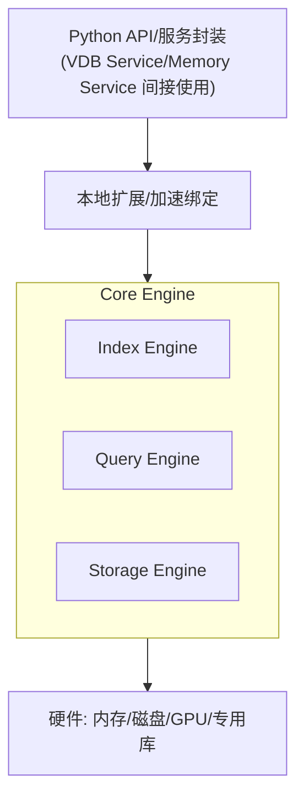

# SAGE-DB（非结构化数据库组件）

SAGE-DB 面向向量/文本等非结构化数据的高性能存储与检索，通常作为 Neuromem/Memory Service 的底层后端之一，也可由 VDB Service 直接对外暴露能力。

- 代码位置（企业版）：packages/sage-middleware/src/sage/middleware/enterprise/sage_db/
- 对上游的关系：被 Memory/Neuromem 或 VDB Service 作为后端引擎使用

本页包含：

- 编译/构建方法（企业版组件）
- 服务示例（如何通过服务对接 SAGE-DB）
- 组件设计（核心分层）
- 组件层 API（对上稳定能力面与典型方法）

---

## 一、编译/构建方法（企业版）

SAGE-DB 位于企业模块目录下，是否包含本地加速/原生扩展依发行包而定。常见构建路径如下（请以实际仓库的构建脚本与说明为准）：

1) 纯 Python/无本地扩展（常见于开发环境）

- 推荐通过中间件包进行可编辑安装，确保依赖就绪
  ```bash
  # 在仓库根目录
  pip install -e packages/sage-middleware
  ```
- 若企业目录下具备独立的 Python 包结构（含 pyproject.toml 或 setup.py），也可在该目录直接安装
  ```bash
  cd packages/sage-middleware/src/sage/middleware/enterprise/sage_db
  pip install -e .
  ```

2) 含本地扩展/需要 C++ 构建（若该目录包含原生加速组件）

- 先安装编译依赖（示例）
   
    - C/C++ 编译器（支持 C++17）
    - Python 开发头文件（python3-dev 等）
    - CMake/Ninja（若使用 CMake 构建）

- 参考该目录自带的构建脚本执行（以下为常见命令范式）
  ```bash
  cd packages/sage-middleware/src/sage/middleware/enterprise/sage_db

  # pyproject 构建
  pip install -v .

  # 或 setup.py 构建（视仓库脚手架而定）
  python setup.py build_ext --inplace -j4
  python setup.py install
  ```
- 若需指定 GPU/向量库等后端，请按照该目录 README/构建脚本中的选项配置环境变量/编译选项

提示：

- 企业模块可能受许可控制；如未包含源码或构建脚本，请联系维护者获取构建说明或预编译包

---

## 二、服务示例（通过服务对接 SAGE-DB）

业务侧不直接依赖 SAGE-DB 组件，而是通过服务抽象访问（例如 VDB Service 或 Memory Service）。

1) 作为 Memory/Neuromem 的后端（推荐使用方式）

- 参考 Neuromem 文档与 Memory Service 示例：在 Function 中使用 self.call_service["memory_service"] 完成长记忆写入与检索
- SAGE-DB 在内部承担向量写入/检索的后端职责

2) 直接通过 VDB Service 访问向量数据库
- 在环境中注册 vdb_service，然后在 Function 中调用
  ```python
  from sage.core.api.local_environment import LocalEnvironment
  # 假设 VDBService 暴露于 services/vdb/（按仓库结构）
  from sage.middleware.services.vdb import VDBService

  def vdb_service_factory():
    return VDBService()  # 构造参数按实际实现填写

  env = LocalEnvironment("sage_db_vdb_demo")
  env.register_service("vdb_service", vdb_service_factory)
  ```

  ```python
  from sage.core.api.function.base_function import BaseFunction

  class VectorWriter(BaseFunction):
      def execute(self, data):
          # 添加向量（方法名/参数以实际实现为准，示例参考 examples/README）
          self.call_service["vdb_service"].add_vectors(
              vectors=data["vectors"],  # List[List[float]]
              ids=data.get("ids"),      # Optional[List[str]]
              metadata=data.get("metadata")  # Optional[List[dict]]
          )
          return {"ok": True}

  class VectorSearcher(BaseFunction):
      def execute(self, data):
          # 相似检索
          results = self.call_service["vdb_service"].search(
              query=data["query_vector"],
              top_k=data.get("top_k", 5),
              filters=data.get("filters")
          )
          return {"results": results}
  ```

---

## 三、组件设计（核心分层）

SAGE-DB 组件通常采用“Python API/服务封装 → 本地/加速绑定 → Core Engine → 硬件资源”的分层，既保证对上 API 的稳定性，又便于替换底层实现（CPU/GPU/特定库）。



- Python API/服务封装：对上为 VDB Service 或 Memory Service 使用
- 本地扩展/加速绑定：如含 C++/CUDA/ROCm 等原生加速
- Core Engine：索引、查询、存储核心
- 硬件：面向不同后端（CPU/GPU/专用向量库）

---

## 四、组件层 API（对上稳定能力面）

以下为“对上”常见能力面（以仓库 examples/README 中的说明为锚点；具体签名以实现为准）：

1) 向量集合与写入

- add_vectors(vectors, ids, metadata)
- update_vectors(vectors, ids)
- delete_vectors(ids)
- create_collection(name, params) / drop_collection(name)

2) 检索能力

- search(query, top_k, filters)：相似度检索
- batch_search(queries, top_k, filters)
- get_vector(id)/get_metadata(id)

3) 维护与工具

- stats()/info()：集合/引擎状态
- persist()/load()：持久化/加载
- compact()/rebuild_index()：索引维护

对上建议：

- 在业务 Function 中优先通过 Memory Service 使用长期记忆能力（由 Neuromem 编排）
- 若需直接操作向量集合，使用 vdb_service 暴露的方法族；避免直接引用企业组件内部类

---

## 五、实践与部署

- 资源选择：根据数据规模与延迟要求选择 CPU/GPU 与对应向量库/索引类型
- 并发模型：批量写入与批量检索能显著降低开销；在服务侧组合批处理以提高吞吐
- 数据一致性：如与 KV/Graph 联动，请通过 Memory/Neuromem 编排，避免自行跨服务写一致性
```