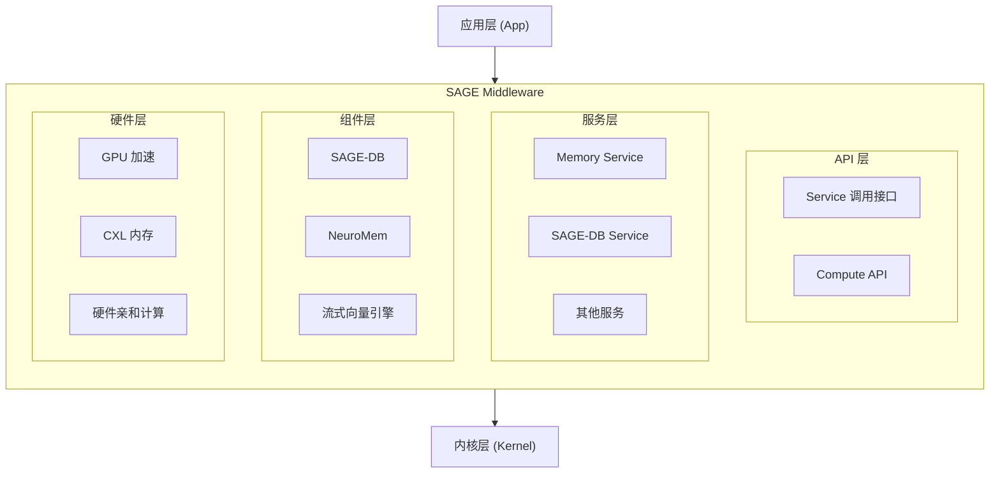

# SAGE Middleware 概览

SAGE Middleware 是一个模块化、高性能的中间件层，为SAGE推理框架提供核心基础设施支持。它采用分层架构设计，提供向量增强、流数据处理、神经记忆管理与复杂数据处理能力，兼顾效果、效率和效能。

## 架构概述

## 核心特性

### 🔌 模块化设计
- 服务解耦：每个服务都是独立的微服务，基于 BaseService 实现
- 灵活组合：服务可以独立部署、测试和扩展
- 统一接口：通过标准化 API 接口进行服务交互（call_service/call_service_async）

### ⚡ 高性能处理
- 异步通信：基于 SAGE 内核的高性能队列机制
- 并发处理：支持多线程和分布式处理
- 资源优化：智能资源分配和硬件加速

### 🧠 智能记忆
- 多模态存储：支持键值、向量、图等多种数据结构
- 记忆编排：高级记忆管理和智能检索
- 长期记忆：持久化神经记忆存储

### 🌐 分布式支持
- Ray 集成：原生支持 Ray 分布式计算
- 服务发现：自动服务注册和发现
- 负载均衡：智能负载分配和故障恢复

## 设计理念

1) 抽象与实现分离
- 抽象服务接口：通过 BaseFunction/BaseService 的 call_service 访问服务
- 计算接口：如 SAGE Flow 提供可编程接口

2) 服务编排模式
- 基础服务：KV、VDB、Graph 等提供底层存储能力
- 编排服务：Memory Service 等协调基础服务提供高级功能

3) 硬件亲和优化
- GPU 加速：向量相似度计算优化
- CXL 内存：大容量内存后端支持
- 专用后端：为不同硬件提供最优计算后端

## 核心组件

- API 层：Service 调用接口（BaseFunction/BaseService 的 call_service/call_service_async）
- 服务层：Memory Service、SAGE-DB Service 等
- 组件层：SAGE-DB、NeuroMem 等
- 硬件层：GPU 加速、CXL 内存

## 使用场景

- 智能检索系统
- 大规模数据存储
- 长期记忆管理

## 开发指南（简要）

- 服务注册（示例，详见“服务快速入门”）
- 在 Function 中调用服务：self.call_service["service_name"].method(...)
