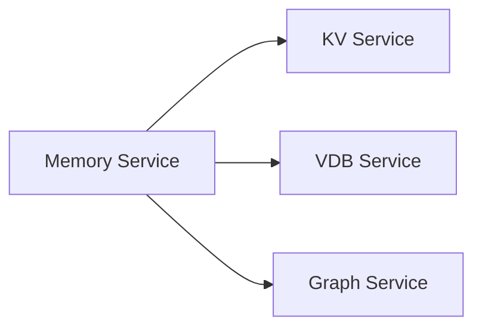
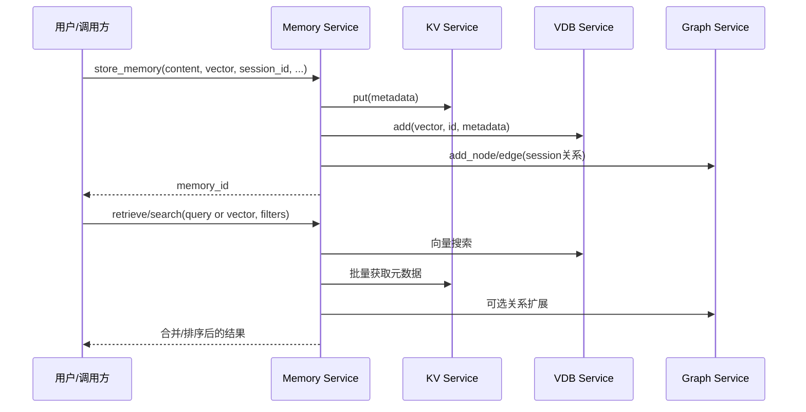

# Memory Service - 记忆编排服务

Memory Service 是 SAGE Middleware 的编排服务，协调 KV、VDB 和 Graph 等基础服务，为应用提供智能的记忆存储、检索和管理能力。

## 服务依赖关系



## 数据流程



## 在 Function 中调用（与仓库接口一致）

```python
from sage.core.api.function.base_function import BaseFunction

class ConversationMemory(BaseFunction):
    def execute(self, data):
        session_id = data["session_id"]
        content = data["content"]
        vector = data["vector"]

        # 存储记忆（同步）
        memory_id = self.call_service["memory_service"].store_memory(
            content=content,
            vector=vector,
            session_id=session_id,
            memory_type="conversation",
            metadata={"source": "user_input"}
        )

        # 检索相关记忆（同步）
        related = self.call_service["memory_service"].retrieve_memories(
            query_vector=vector,
            session_id=session_id,
            top_k=5
        )
        return {"memory_id": memory_id, "related": related}
```

备注：
- 以上调用方式基于 BaseFunction 的 call_service 语法糖，符合当前仓库实现。
- 如果需要异步：使用 self.call_service_async["memory_service"].method(...).result()
