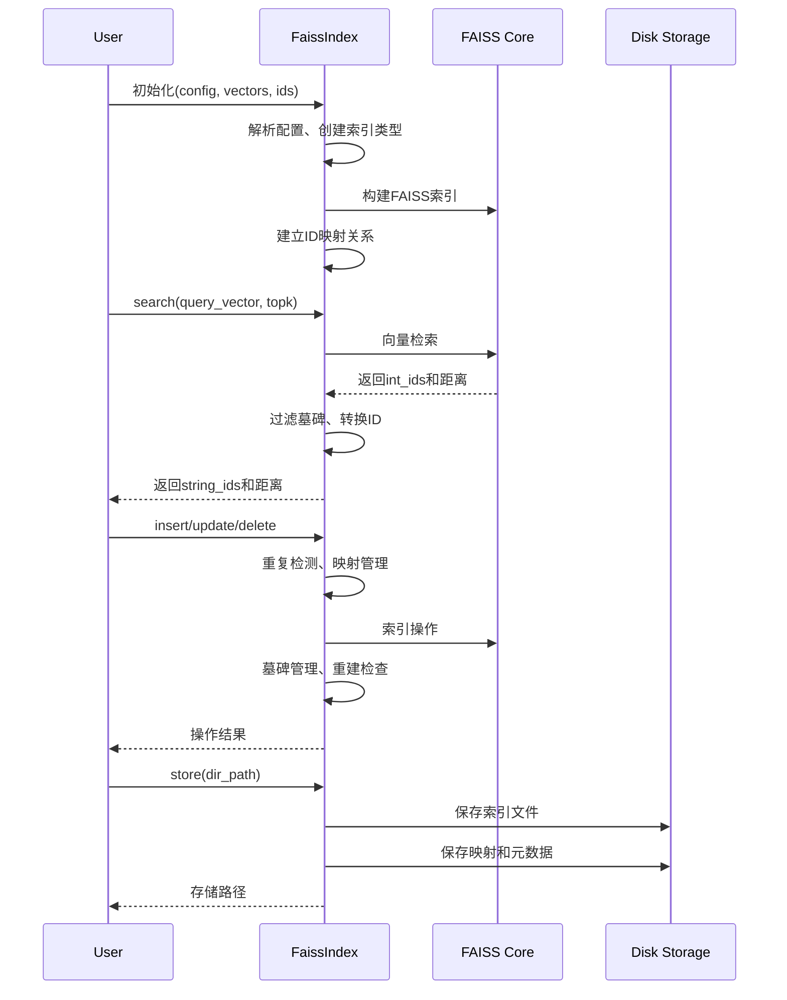

# SAGE FaissIndex API 文档

<!-- 简要介绍：一句话讲清这个 Section 解决什么问题、适用在什么场景 -->

一句话概述：本节介绍 FaissIndex 向量索引类，用于高性能向量相似性搜索和检索，帮助你在 SAGE 神经记忆系统中完成大规模向量数据的存储、管理和快速检索任务。


<small>*注意，在了解本节之前需要提前了解以下知识：*</small>
!!! tip "先决条件（Prerequisites）"
    - 基础概念：向量相似性搜索、嵌入向量、L2距离、内积
    - 技术依赖：FAISS库、numpy数组操作
    <!-- - 推荐前置阅读：[\[返回 Chapter：神经记忆系统\]](../neuromem/overview.md) -->

---

## 一、快速开始

<!-- 写一个例子/一段故事/一次论证来简单介绍一下Section的某个作用/某个特性 -->

=== "Python"
    ```python title="最小可运行示例（可拷贝运行）" linenums="1"
    import numpy as np
    from sage.middleware.services.neuromem.search_engine.vdb_index.faiss_index import FaissIndex

    def main():
        # 配置向量索引
        config = {
            "name": "my_index",
            "dim": 128,
            "index_type": "IndexFlatL2",
            "tombstone_threshold": 50
        }
        
        # 创建索引实例
        index = FaissIndex(config=config)
        
        # 插入向量数据
        vectors = [np.random.random(128).astype(np.float32) for _ in range(5)]
        ids = [f"doc_{i}" for i in range(5)]
        index.batch_insert(vectors, ids)
        
        # 向量检索
        query_vector = np.random.random(128).astype(np.float32)
        result_ids, distances = index.search(query_vector, topk=3)
        print(f"检索结果: {result_ids}")
        print(f"相似度距离: {distances}")

    if __name__ == "__main__":
        main()
    ```

=== "持久化存储"
    ```python title="索引保存与加载示例" linenums="1"
    # 保存索引到磁盘
    index.store("./my_index_data")
    
    # 从磁盘加载索引
    loaded_index = FaissIndex.load("my_index", "./my_index_data")
    
    # 继续使用加载的索引
    results, dists = loaded_index.search(query_vector, topk=5)
    ```

---

## 二、API 概览（签名 / 入口 / 速查）

> 这里放**最常用**的入口与签名；详细参数放到下一节"参数 & 返回"。

```python title="Python API 签名"
class FaissIndex(BaseVDBIndex):
    def __init__(self, 
                 config: Optional[dict] = None,
                 vectors: Optional[List[np.ndarray]] = None, 
                 ids: Optional[List[str]] = None): ...
    
    # 核心检索API
    def search(self, query_vector: np.ndarray, topk: int = 10, 
               threshold: Optional[float] = None) -> Tuple[List[str], List[float]]: ...
    
    # 数据操作API
    def insert(self, vector: np.ndarray, string_id: str) -> int: ...
    def batch_insert(self, vectors: List[np.ndarray], string_ids: List[str]) -> int: ...
    def update(self, string_id: str, new_vector: np.ndarray) -> int: ...
    def delete(self, string_id: str) -> int: ...
    
    # 持久化API
    def store(self, dir_path: str) -> Dict[str, Any]: ...
    
    @classmethod
    def load(cls, name: str, load_path: str) -> "FaissIndex": ...
```

---

## 三、参数 & 返回 & 错误

### 初始化参数（Constructor Parameters）

| 名称        |                    类型 |  必填 |    默认值     | 说明                                                  |
| --------- | --------------------: | :-: | :--------: | --------------------------------------------------- |
| `config`  |       `Optional[dict]` |  否  |    `{}`    | 索引配置字典，包含name、dim、index_type等参数                     |
| `vectors` | `Optional[List[ndarray]]` |  否  |   `None`   | 初始向量列表，与ids参数配对使用                                  |
| `ids`     | `Optional[List[str]]` |  否  |   `None`   | 初始向量对应的字符串ID列表                                     |

#### 配置参数详解（Config Parameters）

| 配置键                     | 类型      | 必填 | 默认值                       | 说明                           |
| ----------------------- | ------- | -- | ------------------------- | ---------------------------- |
| `name`                  | `str`   | 是  | —                         | 索引名称，用于持久化时的标识               |
| `dim`                   | `int`   | 否  | `128`                     | 向量维度                         |
| `index_type`            | `str`   | 否  | `"IndexFlatL2"`           | FAISS索引类型                    |
| `tombstone_threshold`   | `int`   | 否  | `30`                      | 墓碑回收阈值，超过此数量时触发索引重建          |
| `HNSW_M`                | `int`   | 否  | `32`                      | HNSW算法的连接数参数                  |
| `HNSW_EF_CONSTRUCTION`  | `int`   | 否  | `200`                     | HNSW构建时的候选数量                  |
| `HNSW_EF_SEARCH`        | `int`   | 否  | —                         | HNSW搜索时的候选数量                  |
| `IVF_NLIST`             | `int`   | 否  | `100`                     | IVF索引的聚类中心数量                  |
| `IVF_NPROBE`            | `int`   | 否  | `10`                      | IVF搜索时探查的聚类数量                 |
| `PQ_M`                  | `int`   | 否  | `8`                       | 乘积量化的子向量数量                     |
| `PQ_NBITS`              | `int`   | 否  | `8`                       | 乘积量化的编码位数                      |

### 核心方法返回值

#### search() 返回

| 字段          | 类型             | 说明                  |
| ----------- | -------------- | ------------------- |
| `result_ids` | `List[str]`    | 检索到的向量ID列表，按相似度排序    |
| `distances` | `List[float]`  | 对应的距离列表，值越小表示越相似      |

#### 操作方法返回

| 方法                | 返回类型  | 返回值含义               |
| ----------------- | ----- | ------------------- |
| `insert()`        | `int` | 1=成功，0=失败（如向量重复）     |
| `batch_insert()`  | `int` | 成功插入的向量数量           |
| `update()`        | `int` | 1=成功，0=失败           |
| `delete()`        | `int` | 1=成功，0=失败（如ID不存在）   |

### 异常 / 错误码（Errors）

| 错误                      | 触发条件           | 建议修复                        |
| ----------------------- | -------------- | --------------------------- |
| `ValueError`            | config中缺少name字段 | 在config中添加必需的"name"字段         |
| `AssertionError`        | vectors与ids长度不匹配 | 确保vectors和ids列表长度相同          |
| `AttributeError`        | 无效的索引类型        | 检查index_type是否为支持的FAISS索引类型   |
| `FileNotFoundError`     | 加载不存在的索引文件     | 确认索引文件路径正确且文件存在             |
| `重复向量警告`               | 插入已存在的向量       | 检查向量内容或使用update()方法替代       |

---

## 四、工作机制（由浅入深）



!!! info "设计动机 / 取舍"
    - **选择FAISS的原因**：高性能C++实现，支持GPU加速，多种索引算法适应不同场景
    - **ID映射设计**：FAISS原生只支持整数ID，通过双向映射支持字符串ID，便于业务使用
    - **墓碏机制**：对于不支持删除的索引类型，使用软删除+定期重建平衡性能与内存使用
    - **重复检测**：通过向量哈希避免重复数据，保持索引质量
    - **与其他方案对比**：相比Annoy更灵活，相比纯暴力搜索性能更优，相比自研方案稳定性更好

---

## 五、支持的索引类型

| 索引类型                      | 特点                | 适用场景                | 支持删除 |
| ------------------------- | ----------------- | ------------------- | ---- |
| `IndexFlatL2`             | 精确搜索，L2距离         | 小规模数据，要求100%召回率     | ✅    |
| `IndexFlatIP`             | 精确搜索，内积距离         | 小规模数据，内积相似度计算       | ✅    |
| `IndexHNSWFlat`           | 近似搜索，图结构          | 中等规模，平衡精度和速度        | ❌    |
| `IndexIVFFlat`            | 倒排索引+精确距离        | 大规模数据，可训练的量化       | ✅    |
| `IndexIVFPQ`              | 倒排索引+乘积量化        | 超大规模，内存受限           | ✅    |
| `IndexIVFScalarQuantizer` | 倒排索引+标量量化        | 大规模数据，压缩比要求适中       | ✅    |
| `IndexLSH`                | 局部敏感哈希            | 高维稀疏向量，近似搜索         | ❌    |
| `IndexPQ`                 | 纯乘积量化             | 内存极度受限，可接受精度损失      | ❌    |
| `IndexScalarQuantizer`    | 标量量化              | 平衡内存和精度             | ✅    |

---

## 六、配置项（进阶）

### 性能调优配置

| 配置键                    | 类型    | 默认值   | 说明                    | 调优建议                                    |
| ---------------------- | ----- | ----- | --------------------- | --------------------------------------- |
| `tombstone_threshold`  | `int` | `30`  | 墓碑回收阈值                | 删除操作频繁时调小(10-20)，稳定环境可调大(50-100)     |
| `IVF_NLIST`            | `int` | `100` | IVF聚类中心数              | 数据量大时调大(sqrt(N))，小数据集可调小           |
| `IVF_NPROBE`           | `int` | `10`  | IVF搜索探查数              | 召回率要求高时调大，速度要求高时调小                    |
| `HNSW_M`               | `int` | `32`  | HNSW连接度               | 精度要求高调大(48-64)，内存受限调小(16-24)         |
| `HNSW_EF_CONSTRUCTION` | `int` | `200` | HNSW构建时候选数            | 大数据集调大(400-800)，快速构建调小(100-150)      |
| `HNSW_EF_SEARCH`       | `int` | —     | HNSW搜索时候选数            | 高精度搜索设为64-512，快速搜索设为16-32           |

### 内存优化配置

| 配置键         | 类型    | 默认值 | 说明      | 内存优化建议                           |
| ----------- | ----- | --- | ------- | -------------------------------- |
| `PQ_M`      | `int` | `8` | 乘积量化子向量数 | 内存紧张时调大，精度要求高时调小                 |
| `PQ_NBITS`  | `int` | `8` | 量化编码位数  | 极度内存受限时设为4，一般情况保持8              |
| `SQ_TYPE`   | `str` | —   | 标量量化类型  | 内存受限用`QT_4bit`，平衡场景用`QT_8bit` |

### 使用建议

!!! tip "索引选择指南"
    - **< 10万向量**：使用 `IndexFlatL2`，保证100%准确率
    - **10万-100万向量**：使用 `IndexHNSWFlat`，平衡速度和精度  
    - **100万-1000万向量**：使用 `IndexIVFFlat`，设置合适的nlist
    - **> 1000万向量**：使用 `IndexIVFPQ`，启用压缩

!!! warning "注意事项"
    - 向量维度需在初始化时确定，后续不可更改
    - 支持删除的索引类型性能更好，但内存占用较高
    - 墓碑机制会定期触发重建，注意在低峰期进行
    - 建议定期备份索引数据，避免意外丢失
