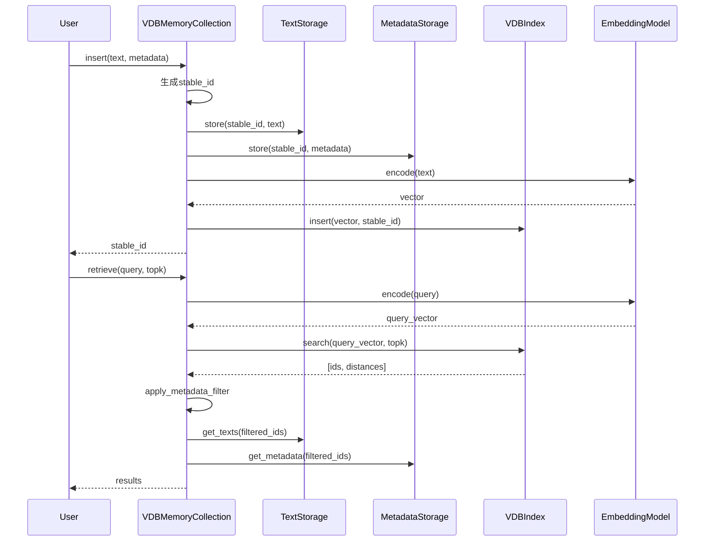

# SAGE VDBMemoryCollection 组件

<!-- 简要介绍：一句话讲清这个 Section 解决什么问题、适用在什么场景 -->

一句话概述：本节介绍 **VDBMemoryCollection**，用于 **向量数据库支持的智能内存集合管理**，帮助你在 **RAG/Agent 系统** 中完成 **高效的文本存储、检索和相似性搜索**。


<small>*注意，在了解本节之前需要提前了解以下知识：*</small>
!!! tip "先决条件（Prerequisites）"
    - 基础概念：**RAG / Vector Database / Embedding / 元数据过滤**
    - 推荐前置阅读：[\[返回 Chapter：SAGE NeuroMem\]](../neuromem/overview.md)
    - 相关组件：**BaseMemoryCollection / VDBIndex / EmbeddingModel**

---

## 一、快速开始

<!-- 写一个例子/一段故事/一次论证来简单介绍一下Section的某个作用/某个特性 -->

VDBMemoryCollection 是 SAGE 系统中的核心内存管理组件，它将传统的文本存储与现代向量数据库技术结合，为 RAG 应用提供强大的语义搜索能力。想象你正在构建一个智能问答系统，需要从大量文档中快速找到与用户问题最相关的内容 — VDBMemoryCollection 正是为此而生。

=== "Python"
    ```python title="最小可运行示例（可拷贝运行）" linenums="1"
    from sage.middleware.services.neuromem.memory_collection.vdb_collection import VDBMemoryCollection

    def main():
        # 创建配置
        config = {
            "name": "my_knowledge_base",
            "default_embedding_model": "mockembedder",
            "default_dim": 128,
            "default_topk": 5,
            "default_vdb_backend": "FAISS"
        }
        
        # 初始化集合
        collection = VDBMemoryCollection(config=config)
        
        # 插入文档
        texts = [
            "Python是一种高级编程语言",
            "机器学习是人工智能的重要分支",
            "向量数据库用于高效的相似性搜索"
        ]
        
        for text in texts:
            collection.insert(text, metadata={"type": "knowledge", "source": "manual"})
        
        # 语义检索
        results = collection.retrieve("编程语言相关信息", topk=2)
        print("检索结果：", results)
        
        # 保存到磁盘
        collection.store("/path/to/save")

    if __name__ == "__main__":
        main()
    ```
=== "加载已有集合"
    ```python title="从磁盘加载已保存的集合" linenums="1"
    from sage.middleware.services.neuromem.memory_collection.vdb_collection import VDBMemoryCollection

    # 从磁盘加载
    collection = VDBMemoryCollection.load(
        name="my_knowledge_base", 
        vdb_path="/path/to/save/vdb_collection/my_knowledge_base"
    )
    
    # 继续使用
    results = collection.retrieve("机器学习", topk=3, with_metadata=True)
    for result in results:
        print(f"文本: {result['text']}")
        print(f"元数据: {result['metadata']}")
    ```
=== "多索引管理"
    ```python title="创建和管理多个专用索引" linenums="1"
    # 创建专用索引
    collection.create_index(config={
        "name": "tech_docs",
        "description": "技术文档专用索引",
        "embedding_model": "sentence-transformers/all-MiniLM-L6-v2",
        "dim": 384
    })
    
    # 向特定索引插入数据
    collection.insert(
        "FastAPI是一个现代的Python Web框架",
        metadata={"category": "tech", "framework": "fastapi"},
        "tech_docs"
    )
    
    # 从特定索引检索
    results = collection.retrieve(
        "Web框架",
        index_name="tech_docs",
        topk=5
    )
    ```

---

## 二、API 概览（签名 / 入口 / 速查）

> 这里放**最常用**的入口与签名；详细参数放到下一节"参数 & 返回"。

```python title="Python API 签名"
class VDBMemoryCollection(BaseMemoryCollection):
    def __init__(self, config: Dict[str, Any]): ...
    
    # 数据管理
    def insert(self, raw_text: str, metadata: Optional[Dict[str, Any]] = None, *index_names) -> str: ...
    def batch_insert_data(self, data: List[str], metadatas: Optional[List[Dict[str, Any]]] = None): ...
    def update(self, former_data: str, new_data: str, new_metadata: Optional[Dict[str, Any]] = None, *index_names: str) -> str: ...
    def delete(self, raw_text: str): ...
    
    # 检索功能
    def retrieve(self, raw_data: str, topk: Optional[int] = None, index_name: Optional[str] = None, 
                threshold: Optional[float] = None, with_metadata: bool = False,
                metadata_filter_func: Optional[Callable] = None, **metadata_conditions): ...
    
    # 索引管理
    def create_index(self, config: Optional[dict] = None, metadata_filter_func: Optional[Callable] = None, **metadata_conditions): ...
    def delete_index(self, index_name: str): ...
    def list_index(self, *index_names) -> List[Dict[str, str]]: ...
    def update_index(self, index_name: str): ...
    
    # 持久化
    def store(self, store_path: Optional[str] = None): ...
    @classmethod
    def load(cls, name: str, vdb_path: Optional[str] = None): ...
    @staticmethod
    def clear(name, clear_path=None): ...
```

---

## 三、参数 & 返回 & 错误

### 初始化参数（Config）

| 名称                       |         类型 |  必填 |          默认值           | 说明                                 |
| ------------------------ | ---------: | :-: | :--------------------: | ---------------------------------- |
| `name`                   |    `str`   |  是  |           —            | 集合名称，用于标识和持久化                      |
| `default_embedding_model` |    `str`   |  否  |      `"default"`       | 默认向量化模型名称                          |
| `default_dim`            |    `int`   |  否  |   `模型自动获取` / `128`    | 默认向量维度                             |
| `default_topk`           |    `int`   |  否  |          `5`           | 默认检索返回数量                           |
| `default_vdb_backend`    |    `str`   |  否  |       `"FAISS"`        | 默认向量数据库后端（支持 FAISS 等）             |
| `global_index`           |   `dict`   |  否  |       `自动生成`        | 全局索引配置，会自动创建 global_index        |

### 检索参数（Retrieve）

| 名称                     |           类型           |  必填 |      默认值       | 说明                    |
| ---------------------- | :-------------------: | :-: | :-----------: | --------------------- |
| `raw_data`             |        `str`          |  是  |       —       | 查询文本                  |
| `topk`                 |        `int`          |  否  | `default_topk` | 返回结果数量                |
| `index_name`           |        `str`          |  否  |  `全局索引`       | 指定搜索的索引名称             |
| `threshold`            |       `float`         |  否  |     `None`    | 相似度阈值过滤               |
| `with_metadata`        |        `bool`         |  否  |    `False`    | 是否返回元数据               |
| `metadata_filter_func` | `Callable[[Dict], bool]` |  否  |     `None`    | 元数据过滤函数               |
| `**metadata_conditions` |       `Any`           |  否  |      `{}`     | 元数据精确匹配条件             |

### 返回格式（Returns）

| 方法              |          返回类型           | 说明                           |
| --------------- | :----------------------: | ---------------------------- |
| `insert`        |          `str`           | 返回生成的稳定ID（SHA256哈希）          |
| `retrieve`      | `List[str]` / `List[Dict]` | 文本列表 或 包含文本和元数据的字典列表        |
| `create_index`  |          `int`           | 成功返回1，失败返回0                 |
| `list_index`    |     `List[Dict[str, str]]` | 索引信息列表：`[{"name": ..., "description": ...}]` |
| `store`         |         `Dict`           | 存储路径信息：`{"collection_path": path}` |

### 异常 / 错误码（Errors）

| 错误                        | 触发条件                    | 建议修复                 |
| ------------------------- | ----------------------- | -------------------- |
| `ValueError: config中必须包含'name'字段` | 初始化时config缺少name字段     | 确保config包含name字段     |
| `ValueError: Index 'xxx' does not exist` | 操作不存在的索引              | 先用list_index检查索引是否存在 |
| `ValueError: Original data not found` | 更新时找不到原始数据            | 确认要更新的数据确实存在         |
| `FileNotFoundError`       | 加载时找不到配置文件            | 检查路径和文件是否存在          |
| `NotImplementedError`     | 使用不支持的索引类型            | 使用FAISS等支持的后端类型      |

---

## 四、工作机制（由浅入深）



!!! info "设计动机 / 取舍"
    - **选择分离式存储设计**：文本、元数据、向量索引分别存储，便于灵活管理和扩展
    - **多索引支持**：允许为不同用途创建专用索引，提高检索精度和性能
    - **与传统全文检索的折中**：牺牲了完全的文本匹配精度，换取语义相似性检索能力
    - **embedding模型可配置**：不同索引可使用不同的embedding模型，平衡性能和效果

### 核心特性

1. **智能索引管理**：
   - 自动创建全局索引 `global_index`
   - 支持多个专用索引，每个索引可配置不同的embedding模型
   - 索引级别的元数据过滤支持

2. **灵活的数据操作**：
   - 单条和批量数据插入
   - 基于稳定ID的数据更新和删除
   - 增量索引更新机制

3. **强大的检索能力**：
   - 语义相似性搜索
   - 元数据过滤（函数式 + 条件式）
   - 阈值过滤和topk限制

4. **持久化支持**：
   - 完整的序列化/反序列化
   - Lambda函数的序列化支持
   - 增量加载和保存

---

## 五、使用场景和最佳实践

### 典型使用场景

1. **RAG知识库构建**：
   ```python
   # 构建企业知识库
   kb_config = {
       "name": "enterprise_kb",
       "default_embedding_model": "text-embedding-ada-002",
       "default_dim": 1536,
       "default_topk": 10
   }
   kb = VDBMemoryCollection(config=kb_config)
   
   # 按部门创建专用索引
   kb.create_index(config={
       "name": "tech_docs",
       "description": "技术文档索引"
   })
   ```

2. **多模态内容管理**：
   ```python
   # 为不同类型的内容创建不同索引
   collection.create_index(config={
       "name": "code_snippets", 
       "embedding_model": "code-search-net",
       "description": "代码片段索引"
   })
   
   collection.create_index(config={
       "name": "documentation",
       "embedding_model": "sentence-transformers/all-MiniLM-L6-v2", 
       "description": "文档索引"
   })
   ```

3. **动态内容过滤**：
   ```python
   # 基于元数据的动态过滤
   results = collection.retrieve(
       "机器学习算法",
       topk=5,
       metadata_filter_func=lambda m: m.get("difficulty") == "beginner",
       category="tutorial"
   )
   ```

### 性能优化建议

1. **索引管理优化**：
   - 为不同业务场景创建专用索引，避免在单一大索引中搜索
   - 合理设置embedding模型维度，平衡精度和性能
   - 定期使用 `update_index()` 重建索引以优化性能

2. **内存和存储优化**：
   - 大量数据时使用 `batch_insert_data()` 批量插入
   - 定期清理不需要的索引和数据
   - 合理配置FAISS索引类型（HNSW/IVF等）

3. **检索优化**：
   - 使用元数据过滤缩小搜索范围
   - 设置合理的topk值，避免返回过多无关结果
   - 利用threshold参数过滤低相似度结果

---

## 六、配置项（进阶）

### VDBMemoryCollection配置

| 配置键                       | 类型             | 默认            | 说明     | 调优建议               |
| ------------------------- | -------------- | ------------- | ------ | ------------------ |
| `default_embedding_model` | `str`          | `"default"`   | 默认向量化模型 | 根据数据类型选择合适模型：代码用CodeBERT，文本用sentence-transformers |
| `default_dim`             | `int`          | `128`         | 默认向量维度 | 高精度场景用1536，性能优先用384 |
| `default_topk`            | `int`          | `5`           | 默认返回数量 | 根据应用场景调整：问答用3-5，推荐用10-20 |
| `default_vdb_backend`     | `str`          | `"FAISS"`     | 向量数据库后端 | 目前主要支持FAISS，未来可扩展其他后端 |

### 索引级配置

| 配置键           | 类型             | 默认            | 说明     | 调优建议               |
| ------------- | -------------- | ------------- | ------ | ------------------ |
| `embedding_model` | `str`      | `继承collection默认` | 索引专用模型 | 不同数据类型使用不同模型提高精度 |
| `backend_type` | `str`         | `"FAISS"`     | 索引后端类型 | 可配置不同FAISS索引类型优化性能 |
| `description` | `str`          | `""`          | 索引描述   | 便于管理和维护多个索引 |

### FAISS索引类型配置

| 索引类型              | 适用场景        | 内存占用  | 搜索速度  | 精度   |
| ----------------- | ----------- | ----- | ----- | ---- |
| `IndexFlatL2`     | 小数据集、高精度要求  | 高     | 中等    | 最高   |
| `IndexHNSWFlat`   | 中等数据集、平衡性能  | 中等    | 快     | 高    |
| `IndexIVFFlat`    | 大数据集       | 低     | 快     | 中等   |
| `IndexIVFPQ`      | 超大数据集、内存敏感  | 最低    | 最快    | 中等   |

基于你的具体需求选择合适的配置，VDBMemoryCollection 将为你的 RAG 应用提供强大而灵活的向量化内存管理能力。
