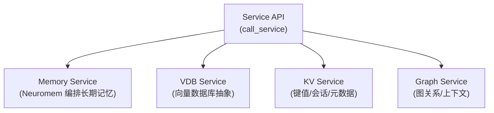
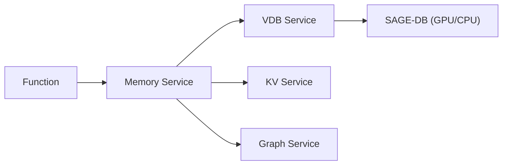

# SAGE Middleware 服务层概览

服务层是 SAGE Middleware 的核心组件，提供预定义的微服务，通过编排各种组件形成完整的服务逻辑，向上层应用提供统一的服务接口。服务层采用微服务架构设计，支持独立部署、扩展和管理。

## 1. 调用入口（统一 API）

- 同步：self.call_service["service_name"].method(args...)
- 异步：self.call_service_async["service_name"].method(args...) → Future（.result(timeout=...)）

示例：
```python
# Function 中
value = self.call_service["kv_service"].get("key1")
fut = self.call_service_async["vdb_service"].search(query=vec, top_k=10)
results = fut.result(timeout=5)
```

## 2. 服务清单与职责（示意）



## 3. 端到端调用路径（示意）



## 4. 典型用法

- Memory（长期记忆）
```python
mid = self.call_service["memory_service"].store_memory(
    content=content, vector=vec, session_id=sid,
    memory_type="conversation", metadata={"source": "user"}
)
hits = self.call_service["memory_service"].search_memories(
    query_vector=vec, session_id=sid, limit=5
)
```

- VDB（直接向量服务）
```python
self.call_service["vdb_service"].add_vectors(vectors=batch, ids=ids, metadata=md)
hits = self.call_service["vdb_service"].search(query=vec, top_k=10)
```

- KV
```python
self.call_service["kv_service"].put("k", {"v": 1})
v = self.call_service["kv_service"].get("k")
```

- Graph
```python
self.call_service["graph_service"].add_edge("A","B", {"rel":"next"})
```

更多示例，请参考“服务快速入门”。
